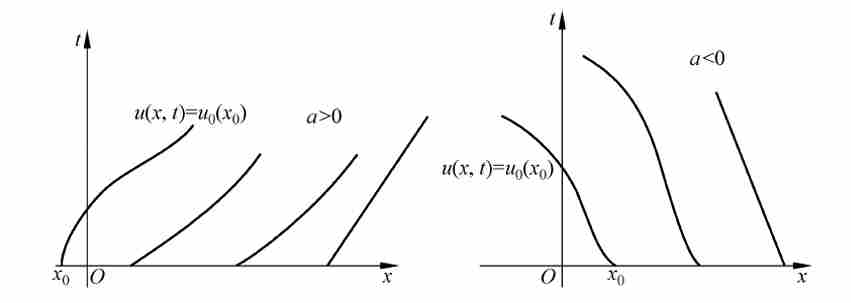

## 第二节 一阶线性常系数方程组

一般形式： $\left\{ \begin{array}{l} \frac{\partial \vec{u}}{\partial t} + A \frac{\partial \vec{u}}{\partial x} = 0 \\ \vec{u}(x, 0) = \vec{f}(x) \end{array} \right.$ 

其中： $\vec{u}(x, t) = \left(u_1(x, t), \dots, u_p(x, t)\right)^T$ , $A = \left(a_{ij}\right)_{p \times p}$ 为常数矩阵

定义：称方程组是**双曲型方程组**，如果 $A$ 的特征值是实的，并存在非奇异阵 $S$ 使得

$$
S ^ {- 1} A S = \operatorname {d i a g} [ \lambda_ {1}, \lambda_ {2}, \dots , \lambda_ {p} ]
$$

其中 $\lambda_{i}$（$i = 1,2,\dots,p$）为 $A$ 的特征值；如果 $A$ 是对称阵，则称为**对称双曲型方程组**。若 $A$ 的特征值互不相同，则称方程组为**严格双曲型方程组**。

如果 $A$ 的特征值是实的, 且有非奇异矩阵 $S$ ,

使: $S^{-1} A S = \Lambda = \left( \begin{array}{c c c} \lambda_ {1} & \dots & 0 \\ \vdots & \ddots & \vdots \\ 0 & \dots & \lambda_ {p} \end{array} \right)$ 

那么引入 $\vec{w} = S^{-1}\vec{u}$ , 有:

$$
\begin{array}{l} S ^ {- 1} \frac {\partial \vec {u}}{\partial t} + S ^ {- 1} A S S ^ {- 1} \frac {\partial \vec {u}}{\partial x} = 0 \\ \frac {\partial \vec {w}}{\partial t} + \boldsymbol {\Lambda} \frac {\partial \vec {w}}{\partial x} = \mathbf {0} \\ \end{array}
$$

这是非耦合的 $p$ 个方程。可独立构造差分格式求解,且有: $\vec{u}(x, t) = S\vec{w}(x, t)$ 

**符号约定**：以下记网格比 $r=\tau/h$；矩阵 $A$（及 $\Lambda$）的特征值仍记为 $\lambda_l$，稳定条件可写为 $r\,|\lambda_l|\le 1$（或 $r\,\rho(A)\le 1$）。

### 1、Lax-Friedrichs 格式

若使用Lax-Friedrichs格式：

$$
\frac {\vec {u} _ {j} ^ {n + 1} - \frac {1}{2} \left(\vec {u} _ {j + 1} ^ {n} + \vec {u} _ {j - 1} ^ {n}\right)}{\tau} + A \frac {\vec {u} _ {j + 1} ^ {n} - \vec {u} _ {j - 1} ^ {n}}{2 h} = 0
$$

这是一阶精度的格式，其增长矩阵：

$$
G (r , k) = \cos k h \cdot I - i r \sin k h \cdot A
$$

$$
\mu_ {l} = \cos k h - i r \lambda_ {l} \sin k h, \qquad l = 1, 2, \dots , p
$$

$$
\left| \mu_ {l} \right| ^ {2} = 1 - \left(1 - r^ {2} \lambda_ {l} ^ {2}\right) \sin^ {2} k h, \qquad l = 1, 2, \dots , p
$$

### 补充：Von Neumann 稳定性条件（定理）

定理：如果对于 $\tau \leq \tau_{0}$ ，存在非奇异矩阵 $S(\tau, k)$ 

使得 $S^{-1}(\tau, k) G(\tau, k) S(\tau, k) = \Lambda(\tau, k)$ 

其中 $\Lambda(\tau, k)$ 为对角矩阵

则 Von Neumann 条件是差分格式稳定的充要条件。

### 稳定性结论

如果 $r \rho(A) \leq 1$ , 则 $\rho(G) \leq 1$ , 满足 Von Neumann 条件,

注意到双曲方程的特性, 即矩阵 $A$ 可对角化,

则 Von Neumann 条件为稳定性的充要条件。

**注：方程的不稳定差分格式推广到方程组仍然是不稳定的**

例如:

对一维对流方程的中心差分格式的直接推广,可取差分格式:

$$
\frac {\vec {u} _ {j} ^ {n + 1} - \vec {u} _ {j} ^ {n}}{\tau} + A \frac {\vec {u} _ {j + 1} ^ {n} - \vec {u} _ {j - 1} ^ {n}}{2 h} = 0
$$

精度 $E = O\left(\tau + h^{2}\right)$ , 但不稳定。

这是由于增长矩阵:

$$
G (r , k) = I - i r \sin k h \cdot A
$$

若 $A$ 的特征值为：

$$
\lambda_ {l} \qquad l = 1, 2, \dots , p
$$

则 $\mathbf{G}$ 的特征值：

$$
\mu_ {l} = 1 - i r \sin k h \cdot \lambda_ {l}
$$

$$
l = 1, 2, \dots , p
$$

$$
\left| \mu_ {l} \right| ^ {2} = 1 + r^ {2} \lambda_ {l} ^ {2} \sin^ {2} k h
$$

### 2、Lax--Wendroff 格式

$$
\vec {u} _ {j} ^ {n + 1} = \vec {u} _ {j} ^ {n} - \frac {1}{2} r A \left(\vec {u} _ {j + 1} ^ {n} - \vec {u} _ {j - 1} ^ {n}\right) + \frac {1}{2} r^ {2} A ^ {2} \left(\vec {u} _ {j + 1} ^ {n} - 2 \vec {u} _ {j} ^ {n} + \vec {u} _ {j - 1} ^ {n}\right)
$$

这是二阶格式，且:

$$
G (r , k) = I - i r \sin k h \cdot A - r^ {2} (1 - \cos k h) \cdot A ^ {2}
$$

若 $\lambda_{l}$ 是 $A$ 的特征值, 则 $G$ 的特征值:

$$
\begin{array}{l} \mu_ {l} = 1 - i r \lambda_ {l} \sin k h - r^ {2} \lambda_ {l} ^ {2} \left(1 - \cos k h\right) \\ \left| \mu_ {l} \right| ^ {2} = 1 - 4 r^ {2} \lambda_ {l} ^ {2} \left(1 - r^ {2} \lambda_ {l} ^ {2}\right) \sin^ {4} \frac {k h}{2} \quad l = 1, 2, \dots , p \\ \end{array}
$$

故当 $|r \lambda_{l}| \leq r \rho(A) \leq 1$ 时, $|\mu_{l}| \leq 1$ , 格式稳定.

### 3、迎风格式

设方程组已化成： $\left\{ \begin{array}{l} \frac{\partial \vec{w}}{\partial t} + \boldsymbol{\Lambda} \frac{\partial \vec{w}}{\partial x} = \mathbf{0} \\ \vec{w}(x, 0) = S^{-1} \vec{u}(x, 0) \end{array} \right.$ 

对每个分量 $w_l$（或对角线上第 $l$ 个方程）分别按 $\lambda_l$ 的符号构造迎风格式，有：

$$
w _ {l j} ^ {n + 1} = w _ {l j} ^ {n} - \frac {r}{2} \lambda_ {l} \left(w _ {l j + 1} ^ {n} - w _ {l j - 1} ^ {n}\right) + \frac {r}{2} \left| \lambda_ {l} \right| \left(w _ {l j + 1} ^ {n} - 2 w _ {l j} ^ {n} + w _ {l j - 1} ^ {n}\right)
$$

写成矩阵形式（对向量 $\vec w$）：

$$
\vec {w} _ {j} ^ {n + 1} = \vec {w} _ {j} ^ {n} - \frac {r}{2} \Lambda \big (\vec {w} _ {j + 1} ^ {n} - \vec {w} _ {j - 1} ^ {n} \big) + \frac {r}{2} \big | \Lambda \big | \big (\vec {w} _ {j + 1} ^ {n} - 2 \vec {w} _ {j} ^ {n} + \vec {w} _ {j - 1} ^ {n} \big)
$$

其中： $\Lambda = \left( \begin{array}{ccc}\lambda_{1} & & \\ & \ddots & \\ & & \lambda_{p} \end{array} \right)$ 

$$
| \boldsymbol {\Lambda} | = \left( \begin{array}{c c c} | \lambda_ {1} | & & \\ & \ddots & \\ & & | \lambda_ {p} | \end{array} \right)
$$

从而有: $\vec{u}_{j}^{n+1} = \vec{u}_{j}^{n} - \frac{r}{2} A\left(\vec{u}_{j+1}^{n} - \vec{u}_{j-1}^{n}\right) + \frac{r}{2} |A|\left(\vec{u}_{j+1}^{n} - 2\vec{u}_{j}^{n} + \vec{u}_{j-1}^{n}\right)$ 

其中 $|A| = S\,|\Lambda|\,S^{-1}$ 

且： $G(r ,k) = I - ir \sin kh\cdot A + r (\cos kh - 1)\big|A|$ 

$$
\begin{array}{l} \mu_ {l} = 1 + r | \lambda_ {l} | (\cos k h - 1) - i r \lambda_ {l} \sin k h \\ \left| \mu_ {l} \right| ^ {2} = \left[ 1 - 4 r \left| \lambda_ {l} \right| \left(1 - r \left| \lambda_ {l} \right|\right) \sin^ {2} \frac {k h}{2} \right] \\ \end{array}
$$

当 $r \left| \lambda_{l} \right| \leq r \rho(A) \leq 1$ 时, 有 $\left| \mu_{l} \right| \leq 1$ , 格式稳定。

## 第三节 变系数方程及方程组

本节差分格式与冻结系数分析中，网格比仍记为 $r=\tau/h$（与第二节一致）。

### 3.1 变系数方程

方程： $\left\{ \begin{array}{l} \frac{\partial u}{\partial t} + a(x, t) \frac{\partial u}{\partial x} = 0 \\ u(x, 0) = f(x) \end{array} \right.$ $x \in (-\infty, +\infty)$ 

其中 $a(x, t)$ 对 $x, t$ 皆一次可微, $a(x, t)$ 光滑函数。

设有函数 $x = x\left(t, x_{0}\right)$ 满足: $\left\{ \begin{array}{l} \frac{d x}{d t} = a(x, t) \\ x \big |_{t = 0} = x_{0} \end{array} \right.$ 

那么：

$$
\begin{array}{l} \frac {d}{d t} \left(u (x, t)\right) = \frac {d}{d t} \left(u \left(x \left(t, x _ {0}\right), t\right)\right) \\ = \frac {\partial u}{\partial t} + \frac {\partial u}{\partial x} \frac {d x}{d t} = 0 \\ \end{array}
$$

即原方程的解沿曲线 $x = x\left(t, x_{0}\right)$ 是常数

$$
u (x, t) = f \left(x _ {0}\right)
$$

其中 $x = x\left(t, x_{0}\right)$ 就称为是原方程的特征曲线。

可将常系数方程的差分格式推至变系数方程：

(1)Lax-Friedrichs格式：

$$
\frac {u _ {j} ^ {n + 1} - \frac {1}{2} \left(u _ {j + 1} ^ {n} + u _ {j - 1} ^ {n}\right)}{\tau} + a _ {j} ^ {n} \frac {u _ {j + 1} ^ {n} - u _ {j - 1} ^ {n}}{2 h} = 0
$$

「冻结系数」法分析稳定性（不严格）：先把 $a$ 看作与 $n, j$ 无关的常数，用 Fourier 方法得到稳定条件后再让指标变化。

可得稳定性条件近似为 $r \max_{j}\left|a_{j}^{n}\right| \leq 1$。

设 $u_{j}^{n} = v^{n} e^{ikjh}$ , 代入差分方程得:

$$
\frac {v ^ {n + 1} e ^ {i k j h} - \frac {1}{2} \left(v ^ {n} e ^ {i k (j + 1) h} + v ^ {n} e ^ {i k (j - 1) h}\right)}{\tau} + a _ {j} ^ {n} \frac {v ^ {n} e ^ {i k (j + 1) h} - v ^ {n} e ^ {i k (j - 1) h}}{2 h} = 0
$$

整理得: $v^{n+1} = (\cos kh - ir a_j^n \sin kh)v^n$ 

$$
G (r , k) = \cos k h - i r a _ {j} ^ {n} \sin k h
$$

$$
\mid G (r , k) \mid^ {2} = 1 - (1 - r^ {2} (a _ {j} ^ {n}) ^ {2}) \sin^ {2} k h
$$

稳定性条件为: $\left|a_{j}^{n}\right| r \leq 1$ 

解冻系数, 稳定性条件为: $\max_{j} \left| a_{j}^{n} \right| r \leq 1$ 

#### 附加：能量分析法讨论稳定性（严格）

下面对 L-F 格式用能量分析法讨论稳定性。

(1) 把 $L - F$ 改写为

$$
u _ {j} ^ {n + 1} = \frac {1}{2} \left(u _ {j + 1} ^ {n} + u _ {j - 1} ^ {n}\right) - \frac {1}{2} a _ {j} ^ {n} r \left(u _ {j + 1} ^ {n} - u _ {j - 1} ^ {n}\right)
$$

(2) 用 $u_{j}^{n+1}$ 乘上式两边得到

$$
\begin{array}{l} \left(u _ {j} ^ {n + 1}\right) ^ {2} = \left[ \frac {1}{2} \left(u _ {j + 1} ^ {n} + u _ {j - 1} ^ {n}\right) - \frac {1}{2} a _ {j} ^ {n} r \left(u _ {j + 1} ^ {n} - u _ {j - 1} ^ {n}\right) \right] u _ {j} ^ {n + 1} \\ \left(u _ {j} ^ {n + 1}\right) ^ {2} = \frac {1}{2} \left(1 + a _ {j} ^ {n} r\right) u _ {j - 1} ^ {n} u _ {j} ^ {n + 1} + \frac {1}{2} \left(1 - a _ {j} ^ {n} r\right) u _ {j + 1} ^ {n} u _ {j} ^ {n + 1} \\ \end{array}
$$

(3) 如果假设 $\max_{j} |a_{j}^{n}| r \leq 1$ , 那么有

$$
\begin{array}{l} \left(u _ {j} ^ {n + 1}\right) ^ {2} \leq \frac {1}{4} \left(1 + a _ {j} ^ {n} r\right) \quad \left(\left(u _ {j - 1} ^ {n}\right) ^ {2} + \left(u _ {j} ^ {n + 1}\right) ^ {2}\right) \\ + \frac {1}{4} (1 - a _ {j} ^ {n} r) \quad \left(\left(u _ {j} ^ {n + 1}\right) ^ {2} + \left(u _ {j + 1} ^ {n}\right) ^ {2}\right) \\ = \frac {1}{4} \left(1 + a _ {j} ^ {n} r\right) \quad \left(u _ {j - 1} ^ {n}\right) ^ {2} + \frac {1}{2} \left(u _ {j} ^ {n + 1}\right) ^ {2} + \frac {1}{4} \left(1 - a _ {j} ^ {n} r\right) \quad \left(u _ {j + 1} ^ {n}\right) ^ {2} \\ \end{array}
$$

从而有

$$
\left(u _ {j} ^ {n + 1}\right) ^ {2} \leq \frac {1}{2} \left(\left(u _ {j - 1} ^ {n}\right) ^ {2} + \left(u _ {j + 1} ^ {n}\right) ^ {2}\right) + \frac {1}{2} a _ {j} ^ {n} r \left(\left(u _ {j - 1} ^ {n}\right) ^ {2} - \left(u _ {j + 1} ^ {n}\right) ^ {2}\right)
$$

(4) 用 $h$ 乘上式两边并对 $j$ 求和, 记离散模

$$
\left\| u ^ {n} \right\| _ {h} ^ {2} = \sum_ {- \infty} ^ {\infty} \left(u _ {j} ^ {n}\right) ^ {2} h
$$

$$
\begin{array}{l} \| u ^ {n + 1} \| _ {h} ^ {2} \leq \| u ^ {n} \| _ {h} ^ {2} + \frac {1}{2} \sum a _ {j} ^ {n} h \left(\left(u _ {j - 1} ^ {n}\right) ^ {2} - \left(u _ {j + 1} ^ {n}\right) ^ {2}\right) \\ = \left\| u ^ {n} \right\| _ {h} ^ {2} + \frac {1}{2} \sum \left(a _ {j + 1} ^ {n} - a _ {j - 1} ^ {n}\right) \left(u _ {j} ^ {n}\right) ^ {2} h \\ \end{array}
$$

如果 $\left| \frac{\partial a}{\partial x} \right| \leq M, x \in R, t \in [0, T]$ 

那么由中值定理有 $\left|a_{j+1}^{n} - a_{j-1}^{n}\right| \leq 2M h$ 

从而有

$$
\left\| u ^ {n + 1} \right\| _ {h} ^ {2} \leq \left(1 + M \tau\right) \left\| u ^ {n} \right\| _ {h} ^ {2}
$$

重复使用上面的式子有

$$
\| u ^ {n + 1} \| _ {h} ^ {2} \leq e ^ {M T} \| u ^ {0} \| _ {h} ^ {2}, n \tau \leq T
$$

注：用能量不等式方法来讨论差分格式的稳定性是严格但很有技巧的方法；在实际应用中，大多采用简单而实用、但非严格的所谓「冻结系数」方法，即把差分格式中的系数在某一点固定后按常系数格式处理，从而可用 Fourier 分析。

(2) 迎风格式：

$$
\frac {u _ {j} ^ {n + 1} - u _ {j} ^ {n}}{\tau} + a _ {j} ^ {n} \frac {u _ {j} ^ {n} - u _ {j - 1} ^ {n}}{h} = 0 \quad \quad \quad a _ {j} ^ {n} \geq 0
$$

$$
\frac {u _ {j} ^ {n + 1} - u _ {j} ^ {n}}{\tau} + a _ {j} ^ {n} \frac {u _ {j + 1} ^ {n} - u _ {j} ^ {n}}{h} = 0 \quad \quad \quad a _ {j} ^ {n} < 0
$$

写成统一的形式，有：

$$
\frac {u _ {j} ^ {n + 1} - u _ {j} ^ {n}}{\tau} + a _ {j} ^ {n} \frac {u _ {j + 1} ^ {n} - u _ {j - 1} ^ {n}}{2 h} - \frac {1}{2 h} \left| a _ {j} ^ {n} \right| \left(u _ {j + 1} ^ {n} - 2 u _ {j} ^ {n} + u _ {j - 1} ^ {n}\right) = 0
$$

稳定性条件为: $\max_{j} \left| a_{j}^{n} \right| r \leq 1$ 

(3)Lax-Wendroff格式（以下取 $a = a(x)$ 与 $t$ 无关；一般 $a(x,t)$ 时需对 $\partial_t$ 使用链式法则，此处从简。）

Taylor 展开:

$$
u (x _ {j}, t _ {n + 1}) = u (x _ {j}, t _ {n}) + \tau \left[ \frac {\partial u}{\partial t} \right] _ {j} ^ {n} + \frac {\tau^ {2}}{2} \left[ \frac {\partial^ {2} u}{\partial t ^ {2}} \right] _ {j} ^ {n} + O (\tau^ {3})
$$

利用微分方程有 $\frac{\partial u}{\partial t} = -a(x) \frac{\partial u}{\partial x}$ 

$$
\begin{array}{l} \frac {\partial^ {2} u}{\partial t ^ {2}} = \frac {\partial}{\partial t} \left(- a (x) \frac {\partial u}{\partial x}\right) = - a (x) \frac {\partial}{\partial x} \left(\frac {\partial u}{\partial t}\right) \\ = - a (x) \frac {\partial}{\partial x} (- a (x) \frac {\partial u}{\partial x}) = a (x) \frac {\partial}{\partial x} (a (x) \frac {\partial u}{\partial x}) \\ \end{array}
$$

代入 Taylor 展开式, 于是有

$$
\begin{array}{l} u (x _ {j}, t _ {n + 1}) = u (x _ {j}, t _ {n}) - a (x _ {j}) \tau \left[ \frac {\partial u}{\partial x} \right] _ {j} ^ {n} \\ + \frac {\tau^ {2}}{2} a (x _ {j}) \left[ \frac {\partial}{\partial x} \left(a (x) \frac {\partial u (x)}{\partial x}\right) \right] _ {j} ^ {n} + O \left(\tau^ {3}\right) \\ \end{array}
$$

并用中心差商近似 $\frac{\partial u}{\partial x}, \frac{\partial}{\partial x}\left(a(x) \frac{\partial u}{\partial x}\right)$ 

$$
\begin{array}{l} \left[ \frac {\partial u}{\partial x} \right] _ {j} ^ {n} = \frac {u (x _ {j + 1} , t _ {n}) - u (x _ {j - 1} , t _ {n})}{2 h} + O (h ^ {2}) \\ \left[ \frac {\partial}{\partial x} (a (x) \frac {\partial u}{\partial x}) \right] _ {j} ^ {n} = \frac {a _ {j + \frac {1}{2}} (u _ {j + 1} ^ {n} - u _ {j} ^ {n}) - a _ {j - \frac {1}{2}} (u _ {j} ^ {n} - u _ {j - 1} ^ {n})}{h ^ {2}} + O (h ^ {2}) \\ \end{array}
$$

得到:

$$
\begin{array}{l} u (x _ {j}, t _ {n + 1}) = u (x _ {j}, t _ {n}) - \frac {a (x _ {j})}{2} \frac {\tau}{h} \big (u (x _ {j + 1}, t _ {n}) - u (x _ {j - 1}, t _ {n}) \big) + O (\tau h ^ {2}) \\ + \frac {1}{2} a (x _ {j}) (\frac {\tau}{h}) ^ {2} \left(a (x _ {j + \frac {1}{2}}) [ u (x _ {j + 1}, t _ {n}) - u (x _ {j}, t _ {n}) ] - a (x _ {j - \frac {1}{2}}) [ u (x _ {j}, t _ {n}) - u (x _ {j - 1}, t _ {n}) ]\right) \\ + O (\tau^ {2} h ^ {2}) + O (\tau^ {3}) \\ \end{array}
$$

略去高阶项得到差分方程:

$$
\begin{array}{l} u _ {j} ^ {n + 1} = u _ {j} ^ {n} - \frac {a _ {j}}{2} \frac {\tau}{h} \left(u _ {j + 1} ^ {n} - u _ {j - 1} ^ {n}\right) \\ + \frac {1}{2} a _ {j} \left(\frac {\tau}{h}\right) ^ {2} \left(a _ {j + \frac {1}{2}} \left[ u _ {j + 1} ^ {n} - u _ {j} ^ {n} \right] - a _ {j - \frac {1}{2}} \left[ u _ {j} ^ {n} - u _ {j - 1} ^ {n} \right]\right) \\ \end{array}
$$

### 3.2 变系数方程组

方程组： $\left\{ \begin{array}{l} \frac{\partial \vec{u}}{\partial t} + A(x, t) \frac{\partial \vec{u}}{\partial x} = 0 \\ \vec{u}(x, 0) = \vec{f}(x) \end{array} \right.$ 

其中 $\vec{u}(x, t)$ 为 $p$ 维向量， $A(x, t)$ 为光滑的 $p\times p$ 矩阵。设 $A(x, t)$ 有实特征值： $\lambda_1(x, t), \lambda_2(x, t), \ldots, \lambda_p(x, t)$ 且有光滑的非奇异变换阵 $S = S(x, t)$ ，

使得 $\boldsymbol{\Lambda} = \boldsymbol{S}^{-1}(\boldsymbol{x},\boldsymbol{t})\boldsymbol{A}(\boldsymbol{x},\boldsymbol{t})\boldsymbol{S}(\boldsymbol{x},\boldsymbol{t}) = \left( \begin{array}{cccc}\lambda_{1}(\boldsymbol {x},\boldsymbol {t}) & & & \\ & \lambda_{2}(\boldsymbol {x},\boldsymbol {t}) & & \\ & & \ddots & \\ & & & \lambda_{p}(\boldsymbol {x},\boldsymbol {t}) \end{array} \right)$ 

#### 把变系数方程的差分格式推广到变系数方程组

**（1）Lax--Wendroff 格式**（$A = A(x)$）

$$
\begin{array}{l} \vec {u} _ {j} ^ {n + 1} = \vec {u} _ {j} ^ {n} - \frac {1}{2} r A _ {j} \left(\vec {u} _ {j + 1} ^ {n} - \vec {u} _ {j - 1} ^ {n}\right) \\ + \frac {1}{2} r^ {2} A _ {j} \left[ A _ {j + \frac {1}{2}} \left(\vec {u} _ {j + 1} ^ {n} - \vec {u} _ {j} ^ {n}\right) - A _ {j - \frac {1}{2}} \left(\vec {u} _ {j} ^ {n} - \vec {u} _ {j - 1} ^ {n}\right) \right] \\ \end{array}
$$

其中： $A_{j} = A\left(x_{j}\right)$ 

$$
A _ {j + \frac {1}{2}} = A \left(\frac {1}{2} \left(x _ {j + 1} + x _ {j}\right)\right)
$$

**（2）迎风格式**

$$
\vec {u} _ {j} ^ {n + 1} = \vec {u} _ {j} ^ {n} - \frac {1}{2} r A _ {j} ^ {n} (\vec {u} _ {j + 1} ^ {n} - \vec {u} _ {j - 1} ^ {n}) + \frac {1}{2} r | A _ {j} ^ {n} | (\vec {u} _ {j + 1} ^ {n} - 2 \vec {u} _ {j} ^ {n} + \vec {u} _ {j - 1} ^ {n})
$$

其中： $\left|A_{j}^{n}\right| = S_{j}^{n}\left|\Lambda_{j}^{n}\right|S_{j}^{n^{-1}},\quad S_{j}^{n} = S\left(x_{j},t_{n}\right)$ 

$$
\left| \boldsymbol {\Lambda} _ {j} ^ {n} \right| = \left( \begin{array}{c c c} \left| \lambda _ {j 1} ^ {n} \right| & & \\ & \ddots & \\ & & \left| \lambda _ {j p} ^ {n} \right| \end{array} \right)
$$

采用「冻结系数」法，可得上述两方法的稳定性条件为： $r \max_{j} \rho(A_{j}^{n}) \leq 1$