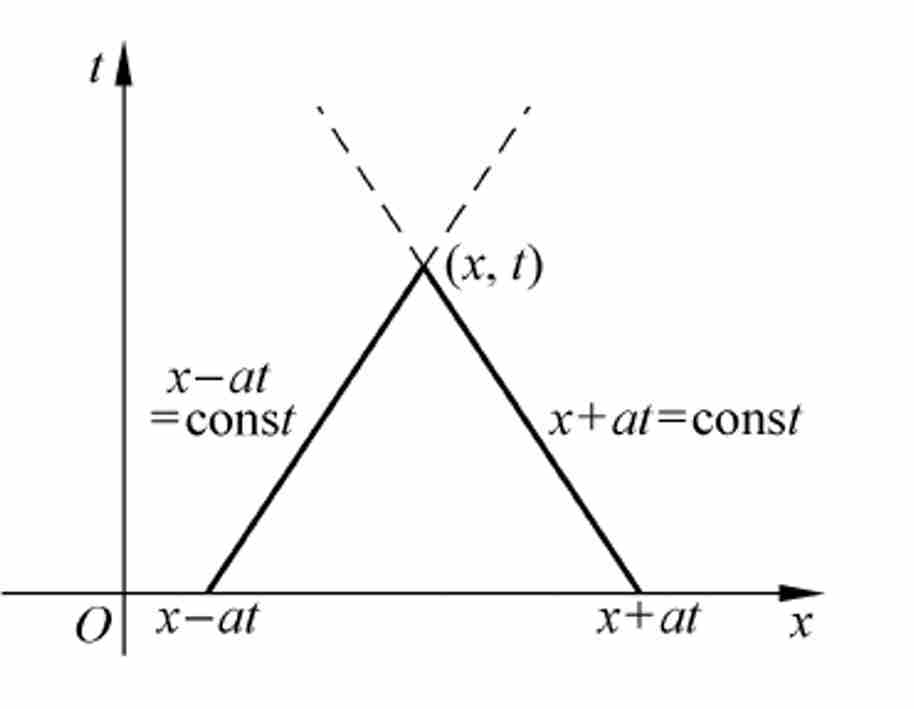

## 第四节 二阶双曲型方程

### 1 波动方程与特征线

波动方程的初值问题：

$$
\left\{ \begin{array}{l l} \frac {\partial^ {2} u}{\partial t ^ {2}} - a ^ {2} \frac {\partial^ {2} u}{\partial x ^ {2}} = 0 & a > 0, x \in R, t \in (0, T ] \\ u (x, 0) = f (x) & x \in R \\ \frac {\partial u}{\partial t} (x, 0) = g (x) & x \in R \end{array} \right.
$$

相应的特征方程为: $(\mathrm d x)^2 - a^{2}(\mathrm d t)^2 = 0$ , 利用特征方向可以得到两族特征线: $x - at = \xi, x + at = \eta$

如果 $u$ 沿特征线的偏导数分别表示为:

$$
\frac {\partial^ {2} u}{\partial t ^ {2}} = \frac {\partial}{\partial t} \left(\frac {\partial u}{\partial \xi} \frac {\partial \xi}{\partial t} + \frac {\partial u}{\partial \eta} \frac {\partial \eta}{\partial t}\right) = a ^ {2} \left(\frac {\partial^ {2} u}{\partial \xi^ {2}} - 2 \frac {\partial^ {2} u}{\partial \xi \partial \eta} + \frac {\partial^ {2} u}{\partial \eta^ {2}}\right)
$$

$$
\frac {\partial^ {2} u}{\partial x ^ {2}} = \frac {\partial}{\partial x} \left(\frac {\partial u}{\partial \xi} \frac {\partial \xi}{\partial x} + \frac {\partial u}{\partial \eta} \frac {\partial \eta}{\partial x}\right) = \frac {\partial^ {2} u}{\partial \xi^ {2}} + 2 \frac {\partial^ {2} u}{\partial \xi \partial \eta} + \frac {\partial^ {2} u}{\partial \eta^ {2}}
$$

从原微分方程可以得到 $\frac{\partial^2 u}{\partial \xi \partial \eta} = 0,$ 

方程的通解形式：

$$
u (x, t) = f _ {1} (\xi) + g _ {1} (\eta) = f _ {1} (x - a t) + g _ {1} (x + a t)
$$

如果考虑初始条件: $u(x, 0) = f(x), \frac{\partial u}{\partial t}(x, 0) = g(x)$ 

则其解析解为:

$$
u (x, t) = \frac {1}{2} [ f (x + a t) + f (x - a t) ] + \frac {1}{2 a} \int_ {x - a t} ^ {x + a t} g (\xi) d \xi
$$

直线族 $x - at = \text{const}, x + at = \text{const}$ 是方程的两族特征线,

#### 化为等价一阶齐次方程组

对于原二阶波动方程: $\frac{\partial^2 u}{\partial t^2} - a^2 \frac{\partial^2 u}{\partial x^2} = 0$ 

引人: $v = \frac{\partial u}{\partial t}, w = a \frac{\partial u}{\partial x}$ 

则方程化为:

$$
\left\{ \begin{array}{l} \frac {\partial v}{\partial t} - a \frac {\partial w}{\partial x} = 0 \\ \frac {\partial w}{\partial t} - a \frac {\partial v}{\partial x} = 0 \end{array} \right.
$$

如果令: $\vec{u} = (v,w)^T$ 

上述方程组可以写成 $\frac{\partial \vec{u}}{\partial t} + A \frac{\partial \vec{u}}{\partial x} = 0$ 

其中： $A = \left( \begin{array}{rr}0 & -a\\ -a & 0 \end{array} \right)$ 

由 $|\lambda I - A| = \lambda^2 - a^2 = 0$ 得**实**特征值 $\lambda_{1} = a,\ \lambda_{2} = -a$（互异，故为严格双曲型；若为纯虚数则对应椭圆型，Cauchy 问题 Hadamard 不适定）。取 $S = \begin{pmatrix} 1 & 1 \\ -1 & 1 \end{pmatrix}$ ，则

$$
S ^ {- 1} = \frac {1}{2} \left( \begin{array}{r r} 1 & - 1 \\ 1 & 1 \end{array} \right), \qquad \Lambda = S ^ {- 1} A S = \left( \begin{array}{c c} a & 0 \\ 0 & - a \end{array} \right)
$$

故 $A$ 是严格双曲型的，第二节中方法可用。

### 2 波动方程的差分格式

**显式格式**

可以简单的用二阶中心差商近似方程：

$$
\frac {u _ {j} ^ {n + 1} - 2 u _ {j} ^ {n} + u _ {j} ^ {n - 1}}{\tau^ {2}} - a ^ {2} \frac {u _ {j + 1} ^ {n} - 2 u _ {j} ^ {n} + u _ {j - 1} ^ {n}}{h ^ {2}} = 0
$$

这是一个二阶格式。称为显式差分格式。

**初始条件的离散**

此时边界条件也应作二阶离散。

可设： $\left\{ \begin{array}{l} \boldsymbol{u}_j^0 = \boldsymbol{f}_j = \boldsymbol{f}(\boldsymbol{x}_j) \\ \frac{\boldsymbol{u}_j^1 - \boldsymbol{u}_j^{-1}}{2\tau} = \boldsymbol{g}_j \end{array} \right.$ 

其中 $\boldsymbol{u}_{j}^{-1}$ 是虚构的。

$$
\text {但 有} \frac {u _ {j} ^ {1} - u _ {j} ^ {- 1}}{2 \tau} = \left[ \frac {\partial u}{\partial t} \right] _ {j} ^ {n} + O \left(\tau^ {2}\right)
$$

在差分方程中，令 $\mathbf{n} = \mathbf{0}$ ，得：

$$
\frac {\boldsymbol {u} _ {j} ^ {1} - 2 \boldsymbol {u} _ {j} ^ {0} + \boldsymbol {u} _ {j} ^ {- 1}}{\tau^ {2}} - \boldsymbol {a} ^ {2} \frac {\boldsymbol {u} _ {j + 1} ^ {0} - 2 \boldsymbol {u} _ {j} ^ {0} + \boldsymbol {u} _ {j - 1} ^ {0}}{\boldsymbol {h} ^ {2}}
$$

与 $\frac{\mathbf{u}_{j}^{1} - \mathbf{u}_{j}^{-1}}{2 \tau} = \mathbf{g}_{j}$ 联立, 得

$$
u _ {j} ^ {1} = \frac {1}{2} a ^ {2} \lambda^ {2} \left(f _ {j - 1} + f _ {j + 1}\right) + \left(1 - a ^ {2} \lambda^ {2}\right) f _ {j} + \tau g _ {j} \quad \lambda = \frac {\tau}{h}
$$

故有差分方程：

$$
\left\{ \begin{array}{l} u _ {j} ^ {n + 1} = a ^ {2} \lambda^ {2} \left(u _ {j + 1} ^ {n} - 2 u _ {j} ^ {n} + u _ {j - 1} ^ {n}\right) + 2 u _ {j} ^ {n} - u _ {j} ^ {n - 1} \\ u _ {j} ^ {1} = \frac {1}{2} a ^ {2} \lambda^ {2} \left(f _ {j - 1} + f _ {j + 1}\right) + \left(1 - a ^ {2} \lambda^ {2}\right) f _ {j} + \tau g _ {j} \end{array} \right. \quad n \geq 1
$$

下面进行稳定性分析：

**三层格式化为二层方程组与稳定性**

令: $w_{j}^{n} = u_{j}^{n - 1}, \vec{U}_{j}^{n} = \left(u_{j}^{n}, w_{j}^{n}\right)^{T}$ 

将差分格式写成矩阵形式，有：

$$
\vec {U} _ {j} ^ {n + 1} = \left( \begin{array}{c c} 2 \left(1 - a ^ {2} \lambda^ {2}\right) & - 1 \\ 1 & 0 \end{array} \right) \vec {U} _ {j} ^ {n} + \left( \begin{array}{c c} a ^ {2} \lambda^ {2} & 0 \\ 0 & 0 \end{array} \right) \vec {U} _ {j + 1} ^ {n} + \left( \begin{array}{c c} a ^ {2} \lambda^ {2} & 0 \\ 0 & 0 \end{array} \right) \vec {U} _ {j - 1} ^ {n}
$$

那么增长矩阵为：

$$
G (\lambda , k) = \left( \begin{array}{c c} 2 - 4 a ^ {2} \lambda^ {2} \sin^ {2} \frac {k h}{2} & - 1 \\ 1 & 0 \end{array} \right)
$$

特征值

$$
\mu_ {1, 2} = 1 - 2 a ^ {2} \lambda^ {2} \sin^ {2} {\frac {k h}{2}} \pm \sqrt {\left(a ^ {2} \lambda^ {2} \sin^ {2} {\frac {k h}{2}} - 1\right) 4 a ^ {2} \lambda^ {2} \sin^ {2} {\frac {k h}{2}}}
$$

当 $|a \lambda| \leq 1$ 时, $\left|\mu_{1,2}\right| = 1$ 

**结论（von Neumann 与边界情形）**：

当 $|a\lambda|<1$ 时，格式稳定。当 $|a\lambda|=1$ 时，放大因子模长仍为 $1$，但增长矩阵在部分波数下可出现**不可对角化的若当块**，误差可能呈 **$O(t)$ 的线性弱不稳定**。不少教材仍把显式格式的实用稳定域写成闭区间 $|a\lambda|\le 1$，需结合上述边界现象理解。

**隐式差分格式**

在节点 $\left(x_{i}, t_{k}\right)$ 处考虑微分方程, 有

$$
\frac {\partial^ {2} u}{\partial t ^ {2}} \left(x _ {i}, t _ {k}\right) - a ^ {2} \frac {\partial^ {2} u}{\partial x ^ {2}} \left(x _ {i}, t _ {k}\right) = 0
$$

$$
\begin{array}{l} \frac {\partial^ {2} u}{\partial x ^ {2}} \left(x _ {i}, t _ {k}\right) = \frac {1}{2} \left(\frac {\partial^ {2} u}{\partial x ^ {2}} \left(x _ {i}, t _ {k - 1}\right) + \frac {\partial^ {2} u}{\partial x ^ {2}} \left(x _ {i}, t _ {k + 1}\right)\right) \\ - \frac {\tau^ {2}}{2} \frac {\partial^ {4} u}{\partial x ^ {2} \partial t ^ {2}} (x _ {i}, \zeta_ {k}) \\ \end{array}
$$

于是有 $\frac{\partial^2 u}{\partial t^2}\left(x_i, t_k\right) - \frac{1}{2} a^2\left(\frac{\partial^2 u}{\partial x^2}\left(x_i, t_{k-1}\right) + \frac{\partial^2 u}{\partial x^2}\left(x_i, t_{k+1}\right)\right)$ 

$$
= - \frac {\left(a \tau\right) ^ {2}}{2} \frac {\partial^ {4} u}{\partial x ^ {2} \partial t ^ {2}} \left(x _ {i}, \quad \zeta_ {k}\right)
$$

**由中心差商得到的离散格式**

(1) $\frac{u_{j}^{n+1} - 2u_{j}^{n} + u_{j}^{n-1}}{\tau^{2}} - \frac{1}{2}a^{2}\left(\frac{u_{j+1}^{n-1} - 2u_{j}^{n-1} + u_{j-1}^{n-1}}{h^{2}} + \frac{u_{j+1}^{n+1} - 2u_{j}^{n+1} + u_{j-1}^{n+1}}{h^{2}}\right) = 0$ 

截断误差为: $R_{j}^{n} = \tau^{2}\left(\frac{1}{12} \frac{\partial^{4} u}{\partial t^{4}}\left(x_{i}, \eta_{k}\right) - \frac{1}{2} \frac{\partial^{4} u}{\partial x^{2} \partial t^{2}}\left(x_{i}, \zeta_{k}\right)\right)$ 

$$
- h ^ {2} \frac {a ^ {2}}{24} \bigg( \frac {\partial^ {4} u}{\partial x ^ {4}} (\xi_ {i}, t _ {k - 1}) + \frac {\partial^ {4} u}{\partial x ^ {4}} (\rho_ {i}, t _ {k + 1}) \bigg)
$$

差分求解格式为

$$
u _ {j} ^ {n + 1} - 2 u _ {j} ^ {n} + u _ {j} ^ {n - 1} - \frac {\lambda^ {2}}{2} \left(u _ {j + 1} ^ {n - 1} - 2 u _ {j} ^ {n - 1} + u _ {j - 1} ^ {n - 1} + u _ {j + 1} ^ {n + 1} - 2 u _ {j} ^ {n + 1} + u _ {j - 1} ^ {n + 1}\right) = 0
$$

**矩阵表示形式**

$$
A U ^ {n + 1} = B U ^ {n - 1} + 2 E U ^ {n} + F
$$

其中

$$
A = \left( \begin{array}{c c c c c} 1 + \lambda^ {2} & - \frac {1}{2} \lambda^ {2} & & & \\ - \frac {1}{2} \lambda^ {2} & 1 + \lambda^ {2} & - \frac {1}{2} \lambda^ {2} & & \\ & \ddots & \ddots & \ddots & \\ & & - \frac {1}{2} \lambda^ {2} & 1 + \lambda^ {2} & - \frac {1}{2} \lambda^ {2} \\ & & & - \frac {1}{2} \lambda^ {2} & 1 + \lambda^ {2} \end{array} \right)
$$

$$
B = \left( \begin{array}{c c c c} - (1 + \lambda^ {2}) & \frac {1}{2} \lambda^ {2} & & \\ \frac {1}{2} \lambda^ {2} & - (1 + \lambda^ {2}) & \frac {1}{2} \lambda^ {2} & \\ & \ddots & \ddots & \ddots \\ & & \frac {1}{2} \lambda^ {2} & - (1 + \lambda^ {2}) \\ & & & \frac {1}{2} \lambda^ {2} \end{array} \right)
$$

$$
F ^ {T} = (\frac {1}{2} \lambda^ {2} (u _ {0} ^ {n - 1} + u _ {0} ^ {n + 1}) + 2 u _ {0} ^ {n} + \tau^ {2} f _ {1} ^ {k}, 2 f _ {2} ^ {n}, \dots , 2 f _ {m - 2} ^ {n},
$$

$$
\frac {1}{2} \lambda^ {2} (u _ {m} ^ {n - 1} + u _ {m} ^ {n + 1}) + 2 u _ {m - 1} ^ {n + 1} + \tau^ {2} f _ {m} ^ {n})
$$

#### 加权隐式格式

$$
\begin{array}{l} \frac {u _ {j} ^ {n + 1} - 2 u _ {j} ^ {n} + u _ {j} ^ {n - 1}}{\tau^ {2}} = a ^ {2} \left[ \theta \frac {u _ {j + 1} ^ {n - 1} - 2 u _ {j} ^ {n - 1} + u _ {j - 1} ^ {n - 1}}{h ^ {2}} \right. \\ \left. + \left(1 - 2 \theta\right) \frac {u _ {j + 1} ^ {n} - 2 u _ {j} ^ {n} + u _ {j - 1} ^ {n}}{h ^ {2}} + \theta \frac {u _ {j + 1} ^ {n + 1} - 2 u _ {j} ^ {n + 1} + u _ {j - 1} ^ {n + 1}}{h ^ {2}} \right] \\ \end{array}
$$

截断误差为: $R_{ij}(h, \tau) = \left(\frac{\tau^2 a^4}{12} - \frac{h^2}{12} - \theta \tau^2 a^2\right) \frac{\partial^4 u}{\partial x^4}\left(x_i, t_j\right)$ 

$$
+ O \left(\tau^ {4} + \tau^ {2} h ^ {2} + h ^ {4}\right)
$$

$$
R _ {i j} (h, \tau) = \left\{ \begin{array}{l l} O (\tau^ {2} + h ^ {2}) & \theta \neq \frac {1}{12} \big( 1 + \big( \frac {h}{a \tau} \big) ^ {2} \big) \\ O (\tau^ {4} + h ^ {4}) & \theta = \frac {1}{12} \big( 1 + \big( \frac {h}{a \tau} \big) ^ {2} \big) \end{array} \right.
$$

当参数为0的时就是显式格式，实际上有兴趣的参数是1/4的时候，如下

$$
\begin{array}{l} \frac {u _ {j} ^ {n + 1} - 2 u _ {j} ^ {n} + u _ {j} ^ {n - 1}}{\tau^ {2}} = \frac {1}{4} a ^ {2} \left(\frac {u _ {j + 1} ^ {n - 1} - 2 u _ {j} ^ {n - 1} + u _ {j - 1} ^ {n - 1}}{h ^ {2}} \right. \\ + 2 \frac {u _ {j + 1} ^ {n} - 2 u _ {j} ^ {n} + u _ {j - 1} ^ {n}}{h ^ {2}} + \frac {u _ {j + 1} ^ {n + 1} - 2 u _ {j} ^ {n + 1} + u _ {j - 1} ^ {n + 1}}{h ^ {2}}) \\ \end{array}
$$

加权格式的稳定性分析，可以证明：

(1) 当 $\theta \geq \frac{1}{4}$ 时, 它是无条件稳定的。

(2) 当 $0 \leq \theta < \frac{1}{4}$ 时，记 Courant 数 $r=a\tau/h$，格式稳定的充要条件为：

$$
r < \frac {1}{\sqrt {1 - 4 \theta}}
$$

### 3 二阶方程的 Courant 条件

对于方程 $\frac{\partial^2 u}{\partial t^2} = a^2 \frac{\partial^2 u}{\partial x^2}$ , 相应的差分格式为: $L_h U = 0$ 若第 $n$ 层的计算值, 依赖于第 $0$ 层的 $u_{j-m}^0, u_{j-m+1}^0, \ldots, u_{j+l}^0$ ，则区间 $[x_{j-m}, x_{j+l}]$ 称为 $u_j^n$ 的数值依赖区间。那么,

经过点 $\left(x_{j}, t_{n}\right)$ 的两条特征线 $x \pm a t = x_{j} \pm a t_{n}$ 与 $x$ 轴交点落入依赖区间 $\left[x_{j-m}, x_{j+l}\right]$ 是格式稳定的必要条件。

$$
\text {即} \left[ x _ {j} - a t _ {n}, x _ {j} + a t _ {n} \right] \in \left[ x _ {j - m}, x _ {j + l} \right]
$$

#### 显式格式的 CFL 条件

差分方程解的依赖区域:

$$
x _ {j - n}, x _ {j - n + 1}, \ldots , x _ {j + n}
$$

微分方程解的依赖区域:

$$
[ x _ {j} - a t _ {n}, x _ {j} + a t _ {n} ]
$$

CFL 条件（必要）: $|a \lambda| \leq 1$ 

与 von Neumann 分析一致：严格内需 $|a\lambda|<1$；$|a\lambda|=1$ 处常有**线性弱不稳定**（见 **2** 中显式二层化分析），但文献也常把可计算的稳定域写成 **$|a\lambda|\le 1$**。

注：CFL 条件是稳定性的必要条件。

### 4 等价一阶齐次方程组的差分格式

对于原二阶波动方程: $\frac{\partial^2 u}{\partial t^2} - a^2 \frac{\partial^2 u}{\partial x^2} = 0$ 

引人: $v = \frac{\partial u}{\partial t}, w = a \frac{\partial u}{\partial x}$ 

则方程化为:

$$
\left\{ \begin{array}{l} \frac {\partial  v}{\partial t} - a \frac {\partial w}{\partial x} = 0 \\ \frac {\partial w}{\partial t} - a \frac {\partial v}{\partial x} = 0 \end{array} \right.
$$

如果令: $\vec{u} = (v,w)^T$ 

上述方程组可以写成 $\frac{\partial \vec{u}}{\partial t} + A \frac{\partial \vec{u}}{\partial x} = 0$ 

其中： $A = \begin{pmatrix} 0 & -a \\ -a & 0 \end{pmatrix}$ 

由 $|\lambda I - A| = \lambda^2 - a^2 = 0$ 得实特征值 $\lambda_{1} = a,\ \lambda_{2} = -a$，及

$$
S = \left( \begin{array}{r r} 1 & 1 \\ - 1 & 1 \end{array} \right), \qquad S ^ {- 1} = \frac {1}{2} \left( \begin{array}{r r} 1 & - 1 \\ 1 & 1 \end{array} \right), \qquad \Lambda = S ^ {- 1} A S = \left( \begin{array}{c c} a & 0 \\ 0 & - a \end{array} \right)
$$

故 $A$ 是严格双曲型的，**2** 中讨论的方法可用。

#### 显式格式

令 $\left\{ \begin{array}{l} v_{j}^{n} = \frac{u_{j}^{n} - u_{j}^{n-1}}{\tau} \\ w_{j-\frac{1}{2}}^{n} = a \frac{u_{j}^{n} - u_{j-1}^{n}}{h} \end{array} \right.$ 

将 $v$ 关于 $t$ 的偏导数用向前差商代替, $v$ 关于 $x$ 的偏导数用向后差商代替, $w$ 关于 $t$ 的偏导数用向前差商代替、$w$ 关于 $x$ 的偏导数用中心差商代替。于是有

$$
\left\{ \begin{array}{l} \frac {v _ {j} ^ {n + 1} - v _ {j} ^ {n}}{\tau} = a \frac {w _ {j + \frac {1}{2}} ^ {n} - w _ {j - \frac {1}{2}} ^ {n}}{h} \\ \frac {w _ {j - \frac {1}{2}} ^ {n + 1} - w _ {j - \frac {1}{2}} ^ {n}}{\tau} = a \frac {v _ {j} ^ {n + 1} - v _ {j - 1} ^ {n + 1}}{h} \end{array} \right.
$$

交错网格下，$v$ 在整点 $x_j$、$w$ 在半整点 $x_{j-1/2}$，Fourier 模态应保留半步相位差：

$$
\left( \begin{array}{l} v_{j}^{n} \\ w _ {j - \frac {1}{2}} ^ {n} \end{array} \right) = \left( \begin{array}{l} \alpha_{n} e ^ {i k j h} \\ \beta_ {n} e ^ {i k (j - \frac {1}{2}) h} \end{array} \right)
$$

代入格式得传播关系 $\begin{pmatrix}\alpha_{n+1}\\\beta_{n+1}\end{pmatrix} = G \begin{pmatrix}\alpha_{n}\\\beta_{n}\end{pmatrix}$（$G=G(\lambda,k)$），其中网格比 $\lambda=\tau/h$，并记 $c = 2a\lambda\sin\frac{kh}{2}$：计算可得放大因子特征值为

$$
\mu_ {1, 2} = \frac {2 - c ^ {2} \pm i c \sqrt {4 - c ^ {2}}}{2}
$$

(1) 当 $|a \lambda| < 1$ 时格式稳定；

(2) 当 $|a \lambda| = 1$ 时，$|\mu|=1$ 但可出现若当型的**线性弱不稳定**（同 **2** 中讨论）；教材亦常写闭区间 $|a\lambda|\le 1$ 作为实用条件。

#### 隐式格式

为了得到绝对稳定的格式,将显式格式的空间差分用2个时间层的值进行平均加权.得到新的格式.

$$
\left[ \frac {v_ {j} ^ {n + 1} - v_ {j} ^ {n}}{\tau} = a \frac {w _ {j + \frac {1}{2}} ^ {n} - w _ {j - \frac {1}{2}} ^ {n} + w _ {j + \frac {1}{2}} ^ {n + 1} - w _ {j - \frac {1}{2}} ^ {n + 1}}{2 h} \right]
$$

$$
\frac {w _ {j - \frac {1}{2}} ^ {n + 1} - w _ {j - \frac {1}{2}} ^ {n}}{\tau} = a \frac {v_ {j} ^ {n + 1} - v_ {j - 1} ^ {n + 1} + v_ {j} ^ {n} - v_ {j - 1} ^ {n}}{2 h}
$$

$$
\left[ v _ {j} ^ {n} = \frac {\mathcal {U} _ {j} ^ {n} - \mathcal {U} _ {j} ^ {n - 1}}{\tau} \right.
$$

令

$$
w _ {j - \frac {1}{2}} ^ {n} = \frac {a}{2} \left(\frac {u _ {j} ^ {n} - u _ {j - 1} ^ {n}}{h} + \frac {u _ {j} ^ {n - 1} - u _ {j - 1} ^ {n - 1}}{h}\right)
$$

$\theta = \frac{1}{4}$ 隐式格式

它的传播矩阵为：

$$
G (\lambda , k) = \frac {1}{1 + \frac {c ^ {2}}{4}} \left( \begin{array}{c c} 1 - \frac {c ^ {2}}{4} & i c \\ i c & 1 - \frac {c ^ {2}}{4} \end{array} \right)
$$

其中 $c = 2a\lambda \sin \frac{kh}{2}$ 

因为有 $G^{\mathrm H}(\lambda, k)\, G(\lambda, k) = I$，于是 $G(\lambda, k)$ 为酉矩阵，因此格式绝对稳定。

#### Lax-Friedrichs 格式

$$
\frac {\bar {u} _ {j} ^ {n + 1} - \frac {1}{2} \left(\bar {u} _ {j + 1} ^ {n} + \bar {u} _ {j - 1} ^ {n}\right)}{\tau} + A \frac {\bar {u} _ {j + 1} ^ {n} - \bar {u} _ {j - 1} ^ {n}}{2 h} = 0
$$

具体地 $\left\{ \begin{array}{l} \frac {v _ {j} ^ {n + 1} - \frac {1}{2} \left(v _ {j + 1} ^ {n} + v _ {j - 1} ^ {n}\right)}{\tau} - a \frac {w _ {j + 1} ^ {n} - w _ {j - 1} ^ {n}}{2 h} = 0 \\ \frac {w _ {j} ^ {n + 1} - \frac {1}{2} \left(w _ {j + 1} ^ {n} + w _ {j - 1} ^ {n}\right)}{\tau} - a \frac {v _ {j + 1} ^ {n} - v _ {j - 1} ^ {n}}{2 h} = 0 \end{array} \right.$ 

传播矩阵为（各向一致的记号） $G(\lambda, k) = \left( \begin{array}{cc} \cos kh & ia\lambda \sin kh \\ ia\lambda \sin kh & \cos kh \end{array} \right)$ 

它的一对特征根为：

$$
\begin{array}{l} \mu_ {1, 2} = \cos kh \pm i a \lambda \sin kh, \\ | \mu_ {1, 2} | ^ 2 = \cos^ {2} kh + \left(a \lambda \sin kh\right) ^ {2} = 1 - \big( 1 - a ^ {2} \lambda^ {2}\big)\sin^{2}kh \\ \end{array}
$$

很显然，当 $|a \lambda| \leq 1$ 时 von Neumann 意义下 $|\mu|\le 1$；在 $|a\lambda|=1$ 时仍须注意可能出现的**线性弱不稳定**（与前述显式二层格式一致）。

#### Lax--Wendroff 格式

$$
\begin{array}{l} v _ {j} ^ {n + 1} = v _ {j} ^ {n} + \frac {1}{2} a \lambda \left(w _ {j + 1} ^ {n} - w _ {j - 1} ^ {n}\right) \\ + \frac {1}{2} a ^ {2} \lambda^ {2} \left(v _ {j + 1} ^ {n} - 2 v _ {j} ^ {n} + v _ {j - 1} ^ {n}\right) \\ \end{array}
$$

$$
\begin{array}{l} w _ {j} ^ {n + 1} = w _ {j} ^ {n} + \frac {1}{2} a \lambda \left(v _ {j + 1} ^ {n} - v _ {j - 1} ^ {n}\right) \\ + \frac {1}{2} a ^ {2} \lambda^ {2} \left(w _ {j + 1} ^ {n} - 2 w _ {j} ^ {n} + w _ {j - 1} ^ {n}\right) \\ \end{array}
$$

（上述黏性项与 $\frac{\tau^2}{2} A^2 U_{xx}$ 一致：$A^2 = a^2 I$，故 $v$、$w$ 的二阶差分各自只与自身耦合。）

它的传播矩阵为（一阶项用全步长 $\sin(kh)$；对角块仍可用半角记号 $c=a\lambda\sin\frac{kh}{2}$，注意 $a\lambda\sin(kh)=2c\cos\frac{kh}{2}$）：

$$
G (\lambda , k) = \left( \begin{array}{c c} 1 - 2 c ^ {2} & i a \lambda \sin (k h) \\ i a \lambda \sin (k h) & 1 - 2 c ^ {2} \end{array} \right), \quad c = a \lambda \sin \frac {k h}{2}
$$

它的一对特征根为：

$$
\begin{array}{l} \mu_ {1, 2} = 1 - 2 c ^ {2} \pm i a \lambda \sin (k h), \\ | \mu_ {1, 2} | = \sqrt {1 - 4 a ^ {2} \lambda^ {2} \big( 1 - a ^ {2} \lambda^ {2} \big) \sin^ {4} \frac {k h}{2}} \\ \end{array}
$$

当 $|a \lambda| \leq 1$ 时 von Neumann 意义下稳定；$|a\lambda|=1$ 时同样存在弱不稳定可能，许多教材仍将实用条件写为闭区间 $|a\lambda|\le 1$。