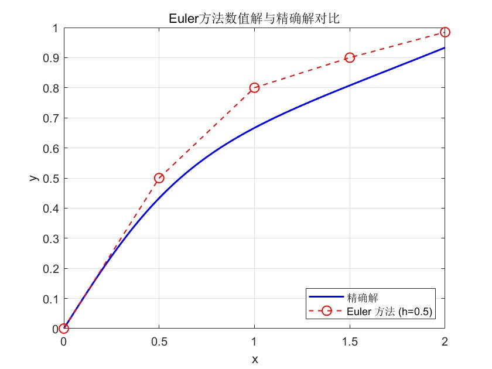
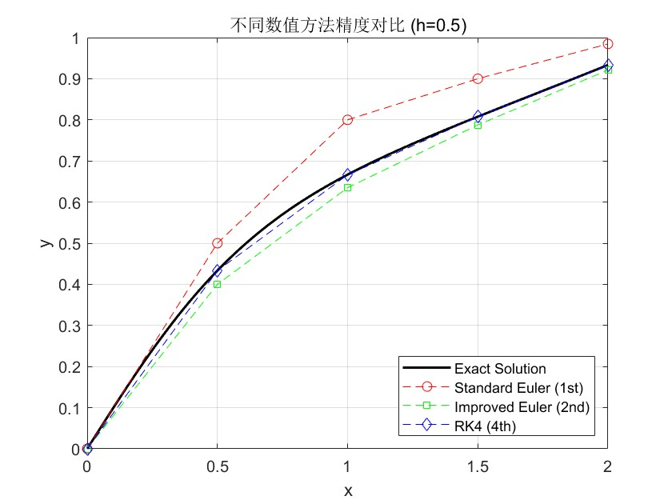
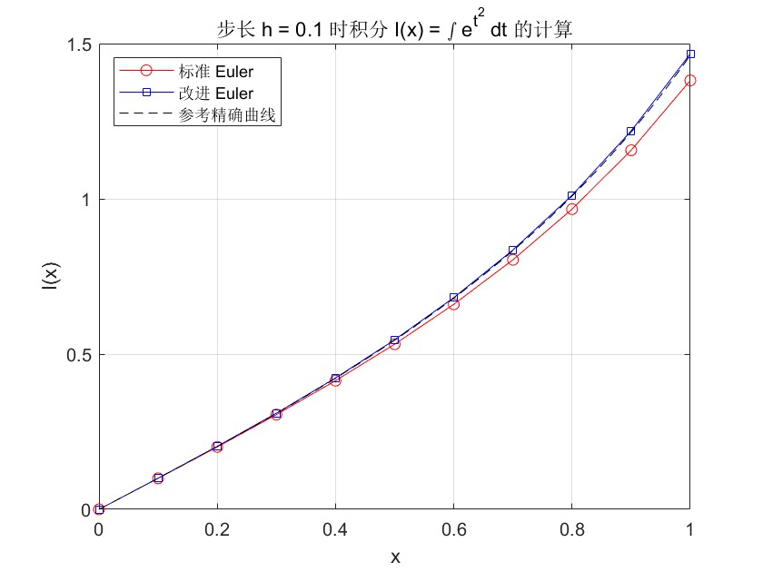
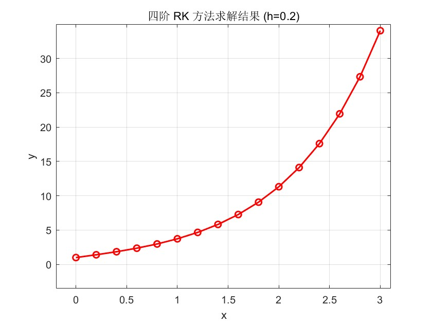

# 常微分方程数值解法

## 第九章：常微分方程初值问题

### 9.1 基本概念与Euler方法

#### 9.1.1 问题描述
考虑一阶常微分方程初值问题：
$$
\begin{cases} 
\frac{dy}{dx} = f(x, y(x)) \\ 
y(a) = y_0 
\end{cases}
$$

**定理** 设 $f(x,y)$ 连续，且关于y满足Lipschitz条件，若初值问题解为 $y(x,y_0)$ 则
$$
|y(x,y_1)-y(x,y_2)| \leq e^{L|x-a|}|y_1-y_2|
$$

#### 9.1.2 离散方法
基本思路：<span style="background-color:rgb(11, 239, 26);padding:2px 5px;">差商近似导数，数值积分，Taylor展开</span>

**向前Euler公式**（显式）：
$$
y_{n+1} = y_n + h f(x_n, y_n), \quad n=0,1,2,\ldots
$$

**向后Euler公式**（隐式）：
$$
y_{n+1} = y_n + h f(x_{n+1}, y_{n+1}), \quad n=0,1,2,\ldots
$$

**梯形公式**：
$$
y_{n+1} = y_n + \frac{h}{2}[f(x_n, y_n) + f(x_{n+1}, y_{n+1})]
$$

#### 9.1.3 改进Euler法（预测-校正系统）
$$
\begin{cases}
\bar{y}_{n+1} = y_n + h f(x_n, y_n) \quad \text{(predictor)} \\
y_{n+1} = y_n + \frac{h}{2}[f(x_n, y_n) + f(x_{n+1}, \bar{y}_{n+1})] \quad \text{(corrector)}
\end{cases}
$$

#### 9.1.4 误差分析
**定义** 局部截断误差：$R_{n+1} = y(x_{n+1}) - \bar{y}_{n+1}$

**定义** 整体截断误差：$e_{n+1} = y(x_{n+1}) - y_{n+1}$

**定义** 若某种数值方法的局部截断误差 $R_{n+1} = O(h^{p+1})$，则称该方法是p阶方法。

Euler方法为一阶方法，局部截断误差：$R_{n+1} = \frac{h^2}{2} y''(x_n) + O(h^3)$

### 9.2 Runge-Kutta法

#### 9.2.1 基本思想
以函数 $f(x,y)$ 在若干点上函数值的线性组合代替 $y'(x)$。

一般形式：$y_{n+1} = y_n + h \varphi(x_n, y_n, h)$
其中 $\varphi = c_1 K_1 + c_2 K_2 + \cdots + c_p K_p$

#### 9.2.2 二阶Runge-Kutta公式
改进Euler公式（也是二阶RK公式）：
$$
\begin{cases}
K_1 = f(x_n, y_n) \\
K_2 = f(x_n + h, y_n + h K_1) \\
y_{n+1} = y_n + \frac{h}{2}(K_1 + K_2)
\end{cases}
$$

中点公式：
$$
\begin{cases}
K_1 = f(x_n, y_n) \\
K_2 = f\left(x_n + \frac{h}{2}, y_n + \frac{h}{2} K_1\right) \\
y_{n+1} = y_n + h K_2
\end{cases}
$$

#### 9.2.3 经典四阶Runge-Kutta公式
$$
\begin{cases}
K_1 = f(x_n, y_n) \\
K_2 = f\left(x_n + \frac{h}{2}, y_n + \frac{h}{2} K_1\right) \\
K_3 = f\left(x_n + \frac{h}{2}, y_n + \frac{h}{2} K_2\right) \\
K_4 = f(x_n + h, y_n + h K_3) \\
y_{n+1} = y_n + \frac{h}{6}(K_1 + 2K_2 + 2K_3 + K_4)
\end{cases}
$$

**注**：4阶RK公式是应用最广泛的单步法之一。

### 9.3 线性多步法

#### 9.3.1 一般形式
$$
\sum_{i=0}^r \alpha_i y_{n-i} = h \sum_{i=0}^r \beta_i f_{n-i}
$$
其中 $f_{n-i} = f(x_{n-i}, y_{n-i})$

若 $\beta_{-1} = 0$ 为显式公式，$\beta_{-1} \neq 0$ 为隐式公式。

#### 9.3.2 常用线性多步公式

**四阶Adams显式公式**：
$$
y_{n+1} = y_n + \frac{h}{24}(55f_n - 59f_{n-1} + 37f_{n-2} - 9f_{n-3})
$$
局部截断误差：$R_{n+1} = \frac{251}{720} h^5 y^{(5)}(x_n) + O(h^6)$

**四阶Adams隐式公式**：
$$
y_{n+1} = y_n + \frac{h}{24}(9f_{n+1} + 19f_n - 5f_{n-1} + f_{n-2})
$$
局部截断误差：$R_{n+1} = -\frac{19}{720} h^5 y^{(5)}(x_n) + O(h^6)$

**Milne公式**（显式）：
$$
y_{n+1} = y_{n-3} + \frac{4h}{3}(2f_n - f_{n-1} + 2f_{n-2})
$$

**Hamming公式**（隐式）：
$$
y_{n+1} = \frac{1}{8}(9y_n - y_{n-2}) + \frac{3h}{8}(f_{n+1} + 2f_n - f_{n-1})
$$

#### 9.3.3 预测-校正系统
Adams预测-校正公式：
$$
\begin{cases}
\bar{y}_{n+1} = y_n + \frac{h}{24}(55f_n - 59f_{n-1} + 37f_{n-2} - 9f_{n-3}) \quad \text{(预测)} \\
y_{n+1} = y_n + \frac{h}{24}(9f(x_{n+1}, \bar{y}_{n+1}) + 19f_n - 5f_{n-1} + f_{n-2}) \quad \text{(校正)}
\end{cases}
$$

### 9.4 相容性、收敛性与稳定性

#### 9.4.1 相容性与收敛性
**相容性**：如果增量函数 $\varphi(x,y,h)$ 关于 $h$ 连续且满足
$$
\lim_{h \to 0} \varphi(x,y,h) = f(x,y)
$$
则称差分方程与原方程相容。

**收敛性**：如果某种数值方法对任意 $x \in [a,b]$，当 $h \to 0$ 时都有 $y_n \to y(x)$，则称该数值方法是收敛的。

**定理**：若单步法具有 $p(\ge 1)$ 阶精度，其增量函数关于 $y$ 满足Lipschitz条件，则单步法的整体截断误差为 $e_{n+1} = y(x_{n+1}) - y_{n+1} = O(h^p)$。

#### 9.4.2 稳定性
考虑试验方程：$y' = \lambda y$，$\lambda$ 可为复数。

**绝对稳定**：若算法在计算过程中任一步产生的误差在以后的计算中都逐步衰减，则称该算法是绝对稳定的。

当步长取 $h$ 时，将某算法应用于试验方程，假设 $y_n$ 有误差 $\delta$，若此误差以后逐步衰减，则称该算法相对于 $\bar{h} = \lambda h$ 绝对稳定，$\bar{h}$ 的全体构成稳定区域。

**A-稳定**：若绝对稳定区域包含左半平面，则称是A-稳定的。

##### 各种方法的绝对稳定区域：
1. **显式Euler法**：$|1 + \lambda h| \le 1$
2. **隐式Euler法**：$|1 - \lambda h| \ge 1$
3. **改进Euler法**：$\left|1 + \lambda h + \frac{(\lambda h)^2}{2}\right| \le 1$
4. **梯形公式**：$\left|\frac{1 + \lambda h/2}{1 - \lambda h/2}\right| \le 1$（A-稳定）
5. **四阶RK法**：$\left|1 + \lambda h + \frac{(\lambda h)^2}{2} + \frac{(\lambda h)^3}{6} + \frac{(\lambda h)^4}{24}\right| \le 1$

当 $\lambda$ 为实数时，各方法的绝对稳定区间分别为：
- Euler法：$-2 \le \lambda h \le 0$
- 改进Euler法：$-2 \le \lambda h \le 0$
- 梯形公式：$-\infty < \lambda h \le 0$（A-稳定）
- 四阶RK法：约 $-2.78 \le \lambda h \le 0$

### 9.5 一阶微分方程组和高阶微分方程的数值解法

#### 9.5.1 一阶微分方程组的数值解法
一阶微分方程组初值问题：
$$
\begin{cases}
\frac{dy_1}{dx} = f_1(x, y_1, y_2, \ldots, y_m) \\
\frac{dy_2}{dx} = f_2(x, y_1, y_2, \ldots, y_m) \\
\vdots \\
\frac{dy_m}{dx} = f_m(x, y_1, y_2, \ldots, y_m)
\end{cases}
$$
初值：$y_1(a) = y_{10}, y_2(a) = y_{20}, \ldots, y_m(a) = y_{m0}$

**向量形式**：令 $\mathbf{y} = (y_1, y_2, \ldots, y_m)^T$，$\mathbf{f} = (f_1, f_2, \ldots, f_m)^T$，则
$$
\frac{d\mathbf{y}}{dx} = \mathbf{f}(x, \mathbf{y}), \quad \mathbf{y}(a) = \mathbf{y}_0
$$

各种单步法可直接推广到向量形式。

#### 9.5.2 高阶微分方程的数值解法
高阶微分方程可化为一阶微分方程组求解。

例如，n阶微分方程：
$$
y^{(n)} = f(x, y, y', \ldots, y^{(n-1)})
$$
初值：$y(a) = \alpha_0, y'(a) = \alpha_1, \ldots, y^{(n-1)}(a) = \alpha_{n-1}$

令 $y_1 = y, y_2 = y', \ldots, y_n = y^{(n-1)}$，则化为：
$$
\begin{cases}
\frac{dy_1}{dx} = y_2 \\
\frac{dy_2}{dx} = y_3 \\
\vdots \\
\frac{dy_{n-1}}{dx} = y_n \\
\frac{dy_n}{dx} = f(x, y_1, y_2, \ldots, y_n)
\end{cases}
$$
初值：$y_1(a) = \alpha_0, y_2(a) = \alpha_1, \ldots, y_n(a) = \alpha_{n-1}$

### 9.6 MATLAB求解函数

#### 9.6.1 ode45函数
```matlab
[t, y] = ode45('fun', [t0, tn], y0)
```
其中 `fun` 为描述微分方程的函数，可用inline函数或m文件描述。

#### 9.6.2 dsolve函数（解析解）
```matlab
[y1, y2, ...] = dsolve('表达式1', '表达式2', ..., '初值1', '初值2', ...)
```

### 总结

1. **Euler方法**：简单但精度低，为一阶方法
2. **Runge-Kutta方法**：精度高，特别是四阶RK法应用广泛
3. **线性多步法**：利用前面多个点的信息，效率高但需要启动值
4. **稳定性分析**：通过试验方程分析算法的数值稳定性
5. **实际应用**：根据问题特点选择合适的方法，考虑精度、稳定性和计算效率

**关键概念**：
- 局部截断误差与整体截断误差
- 方法的阶数
- 相容性、收敛性、稳定性
- 绝对稳定区域与A-稳定性
- 预测-校正系统

### 作业
1.用Euler方法求初值问题：

$$
\begin{cases}
y'=1-\frac{2xy}{1+x^2},0\leq x\leq 2 \\
y(0)=0
\end{cases}
$$

的数值解， $h=0.5$ ，计算结果取5位小数，并与精确解 $y(x)=\frac{x(3+x^2)}{3(1+x^2)}$ 比较



2.分别用改进Euler法与四阶RK方法求解同上初值问题，并与其结果比较



3.用Euler方法与改进Euler法计算积分

$$
I(x)=\int_0^xe^{t^2}dt
$$

在 $x=1$ 的近似值， $h=0.1$ ,保留四位小数

等同问题

$$
\begin{cases}
I'(x)=e^{x^2} \\
I(0)=0
\end{cases}
$$



4.设有ODE初值问题

$$
\begin{cases}
y'=f(x,y) \\
y(x_0)=y_0
\end{cases}
$$

的二步公式

$$
y_{n+1}=y_n+\frac{h}{12}(5f_{n+!}+8f_n-f_{n-1})
$$

试求截断误差，几阶精度？

设有如下二步隐式公式（Adams-Moulton 公式）：
$$y_{n+1} = y_n + \frac{h}{12}(5f_{n+1} + 8f_n - f_{n-1})$$
其中 $f(x, y) = y'(x)$。

局部截断误差定义
局部截断误差 $T_{n+1}$ 定义为将精确解 $y(x)$ 代入差分方程所产生的残差：
$$T_{n+1} = y(x_{n+1}) - y(x_n) - \frac{h}{12}[5y'(x_{n+1}) + 8y'(x_n) - y'(x_{n-1})]$$

Taylor 展开推导
在 $x_n$ 点处对各项进行 Taylor 展开：

左侧项展开
$$y(x_{n+1}) - y(x_n) = hy'_n + \frac{h^2}{2}y''_n + \frac{h^3}{6}y'''_n + \frac{h^4}{24}y^{(4)}_n + \frac{h^5}{120}y^{(5)}_n + O(h^6)$$

导数项展开
1. **$5y'(x_{n+1})$:** $5[y'_n + hy''_n + \frac{h^2}{2}y'''_n + \frac{h^3}{6}y^{(4)}_n + \frac{h^4}{24}y^{(5)}_n + O(h^5)]$
2. **$8y'(x_n)$:** $8y'_n$
3. **$-y'(x_{n-1})$:** $-[y'_n - hy''_n + \frac{h^2}{2}y'''_n - \frac{h^3}{6}y^{(4)}_n + \frac{h^4}{24}y^{(5)}_n + O(h^5)]$

合并系数
将上述展开式代入 $T_{n+1}$ 中，按 $h$ 的幂次合并：

| 阶数 | 精确解展开系数 | 差分公式对应系数 | 差值 (误差系数) |
| :--- | :--- | :--- | :--- |
| **$h^1$** | $y'_n$ | $\frac{1}{12}(5+8-1)y'_n = y'_n$ | $0$ |
| **$h^2$** | $\frac{1}{2}y''_n$ | $\frac{1}{12}(5+1)hy''_n = \frac{1}{2}y''_n$ | $0$ |
| **$h^3$** | $\frac{1}{6}y'''_n$ | $\frac{1}{12}(\frac{5}{2}-\frac{1}{2})h^2 y'''_n = \frac{1}{6}y'''_n$ | $0$ |
| **$h^4$** | $\frac{1}{24}y^{(4)}_n$ | $\frac{1}{12}(\frac{5}{6}+\frac{1}{6})h^3 y^{(4)}_n = \frac{1}{12}y^{(4)}_n$ | $-\frac{1}{24}y^{(4)}_n$ |

- **局部截断误差 (Local Truncation Error):**
  $$T_{n+1} = -\frac{1}{24}h^4 y^{(4)}(\xi) = O(h^4)$$
- **精度阶数 (Order of Accuracy):**
  由于局部截断误差为 $O(h^{p+1})$ 时，该方法为 $p$ 阶方法。
  本公式的局部截断误差为 $O(h^4)$，因此其**精度阶数为 3 阶**。

5.试用Taylor展开构造形如

$$
y_{n+1}=y_{n-3}+h(\alpha f_n+\beta f_{n-1})
$$

的四步公式，使其具有尽可能高的阶，并写出局部截断误差

构造局部截断误差表达式
根据题目要求的公式形式：
$$y_{n+1} = y_{n-3} + h(\alpha f_n + \beta f_{n-1})$$
其局部截断误差 $T_{n+1}$ 定义为：
$$T_{n+1} = y(x_{n+1}) - y(x_{n-3}) - h[\alpha y'(x_n) + \beta y'(x_{n-1})]$$

Taylor 展开 (在 $x_n$ 处展开)
为了确定参数 $\alpha$ 和 $\beta$，我们将各项在 $x_n$ 处展开至 $h^3$ 项：

- **$y(x_{n+1})$:** $$y_n + hy'_n + \frac{h^2}{2}y''_n + \frac{h^3}{6}y'''_n + O(h^4)$$
- **$y(x_{n-3})$:** $$y_n - 3hy'_n + \frac{9h^2}{2}y''_n - \frac{9h^3}{2}y'''_n + O(h^4)$$
- **$h\alpha y'(x_n)$:** $$h\alpha y'_n$$
- **$h\beta y'(x_{n-1})$:** $$h\beta [y'_n - hy''_n + \frac{h^2}{2}y'''_n + O(h^3)] = h\beta y'_n - h^2\beta y''_n + \frac{h^3\beta}{2}y'''_n + O(h^4)$$

待定系数方程组
将上述展开式代入 $T_{n+1}$，按 $h$ 的幂次合并各项系数：

$$
\begin{aligned}
T_{n+1} = & \ (y_n - y_n) \\
& + h(1 - (-3) - \alpha - \beta)y'_n \\
& + h^2(\frac{1}{2} - \frac{9}{2} + \beta)y''_n \\
& + h^3(\frac{1}{6} - (-\frac{9}{2}) - \frac{\beta}{2})y'''_n + O(h^4)
\end{aligned}
$$

为了使公式具有尽可能高的阶，令 $h^1$ 和 $h^2$ 的系数为 0：
1. **$h^1$ 项系数：** $4 - \alpha - \beta = 0$
2. **$h^2$ 项系数：** $-4 + \beta = 0$

解得：
- **$\beta = 4$**
- **$\alpha = 0$**

局部截断误差与阶数确定
将解得的参数代入 $h^3$ 项系数：
$$C_3 = \frac{1}{6} + \frac{9}{2} - \frac{4}{2} = \frac{1+27-12}{6} = \frac{16}{6} = \frac{8}{3}$$

因此：
- **局部截断误差：** $T_{n+1} = \frac{8}{3}h^3 y'''(\xi) = O(h^3)$
- **精度阶数：** 由于局部截断误差为 $O(h^3)$，该方法具有 **2 阶精度**。

最终公式
所构造的四步显式公式为：
$$y_{n+1} = y_{n-3} + 4h f_{n-1}$$


6.写出用四阶RK方法求解问题

$$
\begin{cases}
y'''+2y''-y'-2y=e^x,0\leq x \leq 3\\
y(0)=1,y'(0)=2,y''(0)=0
\end{cases}
$$
的计算公式，取h=0.2

降阶处理（化为一阶方程组），首先将三阶方程化为一阶方程组。令向量 $\mathbf{Y} = [y_1, y_2, y_3]^T$，定义如下变量：
- $y_1 = y$
- $y_2 = y'$
- $y_3 = y''$

由原方程可得：
$$y_3' = y''' = e^x - 2y'' + y' + 2y$$

构造一阶向量微分方程：
$$\frac{d\mathbf{Y}}{dx} = \mathbf{F}(x, \mathbf{Y}) = \begin{bmatrix} y_2 \\ y_3 \\ e^x - 2y_3 + y_2 + 2y_1 \end{bmatrix}$$

初值条件为：
$$\mathbf{Y}_0 = \begin{bmatrix} 1 \\ 2 \\ 0 \end{bmatrix}$$

RK4 迭代公式
对于步长 $h=0.2$，从 $x_n$ 推进到 $x_{n+1}$ 的公式为：
$$\mathbf{Y}_{n+1} = \mathbf{Y}_n + \frac{h}{6}(\mathbf{K}_1 + 2\mathbf{K}_2 + 2\mathbf{K}_3 + \mathbf{K}_4)$$

其中：
- $\mathbf{K}_1 = \mathbf{F}(x_n, \mathbf{Y}_n)$
- $\mathbf{K}_2 = \mathbf{F}(x_n + \frac{h}{2}, \mathbf{Y}_n + \frac{h}{2}\mathbf{K}_1)$
- $\mathbf{K}_3 = \mathbf{F}(x_n + \frac{h}{2}, \mathbf{Y}_n + \frac{h}{2}\mathbf{K}_2)$
- $\mathbf{K}_4 = \mathbf{F}(x_n + h, \mathbf{Y}_n + h\mathbf{K}_3)$

