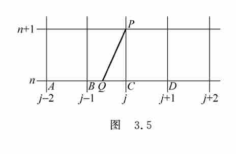

## 双曲型方程的差分格式

### 概述

考虑一阶常系数线性对流方程

$$
\begin{cases}
\frac{\partial u}{\partial t} + a \frac{\partial u}{\partial x} = 0, & -\infty < x < \infty \\[6pt]
u(x,0) = f(x)
\end{cases}
$$

设 $a>0$。特征线为 $x - at = \text{常数}$。

### 几种典型的差分格式

#### 1. 迎风格式（Upwind Scheme）

当 $a>0$ 时，

$$
\frac{u_j^{n+1} - u_j^n}{\tau} + a \frac{u_j^n - u_{j-1}^n}{h} = 0 .
$$

离散形式为

$$
u_j^{n+1} = (1 - a\lambda) u_j^n + a\lambda\, u_{j-1}^n .
$$

* **截断误差**：$O(\tau + h)$
* **稳定性条件**：$a\lambda \le 1$（CFL条件）

当 $a<0$ 时，迎风格式改为右偏。

统一形式（适用于变系数）：

$$
\frac{u_j^{n+1} - u_j^n}{\tau} + a^+ \frac{u_j^n - u_{j-1}^n}{h} + a^- \frac{u_{j+1}^n - u_j^n}{h} = 0,
$$

其中 $a^+ = \max(a,0)$，$a^- = \min(a,0)$。

#### 2. Lax–Friedrichs 格式

$$
\frac{u_j^{n+1} - \frac12(u_{j+1}^n + u_{j-1}^n)}{\tau} + a \frac{u_{j+1}^n - u_{j-1}^n}{2h} = 0 .
$$

离散形式为

$$
u_j^{n+1} = \frac12 (u_{j+1}^n + u_{j-1}^n) - \frac{a\lambda}{2} (u_{j+1}^n - u_{j-1}^n) .
$$

* **截断误差**：$O\!\left(\tau + h^2 + \frac{h^2}{\tau}\right)$
* **稳定性条件**：$|a|\lambda \le 1$

#### 3. Lax–Wendroff 格式（二阶精度）

利用 Taylor 展开并结合原方程，得到

$$
u_j^{n+1} = u_j^n - \frac{a\lambda}{2} (u_{j+1}^n - u_{j-1}^n) + \frac{a^2\lambda^2}{2} (u_{j+1}^n - 2u_j^n + u_{j-1}^n) .
$$

* **截断误差**：$O(\tau^2 + h^2)$
* **稳定性条件**：$|a|\lambda \le 1$

#### 4. 蛙跳格式（Leap‑frog Scheme）

$$
\frac{u_j^{n+1} - u_j^{n-1}}{2\tau} + a \frac{u_{j+1}^n - u_{j-1}^n}{2h} = 0 .
$$

离散形式为

$$
u_j^{n+1} = u_j^{n-1} - a\lambda (u_{j+1}^n - u_{j-1}^n) .
$$

* **截断误差**：$O(\tau^2 + h^2)$
* **稳定性条件**：$|a|\lambda < 1$（当 $|a|\lambda = 1$ 时不稳定）

#### 5. 隐式格式

* **隐式中心格式**

  $$
  \frac{u_j^{n} - u_j^{n-1}}{\tau} + a \frac{u_{j+1}^n - u_{j-1}^n}{2h} = 0 .
  $$

  无条件稳定，截断误差 $O(\tau + h^2)$。

* **Crank–Nicolson 格式**

  $$
  \frac{u_j^{n} - u_j^{n-1}}{\tau} + \frac{a}{2} \left( \frac{u_{j+1}^{n-1} - u_{j-1}^{n-1}}{2h} + \frac{u_{j+1}^{n} - u_{j-1}^{n}}{2h} \right) = 0 .
  $$

  无条件稳定，截断误差 $O(\tau^2 + h^2)$。

### Courant–Friedrichs–Lewy (CFL) 条件

差分格式的依赖区域必须包含微分方程的依赖区域。对于对流方程 $u_t + a u_x = 0$（$a>0$），微分方程的依赖点为 $x_j - a t_n$。

若差分格式涉及初值 $u_{j-l}^0, u_{j-l+1}^0, \dots, u_{j+m}^0$，则依赖区间为 $[x_{j-l}, x_{j+m}]$。稳定性要求

$$
x_{j-l} \le x_j - a t_n \le x_{j+m}.
$$

对迎风格式（左偏），$l=1,\; m=0$，得到 $a\lambda \le 1$；对中心类格式，$l=m$，得到 $|a|\lambda \le 1$。

### 利用特征线构造差分格式

过点 $(x_j, t_{n+1})$ 向下作特征线 $x - a t = x_j - a t_{n+1}$，交 $t=t_n$ 于 $Q$ 点。由 $u(P) = u(Q)$，对 $u(Q)$ 采用不同插值可得不同格式：

1. **线性插值（B、C两点）** → 迎风格式
2. **线性插值（B、D两点）** → Lax–Friedrichs 格式
3. **抛物插值（B、C、D三点）** → Lax–Wendroff 格式
4. **抛物插值（A、B、C三点）** → 二阶迎风格式（Beam–Warming 格式）

### 稳定性的 Fourier 分析（示例）

#### 中心显式格式

$$
\frac{u_j^{n+1} - u_j^n}{\tau} + a \frac{u_{j+1}^n - u_{j-1}^n}{2h} = 0 .
$$

令 $u_j^n = v^n e^{i k j h}$，代入得

$$
v^{n+1} = \big[1 - i a\lambda \sin(kh)\big] v^n .
$$

增长因子 $G(\lambda,k) = 1 - i a\lambda \sin(kh)$，模平方为

$$
|G|^2 = 1 + a^2\lambda^2 \sin^2(kh) \ge 1,
$$

故该格式**绝对不稳定**。

#### Lax–Friedrichs 格式的增长因子

$$
G(\lambda,k) = \cos(kh) - i a\lambda \sin(kh).
$$

$$
|G|^2 = \cos^2(kh) + a^2\lambda^2 \sin^2(kh) = 1 - (1 - a^2\lambda^2)\sin^2(kh).
$$

当 $|a|\lambda \le 1$ 时，$|G| \le 1$，格式稳定。

#### Lax–Wendroff 格式的增长因子

$$
G(\lambda,k) = 1 - 2a^2\lambda^2 \sin^2\!\frac{kh}{2} - i a\lambda \sin(kh).
$$

$$
|G|^2 = 1 - 4a^2\lambda^2 (1 - a^2\lambda^2) \sin^4\!\frac{kh}{2}.
$$

当 $|a|\lambda \le 1$ 时，$|G| \le 1$，格式稳定。

---

### 补充习题

分析对流方程

$$
\begin{cases}
\frac{\partial u}{\partial t} + a \frac{\partial u}{\partial x} = 0, & x\in\mathbb{R},\; t>0,\; a>0 \\[6pt]
u(x,0) = f(x)
\end{cases}
$$

的差分格式

$$
\frac{u_j^{n+1} - u_j^n}{\tau} + a \frac{u_{j+1}^{n+1} - u_j^{n+1}}{h} = 0 .
$$

讨论其截断误差及稳定性。

---

### 作业：一维常系数对流方程数值格式分析

对于一维常系数对流方程：

$$
\frac{\partial u}{\partial t} + a \frac{\partial u}{\partial x} = 0 \quad (a > 0)
$$

我们定义网格比（Courant 数）为：$C = \frac{\Delta t}{\Delta x}$（与讲义中 $\lambda=a\tau/h$ 的关系为 $C=a\lambda$）。

#### 1. 左偏格式 (Left-Sided / Upwind)

**差分方程：**

$$\frac{u_j^{n+1} - u_j^n}{\Delta t} + a \frac{u_j^n - u_{j-1}^n}{\Delta x} = 0$$

**截断误差 (T.E.) 分析：** 利用泰勒展开到二阶项：

- $u_j^{n+1} \approx u_j^n + \Delta t (u_t) + \frac{\Delta t^2}{2} (u_{tt})$
- $u_{j-1}^n \approx u_j^n - \Delta x (u_x) + \frac{\Delta x^2}{2} (u_{xx})$

代入差分方程并利用原方程关系 $u_{tt} = a^2 u_{xx}$，得：

$$T.E. = \frac{a \Delta x}{2} (1 - C) \frac{\partial^2 u}{\partial x^2} + O(\Delta t^2, \Delta x^2)$$

**结论：** **$O(\Delta t, \Delta x)$** 一阶精度。

**稳定性 (Von Neumann)：** $G(\theta) = 1 - C(1 - \cos\theta + i\sin\theta)$。当 **$0 \le C \le 1$** 时，$|G| \le 1$，格式稳定（CFL）。

#### 2. 右偏格式 (Right-Sided)

**差分方程：**

$$\frac{u_j^{n+1} - u_j^n}{\Delta t} + a \frac{u_{j+1}^n - u_j^n}{\Delta x} = 0$$

$$T.E. = -\frac{a \Delta x}{2} (1 + C) \frac{\partial^2 u}{\partial x^2} + O(\Delta t^2, \Delta x^2)$$

**结论：** **$O(\Delta t, \Delta x)$** 一阶精度。对 **$a > 0$**，放大因子模长恒大于 1 → **无条件不稳定**。

#### 3. 中心格式 (Central Difference)

**差分方程：**

$$\frac{u_j^{n+1} - u_j^n}{\Delta t} + a \frac{u_{j+1}^n - u_{j-1}^n}{2\Delta x} = 0$$

$$T.E. = \frac{\Delta t}{2} \frac{\partial^2 u}{\partial t^2} + \frac{a \Delta x^2}{6} \frac{\partial^3 u}{\partial x^3} + \dots$$

**结论：** **$O(\Delta t, \Delta x^2)$**。**稳定性：** $|G|^2 = 1 + C^2\sin^2\theta$，$C \neq 0$ 时 **无条件不稳定**。
