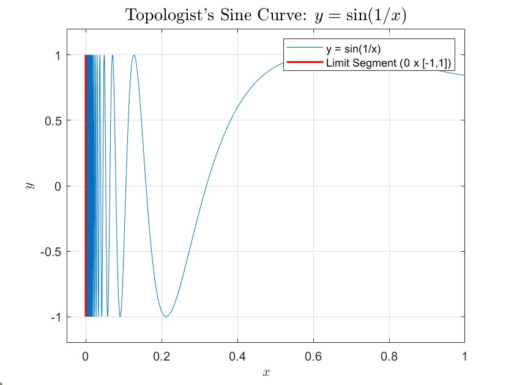

## Chapter 11

::: {.callout-note appearance="simple"}
**Exercise:** Let $\mathcal{T}_1$ be a coarser topology than $\mathcal{T}_2$ on a set $X$.

(1) Is any connected subspace of $(X, \mathcal{T}_1)$ also connected under the subspace topology induced from $\mathcal{T}_2$? Or the other way around?
(2) Let $\mathcal{T}_1$ be the Zariski topology on $\mathbb{R}^2$ and let $\mathcal{T}_2$ be the standard topology on $\mathbb{R}^2$. Find a connected subspace of $\mathbb{R}^2$ equipped with one of $\mathcal{T}_i$ that is disconnected with respect to the other topology.

[点击展开解答]

(1) **不一定；反过来成立。**

*   **$(X, \mathcal{T}_1)$ 中连通不一定在 $\mathcal{T}_2$ 中连通**：因为 $\mathcal{T}_1 \subseteq \mathcal{T}_2$（$\mathcal{T}_2$ 是更精细的拓扑，拥有更多的开集），所以更容易在 $\mathcal{T}_2$ 中找到能够分离该子空间的开集。例如对包含两个以上的元素的集合，$\mathcal{T}_1$ 取平凡拓扑（连通），$\mathcal{T}_2$ 取离散拓扑（完全不连通）。

*   **$(X, \mathcal{T}_2)$ 中连通可推导出在 $\mathcal{T}_1$ 中连通**：考虑恒等映射 $id: (X, \mathcal{T}_2) \to (X, \mathcal{T}_1)$。因为开集 $\mathcal{T}_1 \subseteq \mathcal{T}_2$，该恒等映射是连续映射。根据连通集在连续映射下的像仍为连通集的性质，$\mathcal{T}_2$ 中的连通子空间在 $\mathcal{T}_1$ 中必定连通。

(2) **例子：双曲线 $S = \{ (x,y) \in \mathbb{R}^2 \mid x^2 - y^2 = 1 \}$。**

*   Zariski 拓扑 $\mathcal{T}_1$ 是比标准拓扑 $\mathcal{T}_2$ 更粗的拓扑。根据第 (1) 问的结论，我们需要寻找一个在 $\mathcal{T}_1$ 中连通但在 $\mathcal{T}_2$ 中不连通的集合。

*   在标准拓扑 $\mathcal{T}_2$ 下，$S$ 被分成了左右两支，它可以表示为 $S = (S \cap \{(x,y) \mid x > 0\}) \cup (S \cap \{(x,y) \mid x < 0\})$。这是两个不相交的非空相对开集的并，因此 $S$ 在 $\mathcal{T}_2$ 下是**不连通的**。

*   在 Zariski 拓扑 $\mathcal{T}_1$ 下，$S$ 是由多项式 $f(x,y) = x^2 - y^2 - 1$ 定义的代数集。因为 $x^2 - y^2 - 1$ 在实系数多项式环 $\mathbb{R}[x,y]$ 中是不可约多项式，所以 $S$ 是一个不可约代数集（不可约空间）。由于所有的不可约拓扑空间都一定是连通空间，因此 $S$ 在 $\mathcal{T}_1$ 下是**连通的**。

:::

::: {.callout-note appearance="simple"}
**Exercise:** Sketch $X$ which is the **complement** of
$$ \bigcup_{n=1}^{\infty} \left\{\frac{1}{4n-2}, 1 - \frac{1}{4n-2}\right\} \times \left[\frac{1}{6n-3}, 1\right] \cup \left\{\frac{1}{4n}, 1 - \frac{1}{4n}\right\} \times \left[0, 1 - \frac{1}{6n}\right] $$
in $[0, 1] \times [0, 1]$. Find its components and path-components and justify your results.

[点击展开解答]

**1. 空间 $X$ 的草图与描述**

$X$ 是在单位正方形 $[0, 1] \times [0, 1]$ 中挖去两组交替的无穷多条垂直线段后得到的空间：

*   **第一组（顶部相连）**：横坐标为 $x = \frac{1}{4n-2}$ 或 $1 - \frac{1}{4n-2}$，线段从顶部 $y=1$ 向下延伸到 $y = \frac{1}{6n-3}$。随着 $n \to \infty$，这些线段分别向边界 $x=0$ 和 $x=1$ 逼近，且底部越来越接近 $y=0$。
*   **第二组（底部相连）**：横坐标为 $x = \frac{1}{4n}$ 或 $1 - \frac{1}{4n}$，线段从底部 $y=0$ 向上延伸到 $y = 1 - \frac{1}{6n}$。随着 $n \to \infty$，这些线段也向边界 $x=0$ 和 $x=1$ 逼近，且顶部越来越接近 $y=1$。

直观上，$X$ 中间部分（$0 < x < 1$）形成了一条连续蜿蜒、上下折叠的“走廊”，并且在边界处（$x=0$ 和 $x=1$）保留了完整的垂直线段 $\{0\} \times [0, 1]$ 和 $\{1\} \times [0, 1]$。这本质上是“拓扑正弦曲线”（Topologist's Sine Curve）的双侧变体。

**2. 连通分支 (Components)**

$X$ 只有 **1个连通分支**，即 $X$ 本身（意味着 $X$ 是连通空间）。

**证明：**
令中间的“走廊”部分为 $U = X \cap ((0, 1) \times [0, 1])$。由于在 $U$ 中总是可以绕过被挖去的线段末端（即在线段下方或上方通过），因此 $U$ 内任意两点可用折线相连，即 $U$ 是道路连通的，从而 $U$ 是连通的。
考察边界线段 $L = \{0\} \times [0, 1]$ 和 $R = \{1\} \times [0, 1]$，它们显然包含在 $X$ 中。
因为走廊 $U$ 在向 $x=0$ 逼近时，其 $y$ 坐标在 $0$ 和 $1$ 之间剧烈且无限次地上下震荡，这导致 $L$ 上的每一点都是 $U$ 的极限点。同理，$R$ 上的每一点也是 $U$ 的极限点。因此有 $L \subset \overline{U}$ 且 $R \subset \overline{U}$。
根据拓扑学性质，由于 $U$ 是连通的，且 $U \subset X \subset \overline{U}$，因此 $X$ 必然是连通的。

**3. 道路连通分支 (Path-components)**

$X$ 共有 **3个道路连通分支**，分别是：$L = \{0\} \times [0, 1]$，$R = \{1\} \times [0, 1]$，以及 $U = X \cap ((0, 1) \times [0, 1])$。

**证明：**

*   $L, R, U$ 各自显然是内部道路连通的。
*   **反证法证明 $L$ 与 $U$ 不道路连通**：假设存在一条连续路径 $\gamma: [0, 1] \to X$ 连接 $L$ 中的某点与 $U$ 中的某点。设 $t_0$ 为路径最后一次处于 $L$ 上的时刻。当 $t \to t_0^+$ 时，$\gamma(t)$ 的横坐标 $x(t) \to 0$。为了使得路径留在 $X$ 中不被阻挡，当 $x(t)$ 从右向左穿越 $x = \frac{1}{4n-2}$ 时，$y(t)$ 必须小于 $\frac{1}{6n-3}$（被迫接近 0）；而当 $x(t)$ 穿越更接近 0 的 $x = \frac{1}{4n}$ 时，$y(t)$ 必须大于 $1 - \frac{1}{6n}$（被迫接近 1）。
*   这意味着随着 $t \to t_0^+$，$y(t)$ 必须在 0 和 1 附近无限次地来回突变，无法收敛到任何极限值，这违背了路径 $\gamma$ 在 $t_0$ 处的连续性。
*   因此，$L$ 不能与 $U$ 道路连通。同理可严格证明 $R$ 也不能与 $U$ 道路连通。$L$ 与 $R$ 之间被 $U$ 隔断，自然也不互相道路连通。

:::

::: {.callout-note appearance="simple"}
**Exercise:** The topologist's sine curve and the closed topologist's sine curve is connected but not path-connected.

[点击展开解答]

为了证明这个命题，我们首先明确拓扑正弦曲线 (Topologist's sine curve) 及其闭包的定义。
令 $S = \{(x, \sin(1/x)) \mid 0 < x \le 1\}$ 为 $x>0$ 时的连续曲线部分。
拓扑正弦曲线通常定义为 $T = S \cup \{(0,0)\}$。
闭拓扑正弦曲线定义为 $S$ 的闭包，即 $\overline{T} = S \cup (\{0\} \times [-1, 1])$。

**1. 证明连通性 (Connectedness)**

*   **$S$ 的连通性：** 函数 $f: (0, 1] \to \mathbb{R}^2$ 定义为 $f(x) = (x, \sin(1/x))$ 是连续函数。由于区间 $(0, 1]$ 是连通的，连通空间在连续映射下的像必定连通，故 $S = f((0, 1])$ 是连通空间。
*   **$T$ 和 $\overline{T}$ 的连通性：** 根据拓扑学的一个基本定理，如果一个子空间 $A$ 是连通的，那么满足 $A \subseteq B \subseteq \overline{A}$ 的任意子空间 $B$ 也是连通的。因为 $S \subset T \subset \overline{T} = \overline{S}$，且 $S$ 是连通的，所以 $T$ 和 $\overline{T}$（闭拓扑正弦曲线）都是连通的。

**2. 证明非道路连通性 (Not path-connected)**

我们通过反证法证明更广泛的 $\overline{T}$ 不是道路连通的（这自然蕴含了其子空间 $T$ 也不是道路连通的）。假设 $\overline{T}$ 是道路连通的。

*   假设存在一条连续路径 $p: [0, 1] \to \overline{T}$，设 $p(t) = (x(t), y(t))$。我们假定该路径连接了 $y$ 轴上的点和 $S$ 中的点，即 $p(0) \in \{0\} \times [-1, 1]$ 且 $p(1) \in S$。
*   由于 $x(t)$ 是从 $[0, 1]$ 到 $\mathbb{R}$ 的连续函数，原像集合 $A = \{t \in [0, 1] \mid x(t) = 0\}$ 是一个闭集。已知 $p(0)$ 的 $x$ 坐标为 0，所以 $0 \in A$，即 $A$ 是非空有界闭集。
*   令 $t_0 = \max A$（由于 $p(1) \in S$，即 $x(1) > 0$，因此 $t_0 < 1$）。根据定义，对于所有的 $t \in (t_0, 1]$，都有 $x(t) > 0$。这意味着当 $t > t_0$ 时，路径完全位于曲线 $S$ 上，满足 $y(t) = \sin(1/x(t))$。
*   因为路径 $p(t)$ 在 $t_0$ 处连续，当 $t \to t_0^+$ 时，$x(t) \to 0^+$，且极限 $\lim_{t \to t_0^+} y(t) = y(t_0)$ 必须存在且有限。
*   然而，由于 $x(t)$ 是连续的，当 $t$ 从右侧趋近于 $t_0$ 时，$x(t)$ 会连续地取遍某个区间 $(0, \epsilon)$ 内的所有值（介值定理）。因此，$1/x(t)$ 会趋于正无穷大，导致 $\sin(1/x(t))$ 在 $-1$ 和 $1$ 之间无限次高频震荡。
*   这种震荡导致极限 $\lim_{t \to t_0^+} \sin(1/x(t))$ 根本不存在，这与 $y(t)$ 在 $t_0$ 处的连续性产生了不可调和的矛盾。

*   因此，不存在这样的连续路径，$\overline{T}$ 以及 $T$ 均不是道路连通的。

:::

::: {.callout-note appearance="simple"}
**Exercise:** Is there an open subset of $\mathbb{R}^2$ that is connected but not path-connected?

[点击展开解答]

**不存在。**在 $\mathbb{R}^n$（包括 $\mathbb{R}^2$）中，任何开的连通子集必然也是道路连通的。这可以推广到任何局部道路连通空间。

**证明步骤如下：**

*   假设 $U$ 是 $\mathbb{R}^2$ 中的一个非空、连通的开集。在 $U$ 中任取一点 $x_0$。
*   定义 $V = \{x \in U \mid x \text{ 可以通过 } U \text{ 内的连续路径与 } x_0 \text{ 相连}\}$。我们的目标是证明 $V = U$。
*   **证明 $V$ 是开集：** 对于任意 $y \in V$，由于 $U$ 是开集，存在以 $y$ 为中心且完全包含在 $U$ 中的开圆盘 $B(y, r) \subseteq U$。因为开圆盘本身是凸集（自然是道路连通的），$B(y, r)$ 中的任意一点都可以与 $y$ 道路相连。由于 $y \in V$（$y$ 与 $x_0$ 道路相连），将路径拼接可知，$B(y, r)$ 中的任意一点都能与 $x_0$ 道路相连。因此 $B(y, r) \subseteq V$，这证明了 $V$ 是开集。
*   **证明 $U \setminus V$ 是开集：** 对于任意 $z \in U \setminus V$（即 $z \in U$ 但不能与 $x_0$ 道路相连），由于 $U$ 是开集，同样存在开圆盘 $B(z, r) \subseteq U$。假设 $B(z, r)$ 中存在某点能与 $x_0$ 道路相连，那么 $z$ 可以先在圆盘内与该点相连，再与 $x_0$ 相连，这就导致 $z \in V$，产生矛盾。因此，$B(z, r)$ 中的所有点都不能与 $x_0$ 道路相连，即 $B(z, r) \subseteq U \setminus V$。这证明了 $U \setminus V$ 也是开集。
*   **利用连通性得出结论：** 现在我们将空间 $U$ 写成了两个不相交的开集之并：$U = V \cup (U \setminus V)$。由于 $x_0 \in V$，可知 $V$ 是非空开集。因为已知 $U$ 是连通空间，根据连通空间的定义，它不能表示为两个非空的不相交开集之并。因此，另一部分 $U \setminus V$ 必须为空集 $\emptyset$。
*   结论：$U \setminus V = \emptyset$ 意味着 $V = U$。即 $U$ 中的所有点都可以与给定的点 $x_0$ 道路相连，因此 $U$ 是道路连通的。

:::

::: {.callout-note appearance="simple"}
**Exercise:** Show that $([0,1]^2, \mathcal{T}_{\text{lexi}})$ with the lexicographical order topology is locally connected but not locally path-connected. What are its path-components?

[点击展开解答]

**1. 局部连通性 (Locally connected)**

*   空间 $X = ([0,1]^2, \le_{\text{lexi}})$ 是一个线性连续统（Linear Continuum）：它具有全序关系，满足最小上界性质（Least Upper Bound Property），并且在任意两点之间总存在第三点。
*   在字典序拓扑 $\mathcal{T}_{\text{lexi}}$ 中，其基本开集是由开区间 $((x_1, y_1), (x_2, y_2))$ 以及边界处的半开区间构成的。
*   对于任何线性连续统，其上的任意区间都是连通集。
*   由于 $X$ 拥有一个完全由连通集（即这些区间）构成的拓扑基，空间中的每一点都有连通的局部基。因此 $X$ 是**局部连通的**。

**2. 道路连通分支 (Path-components)**

$X$ 的道路连通分支是所有的垂直线段 $P_x = \{x\} \times [0, 1]$，其中 $x \in [0, 1]$。

**证明：**

*   首先，对于任意固定的 $x$，子空间 $P_x = \{x\} \times [0, 1]$ 在字典序拓扑下诱导的子空间拓扑，等价于 $[0, 1]$ 上的标准实数拓扑。因此 $P_x$ 本身是同胚于标准闭区间 $[0, 1]$ 的，所以是道路连通的。
*   其次，假设存在一条连续路径 $\gamma: [0, 1] \to X$ 连接了具有不同 $x$ 坐标的两点 $(x_1, y_1)$ 和 $(x_2, y_2)$，且不妨设 $x_1 < x_2$。
*   因为 $[0, 1]$ 是连通且紧致的，$\gamma([0, 1])$ 必然是 $X$ 中的连通紧致子集。在线性连续统中，它必定包含两点之间的整个闭区间 $I = [(x_1, y_1), (x_2, y_2)]$。
*   该区间 $I$ 内部包含了不可数个互不相交的非空开集（例如对于所有 $x \in (x_1, x_2)$，取 $U_x = \{x\} \times (1/3, 2/3)$）。如果一个拓扑空间包含不可数个互不相交的开集，那么它绝不可能是可分空间（Non-separable）。
*   然而，连续映射会保持可分性。$[0, 1]$ 是可分空间，其连续像 $\gamma([0, 1])$ 也必须是可分空间。这就与 $I \subseteq \gamma([0, 1])$ 的不可分性产生了矛盾。
*   因此，任何连续路径都不能跨越不同的 $x$ 坐标，道路只能在单一的垂直线段上移动。结论得证。

**3. 非局部道路连通 (Not locally path-connected)**

*   如果一个空间是局部道路连通的，那么它的任意一点都必须拥有一个由**道路连通的开集**构成的局部基。
*   考虑底边上的点 $p = (1/2, 0)$（对于任何 $0 < x \le 1$ 的 $(x, 0)$ 均同理）。
*   任取 $p$ 的一个开邻域 $U$。根据字典序拓扑的定义，$U$ 必须包含一个形如 $((x_1, y_1), (1/2, 0)]$ 的基开集，其中必然满足 $x_1 < 1/2$。
*   由第 2 问可知，在 $U$ 中包含点 $p$ 的最大道路连通子集（即道路连通分支）只能沿着垂直方向延伸，因此它必定是垂直线段 $\{1/2\} \times [0, \epsilon)$ 的某个子集。
*   但是，集合 $\{1/2\} \times [0, \epsilon)$ 在字典序拓扑下**不是开集**。因为任何包含 $(1/2, 0)$ 的开集，其左端点都必须跨越到 $x < 1/2$ 的区域。
*   这意味着点 $p$ 的任何开邻域都不包含能将 $p$ 包裹在内的道路连通开集。因此 $X$ **不是局部道路连通的**。

:::

::: {.callout-note appearance="simple"}
Let $Y = [0, 1] \cap \mathbb{Q}$ and let $X = CY$ be the cone of $Y$.

(1) Show that $X$ is path-connected and find all points where it is locally connected.
(2) Find a subspace of $\mathbb{R}^2$ that is path-connected but nowhere locally connected.

[点击展开解答]

**第一题 (1)**

**设 $Y = [0,1] \cap \mathbb{Q}$，且 $X = CY$ 是 $Y$ 的锥。证明 $X$ 是道路连通的，并求出 $X$ 中所有局部连通的点。**

**证明：**
设锥 $X = CY = (Y \times [0,1]) / (Y \times \{1\})$，商映射为 $q: Y \times [0,1] \to X$。记锥点为 $* = q(Y \times \{1\})$。

**(a) 证明 $X$ 是道路连通的：**
对于任意点 $x \in X$，存在 $(y, t) \in Y \times [0,1]$ 使得 $x = q(y, t)$。

定义映射 $\gamma_x: [0, 1-t] \to X$ 为：

$$
\gamma_x(s) = q(y, t+s)
$$

因为 $q$ 是连续的，所以 $\gamma_x$ 是 $X$ 中的一条连续道路。

注意到 $\gamma_x(0) = q(y, t) = x$，且 $\gamma_x(1-t) = q(y, 1) = *$。

因此，$X$ 中的每个点都可以通过道路连接到锥点 $*$。由于道路连通性是一个等价关系，$X$ 中的任意两点都可以通过 $*$ 互相连接。故 $X$ 是道路连通的。

**(b) 寻找所有局部连通点：**

**断言：** 锥点 $*$ 是 $X$ 中**唯一**的局部连通点。

*步骤 1：锥点 $*$ 是局部连通的。*

$*$ 在 $X$ 中的一个基本开邻域系由以下形式的集合给出：

$$ 
U_a = q(Y \times (a, 1]), \quad \text{其中 } a \in [0, 1) 
$$

对于任意 $a \in [0,1)$ 和任意 $x = q(y, t) \in U_a$（其中 $t > a$），线段 $q(\{y\} \times [t, 1])$ 完全位于 $U_a$ 内，并将 $x$ 连接到 $*$。因此，每个 $U_a$ 都是道路连通的（因而是连通的）。由于 $*$ 拥有由连通集构成的邻域基底，因此 $X$ 在 $*$ 处是局部连通的。

*步骤 2：$X$ 中的其他点均非局部连通。*

设 $x = q(y_0, t_0) \in X$，其中 $t_0 < 1$。
任取 $x$ 的一个不包含 $*$ 的邻域 $W$。根据商拓扑的定义，存在 $Y$ 中包含 $y_0$ 的开集 $V$，以及区间 $(a, b)$ 满足 $0 \le a < t_0 < b < 1$，使得：

$$
x \in U = q(V \times (a, b)) \subset W 
$$

设 $C$ 为 $U$ 中包含 $x$ 的连通分支。我们考虑投影映射 $\pi: V \times (a, b) \to V$，定义为 $\pi(y, t) = y$。由于 $U$ 不与锥点相交，$q$ 限制在 $V \times (a, b)$ 上是一个到其像的同胚。因此，$q^{-1}(C)$ 在 $V \times (a, b)$ 中是连通的。

因为 $\pi$ 是连续的，所以像 $\pi(q^{-1}(C))$ 必定在 $V$ 中连通。然而，$V \subset Y \subset \mathbb{Q}$，而有理数子空间是完全不连通的。因此，连通子集 $\pi(q^{-1}(C))$ 必定是一个单点集，即 $\{y_0\}$。

这意味着 $C \subset q(\{y_0\} \times (a, b))$。

若 $C$ 要成为 $x$ 在 $X$ 中的邻域，$C$ 必须包含 $x$ 在 $X$ 中的某个开集。但是 $q(\{y_0\} \times (a, b))$ 在 $X$ 中的内部为空，因为 $\{y_0\}$ 在 $Y$ 中不是开集（$Y$ 没有孤立点）。因此，$C$ 不能是 $x$ 的邻域。

因为 $W$ 是任取的，所以 $x$ 不存在连通邻域基。因此 $X$ 在 $x$ 处不是局部连通的。

**第(1)问结论：** $X$ 是道路连通的，且唯一的局部连通点是锥点 $*$。

---

**第二题 (2)**

**求 $\mathbb{R}^2$ 中的一个子空间，使其道路连通但处处非局部连通 (nowhere locally connected)。**

**解答：**
定义子空间 $X \subset \mathbb{R}^2$ 为两个“有理扇 (rational fans)”的并集：

$$
X = \bigcup_{q \in \mathbb{Q} \cap [0,1]} L_1(q) \ \cup \ \bigcup_{q \in \mathbb{Q} \cap [0,1]} L_2(q) 
$$

其中：

*   $L_1(q)$ 是连接 $(0,0)$ 和 $(1, q)$ 的闭线段。
*   $L_2(q)$ 是连接 $(1,0)$ 和 $(0, -q)$ 的闭线段。

**性质证明：**

**(a) $X$ 是道路连通的：**

设 $F_1 = \bigcup L_1(q)$（左扇）和 $F_2 = \bigcup L_2(q)$（右扇）。

$F_1$ 中的每个点都通过直线段连接到顶点 $(0,0)$。

$F_2$ 中的每个点都通过直线段连接到顶点 $(1,0)$。

注意到当 $q=0$ 时，$L_1(0)$ 和 $L_2(0)$ 表示的是同一条沿着 $x$ 轴连接 $(0,0)$ 和 $(1,0)$ 的水平线段。由于 $F_1 \cap F_2 \neq \emptyset$，$X$ 中的任意一点都可以连接到 $(0,0)$，$(0,0)$ 进而连接到 $(1,0)$，$(1,0)$ 又可以连接到 $F_2$ 中的任意一点。因此，$X$ 是道路连通的。

**(b) $X$ 是处处非局部连通的：**

任取点 $p \in X$。设 $B(p, \epsilon)$ 为 $\mathbb{R}^2$ 中以 $p$ 为中心，$\epsilon$ 为半径的开圆盘。我们在子空间拓扑下考察开邻域 $U = B(p, \epsilon) \cap X$。

**情形 1：$p \neq (0,0)$ 且 $p \neq (1,0)$。**

选择足够小的 $\epsilon$，使得 $B(p, \epsilon)$ 不包含 $(0,0)$ 或 $(1,0)$。

交集 $U$ 由一族互不相交的线段片段构成。由于 $\mathbb{Q}$ 是完全不连通的且在 $\mathbb{R}$ 中稠密，在任意两条有理线段之间都存在对应于无理斜率的空隙。因此，$U$ 中包含 $p$ 的连通分支仅仅是包含 $p$ 的那单一一条线段片段本身。该片段在 $X$ 中不是开集，因为围绕 $p$ 的任何开圆盘都会截取到与其无限接近的无数条其他有理线段。因此，$U$ 不包含 $p$ 的连通邻域。

**情形 2：$p = (0,0)$（对于 $(1,0)$ 的论证是对称的）。**

选择 $\epsilon < 1$。邻域 $U = B((0,0), \epsilon) \cap X$ 包含了来自 $F_1$ 和 $F_2$ 的线段。

$U$ 内部来自 $F_1$ 的线段都在 $(0,0)$ 处交汇，形成一个连通集。然而，$U$ 也会与来自 $F_2$ 的无限多条线段相交（这些线段在 $(0, -q)$ 处穿过 $y$ 轴）。由于顶点 $(0,0)$ 和 $(1,0)$ 相距为 1，$U$ 内部的 $F_2$ 线段与 $U$ 内部的 $F_1$ 线段在局部是完全互不相交的。

因此，$(0,0)$ 在 $U$ 中的连通分支恰好是 $B((0,0), \epsilon) \cap F_1$。但这一个分支在 $X$ 中不是开集：围绕 $(0,0)$ 的任何任意小的开圆盘都会包含 $F_2$ 中的点（因为当 $q \to 0$ 时，$y$ 轴截距 $(0, -q)$ 会无限逼近 $(0,0)$）。因此，不存在包含 $(0,0)$ 的连通邻域。

:::

::: {.callout-note appearance="simple"}
**Exercise:** Show that the topological spaces $\mathbb{R}, \mathbb{R}^2, [0, 1], [0, 1[$, and $\mathbb{S}^1$ are pairwise non-homeomorphic (Proposition 11.4.3.1).

[点击展开解答]

要证明这些空间两两不同胚，我们主要利用拓扑不变量：**紧致性 (Compactness)** 和 **割点 (Cut Points)** 性质。如果两个空间同胚，它们必须在这些性质上保持一致。

**1. 利用紧致性进行第一轮分组**

我们将这五个空间分为两组：

*   **紧致空间组**：$[0, 1]$ 和 $\mathbb{S}^1$。根据 Heine-Borel 定理，它们在 $\mathbb{R}^n$ 中是闭且有界的。
*   **非紧致空间组**：$\mathbb{R}$，$\mathbb{R}^2$ 和 $[0, 1[$。它们或者是无界的，或者不是闭集。

由于紧致性是同胚不变量，紧致组中的任何空间都不同胚于非紧致组中的任何空间。

**2. 区分紧致空间：$[0, 1]$ vs $\mathbb{S}^1$**

我们利用**割点**（移除该点后空间不再连通的点）来区分：

*   **$\mathbb{S}^1$**：圆周上的任意一点都不是割点。移除任何一个点后，剩余部分仍与开区间 $(0, 1)$ 同胚，是连通的。
*   **$[0, 1]$**：包含大量的割点。例如，移除 $1/2$ 后，空间分裂为 $[0, 1/2) \cup (1/2, 1]$，不再连通。

因此，$[0, 1] \not\cong \mathbb{S}^1$。

**3. 区分非紧致空间：$\mathbb{R}$，$\mathbb{R}^2$ 和 $[0, 1[$**

同样利用割点性质：

*   **$\mathbb{R}^2$**：平面上没有割点。移除任何一点后，剩余部分仍然是道路连通的（从而连通）。因此 $\mathbb{R}^2$ 与 $\mathbb{R}$ 和 $[0, 1[$ 均不同胚。

*   **$\mathbb{R}$ vs $[0, 1[$**：
    
    *   在 **$\mathbb{R}$** 中，**每一个点**都是割点。移除任意一点 $x$，空间都会分裂成两个连通分支 $(-\infty, x)$ 和 $(x, \infty)$。
    
    *   在 **$[0, 1[$** 中，点 $0$ **不是割点**。移除 $0$ 后，剩余部分为 $(0, 1)$，它仍然是连通的。

由于“是否存在非割点”是一个拓扑性质，故 $\mathbb{R} \not\cong [0, 1[$。

:::

## Chapter 12

::: {.callout-note appearance="simple"}
**Exercise:** For each of the 9 topologies (up to homeomorphism) on $X = \{a,b,c\}$ determine whether it satisfies the $\mathbf{T}_i$ axiom for $i \in \{0, 1, 2, 3, 4\}$.

[点击展开解答]

*   **$\mathbf{T}_3$** 要求“点与闭集可分离”，即标准定义中的**正则 (Regular)**，它**不预设**满足 $\mathbf{T}_1$。
*   **$\mathbf{T}_4$** 要求“闭集与闭集可分离”，即标准定义中的**正规 (Normal)**，它也**不预设**满足 $\mathbf{T}_1$。

在这个定义体系下，著名的蕴含关系 $\mathbf{T}_4 \implies \mathbf{T}_3 \implies \mathbf{T}_2 \implies \mathbf{T}_1 \implies \mathbf{T}_0$ **不再成立**。我们需要对这 9 种拓扑（记为 $\mathcal{T}_1 \sim \mathcal{T}_9$）根据新定义逐一重新严格判定。

**同胚意义下的 9 种拓扑及其闭集：**

*   $\mathcal{T}_1 = \{\emptyset, X\}$ （闭集：$X, \emptyset$）
*   $\mathcal{T}_2 = \{\emptyset, \{a\}, X\}$ （闭集：$X, \{b,c\}, \emptyset$）
*   $\mathcal{T}_3 = \{\emptyset, \{a, b\}, X\}$ （闭集：$X, \{c\}, \emptyset$）
*   $\mathcal{T}_4 = \{\emptyset, \{a\}, \{a, b\}, X\}$ （闭集：$X, \{b,c\}, \{c\}, \emptyset$）
*   $\mathcal{T}_5 = \{\emptyset, \{a\}, \{b, c\}, X\}$ （闭集：$X, \{b,c\}, \{a\}, \emptyset$）
*   $\mathcal{T}_6 = \{\emptyset, \{a\}, \{b\}, \{a, b\}, X\}$ （闭集：$X, \{b,c\}, \{a,c\}, \{c\}, \emptyset$）
*   $\mathcal{T}_7 = \{\emptyset, \{a\}, \{a, b\}, \{a, c\}, X\}$ （闭集：$X, \{b,c\}, \{c\}, \{b\}, \emptyset$）
*   $\mathcal{T}_8 = \{\emptyset, \{a\}, \{b\}, \{a, b\}, \{a, c\}, X\}$ （闭集：$X, \{b,c\}, \{a,c\}, \{c\}, \{b\}, \emptyset$）
*   $\mathcal{T}_9 = \mathcal{P}(X)$ （离散拓扑，所有子集都是闭集）

**判定结果与解析：**

*   **$\mathbf{T}_0$ (任意两点至少有一点有不含另一点的邻域)：**
    满足：**$\mathcal{T}_4, \mathcal{T}_6, \mathcal{T}_7, \mathcal{T}_8, \mathcal{T}_9$**。

*   **$\mathbf{T}_1$ (任意两点互相可分离) & $\mathbf{T}_2$ (任意两点有不相交邻域)：**
    满足：只有 **$\mathcal{T}_9$**。
    （有限集上满足 $\mathbf{T}_1$ 必须是离散拓扑，$\mathbf{T}_2$ 要求更强自然也只有离散拓扑）。

*   **$\mathbf{T}_3$ (任意点与不包含它的闭集有不相交邻域)：**
    满足：**$\mathcal{T}_1, \mathcal{T}_5, \mathcal{T}_9$**。
    *   $\mathcal{T}_1$：唯一闭集是 $X$ 和 $\emptyset$。点只与 $\emptyset$ 不相交，开邻域 $X$ 和 $\emptyset$ 互不相交，**空真 (vacuously)** 满足。
    *   $\mathcal{T}_5$：点 $a$ 与闭集 $\{b,c\}$ 可被开集 $\{a\}$ 与 $\{b,c\}$ 分离；点 $b, c$ 与闭集 $\{a\}$ 可被开集 $\{b,c\}$ 与 $\{a\}$ 分离。满足。
    *   其它均不满足。例如 $\mathcal{T}_2$ 中点 $a$ 与闭集 $\{b,c\}$ 互不相交，包含 $a$ 的开集有 $\{a\}$ 和 $X$，包含 $\{b,c\}$ 的开集只有 $X$，它们的交集绝不为空。

*   **$\mathbf{T}_4$ (任意两个不相交的闭集有不相交邻域)：**
    满足：**$\mathcal{T}_1, \mathcal{T}_2, \mathcal{T}_3, \mathcal{T}_4, \mathcal{T}_5, \mathcal{T}_6, \mathcal{T}_9$**。
    *   $\mathcal{T}_1, \mathcal{T}_2, \mathcal{T}_3, \mathcal{T}_4, \mathcal{T}_6$：在这些拓扑中，**不存在**两个非空且互不相交的闭集（它们的所有非空闭集都有交集）。因此，“如果两个闭集不相交，则...” 这个条件前件为假，逻辑上**空真 (vacuously)** 满足 $\mathbf{T}_4$。
    *   $\mathcal{T}_5$：不相交的闭集只有 $\{a\}$ 和 $\{b,c\}$，它们分别被开集 $\{a\}$ 和 $\{b,c\}$ 完美分离，满足。
    *   不满足：$\mathcal{T}_7, \mathcal{T}_8$。例如在 $\mathcal{T}_7$ 和 $\mathcal{T}_8$ 中，$\{b\}$ 和 $\{c\}$ 是不相交的闭集，但在 $\mathcal{T}_7$ 中包含它们的最小开集分别是 $\{a,b\}$ 和 $\{a,c\}$，交集 $\{a\} \neq \emptyset$；在 $\mathcal{T}_8$ 中包含 $\{c\}$ 的开集只有 $X$，与任何包含 $\{b\}$ 的非空开集必定相交，无法分离。

:::

::: {.callout-note appearance="simple"}
**Exercise:** Let $X$ be a topological space with the natural quotient map $\pi: X \to (\text{Conn } X, \mathcal{T}_{\text{conn}})$.

(1) Show that $(\text{Conn } X, \mathcal{T}_{\text{conn}})$ is $\text{T}_1$.
(2) Does $(\text{Conn } X, \mathcal{T}_{\text{conn}})$ being $\text{T}_2$ imply that $\text{Conn } X = \text{QConn } X$?

[点击展开解答]

**(1) 证明 $(\text{Conn } X, \mathcal{T}_{\text{conn}})$ 是 $\text{T}_1$ 空间：**

*   一个拓扑空间是 $\text{T}_1$ 空间的等价条件是它的所有单点集都是闭集。

*   设 $C \in \text{Conn } X$ 是商空间中的任意一点。由定义可知，它对应于原空间 $X$ 中的一个连通分支（connected component）。

*   根据拓扑学基本性质，空间中的连通分支总是闭集（因为连通集的闭包仍然是连通集，而连通分支被定义为极大的连通子集）。因此 $C$ 在 $X$ 中是闭集。

*   根据商拓扑的定义，商空间中的子集 $\{C\}$ 是闭集当且仅当其在映射 $\pi$ 下的原像 $\pi^{-1}(\{C\}) = C$ 在 $X$ 中是闭集。

*   由于 $\pi^{-1}(\{C\})$ 确实是闭集，所以 $\{C\}$ 在 $\mathcal{T}_{\text{conn}}$ 中是闭集。这证明了该商空间是 $\text{T}_1$ 的。

**(2) 不一定（不能推导）。**

*   **概念转换：** $X$ 的拟连通分支（$\text{QConn } X$，即包含某点的所有既开又闭集的交集）与连通分支重合，等价于要求：在商空间 $Y = \text{Conn } X$ 中，任意两个不同的点都能被既开又闭集（clopen set）严格分离。具有这种性质的空间被称为**完全分离空间（totally separated space）**。

*   **已知条件：** 商空间 $Y = \text{Conn } X$ 的所有连通分支显然都是单点集本身，这意味着 $Y$ 必然是一个**完全不连通空间（totally disconnected space）**。

*   **反证逻辑：** 如果题目中的推导成立，就意味着“任何满足 $\text{T}_2$（Hausdorff）的完全不连通空间，都必定是完全分离空间”。然而在一般点集拓扑中，这是**不成立**的。存在许多满足 $\text{T}_2$ 分离公理且完全不连通，但由于缺乏足够的既开又闭集，从而无法把所有点完全分离的反例。

*   因此，即使 $(\text{Conn } X, \mathcal{T}_{\text{conn}})$ 是 $\text{T}_2$ 的，也不能保证它含有足够的既开又闭集，进而无法保证 $\text{Conn } X = \text{QConn } X$。

:::

::: {.callout-note appearance="simple"}
**Exercise:** Fill a topological space in each blank cell of the chart by examples of spaces which satisfies certain $\mathbf{T}_i$ axioms and give a brief explanation to each.

[点击展开解答]

| | $\neg \mathbf{T}_0$ | $\mathbf{T}_0 \wedge \neg \mathbf{T}_1$ | $\mathbf{T}_1 \wedge \neg \mathbf{T}_2$ | $\mathbf{T}_2$ |
| :--- | :--- | :--- | :--- | :--- |
| **$\neg \mathbf{T}_3 \wedge \neg \mathbf{T}_4$** | $X_1$ | $X_2$ | cofinite | $\mathbb{R}_K$ |
| **$\mathbf{T}_3 \wedge \neg \mathbf{T}_4$** | $M \times \{0,1\}$ | N/A | N/A | Moore |
| **$\neg \mathbf{T}_3 \wedge \mathbf{T}_4$** | $X_5$ | Sierpinski | N/A | N/A |
| **$\mathbf{T}_3 \wedge \mathbf{T}_4$** | trivial | N/A | N/A | metric |

**空白处填补的具体例子与简要解释：**

*   **1. $X_1$ (对应 $\neg \mathbf{T}_0$ 且 $\neg \mathbf{T}_3 \wedge \neg \mathbf{T}_4$)**
    
    **定义：** 有限空间 $X_1=\{a,b,c,d\}$，拓扑 $\mathcal{T}=\{\emptyset, \{a\}, \{a,b,c\}, \{a,d\}, X_1\}$。
    
    **解释：** 点 $b$ 和 $c$ 拥有完全相同的开邻域，无法被拓扑区分，因此不满足 $\mathbf{T}_0$。空间中存在不相交的闭集 $\{d\}$ 与 $\{b,c\}$，但任何包含它们的开集（如 $\{a,d\}$ 和 $\{a,b,c\}$）的交集都至少包含点 $a$，无法分离，故不满足 $\mathbf{T}_4$。同理，点 $b$ 与不包含它的闭集 $\{d\}$ 也没有不相交的开邻域，故不满足 $\mathbf{T}_3$。

*   **2. $X_2$ (对应 $\mathbf{T}_0 \wedge \neg \mathbf{T}_1$ 且 $\neg \mathbf{T}_3 \wedge \neg \mathbf{T}_4$)**
    
    **定义：** 有限空间 $X_2=\{a,b,c\}$，拓扑 $\mathcal{T}=\{\emptyset, \{a\}, \{a,b\}, \{a,c\}, X_2\}$。
    
    **解释：** 任意两点都能找到只包含其中一点的开集，故满足 $\mathbf{T}_0$；但单点集 $\{a\}$ 不是闭集，故不满足 $\mathbf{T}_1$。空间中存在不相交的闭集 $\{b\}$ 与 $\{c\}$，但包含它们的开集必然都包含点 $a$，无法用不相交开集分离，故不满足 $\mathbf{T}_4$。点 $b$ 与闭集 $\{c\}$ 亦同理无法分离，故不满足 $\mathbf{T}_3$。

*   **3. $\mathbb{R}_K$ (对应 $\mathbf{T}_2$ 且 $\neg \mathbf{T}_3 \wedge \neg \mathbf{T}_4$)**
    
    **定义：** 实数集上的 $\mathbf{K}$-拓扑空间 $\mathbb{R}_K$。
    
    **解释：** $\mathbf{K}$-拓扑比标准实数拓扑更精细，所以它显然是 $\mathbf{T}_2$（Hausdorff）的。但点 $0$ 与闭集 $K = \{1/n \mid n \in \mathbb{Z}^+\}$ 无法由不相交的开集分离，故不满足 $\mathbf{T}_3$（非正则）。由于该空间满足 $\mathbf{T}_1$，如果它正规（$\mathbf{T}_4$）则必定正则，既然非正则，自然也不满足 $\mathbf{T}_4$。

*   **4. $M \times \{0,1\}$ (对应 $\neg \mathbf{T}_0$ 且 $\mathbf{T}_3 \wedge \neg \mathbf{T}_4$)**
    
    **定义：** 莫尔平面 (Moore plane) $M$ 与带有平凡拓扑的二点空间 $\{0,1\}$ 的乘积空间。
    
    **解释：** 由于乘上了一个平凡拓扑空间（等价于将 Moore 平面上的每一个点“双倍化”为不可区分的一对），空间中存在完全无法区分的点对，故不满足 $\mathbf{T}_0$。然而，由于 Moore 平面本身是正则且非正规的，乘积空间完全继承了这两个性质，能够分离点与闭集（$\mathbf{T}_3$），但存在无法分离的不相交闭集（$\neg \mathbf{T}_4$）。

*   **5. $X_5$ (对应 $\neg \mathbf{T}_0$ 且 $\neg \mathbf{T}_3 \wedge \mathbf{T}_4$)**
    
    **定义：** 有限空间 $X_5=\{a,b,c\}$，拓扑 $\mathcal{T}=\{\emptyset, \{a\}, X_5\}$。
    
    **解释：** 点 $b$ 和 $c$ 拓扑不可区分，故不满足 $\mathbf{T}_0$。该空间的闭集只有 $X_5, \{b,c\}, \emptyset$。因为不存在两个非空且不相交的闭集，所以“如果两闭集不相交，则可分离”的前提为假，逻辑上空真地（vacuously）满足了正规性 $\mathbf{T}_4$。但是，点 $a$ 与闭集 $\{b,c\}$ 无法被分离（包含 $\{b,c\}$ 的唯一开集是 $X_5$），所以不满足 $\mathbf{T}_3$。

**Moore Plane 定义：**

Moore Plane 的底层集合是上半平面及其边界：
$$
X = \{ (x, y) \in \mathbb{R}^2 : y \ge 0 \}
$$

它的拓扑（记为 $\mathcal{T}$）通过定义以下两类点的邻域基来给出：

* 对于上半平面内的点 $(y > 0)$：其邻域基与标准欧几里得拓扑相同，即包含在该点附近的标准开圆盘。
* 对于 $x$ 轴上的点 $(x, 0)$：其邻域基定义为以 $(x, r)$ 为圆心且切于 $x$ 轴于点 $(x, 0)$ 的开圆盘 $D$ 加上切点 $(x, 0)$ 本身。即：$B_r(x, 0) = \{ (x, 0) \} \cup \{ (u, v) \in \mathbb{R}^2 : (u-x)^2 + (v-r)^2 < r^2 \}$。

:::

::: {.callout-note appearance="simple"}
**Exercise:** 
$$
\begin{aligned}
\mathbf{T}_5 &\implies \mathbf{T}_4 \\
\mathbf{T}_4 \land \mathbf{T}_3 &\implies \mathbf{T}_{3\frac{1}{2}} \\
\mathbf{T}_4 \land \mathbf{T}_1 &\implies \mathbf{T}_{3\frac{1}{2}} \implies \mathbf{T}_3 \\
\mathbf{T}_3 \land \mathbf{T}_2 &\implies \mathbf{T}_{2\frac{1}{2}} \\
\mathbf{T}_3 \land \mathbf{T}_0 &\implies \mathbf{T}_{2\frac{1}{2}} \implies \mathbf{T}_2 \implies \mathbf{T}_1 \implies \mathbf{T}_0
\end{aligned} \qquad (175)
$$

[点击展开解答]

*Proof:* 

$\mathbf{T}_5 \implies \mathbf{T}_4$. Any two disjoint closed sets are separated. 

$\mathbf{T}_3 \land \mathbf{T}_0 \implies \mathbf{T}_2$. Let $p, q \in X$ be two distinct points. By $\mathbf{T}_0$, there is $U \in \mathcal{T}$ containing exactly one of $p$ and $q$, and we assume without loss of generality that $q \in U$ but $p \notin U$. By $\mathbf{T}_3$, there is $V \in \mathcal{N}_q$ and $W \in \mathcal{N}_{X \setminus U}$ with $W \cap V = \emptyset$. In particular, $W \in \mathcal{N}_p$ and $X$ satisfies $\mathbf{T}_2$. 

$\mathbf{T}_3 \land \mathbf{T}_2 \implies \mathbf{T}_{2\frac{1}{2}}$. Let $p, q \in X$ be two distinct points. By $\mathbf{T}_2$, there are $U \in \mathcal{N}_p$ and $V \in \mathcal{N}_q$ such that $U \cap V = \emptyset$. By $\mathbf{T}_3$, there is $U_1 \in \mathcal{N}_p$ and $V_1 \in \mathcal{N}_q$ such that $\overline{U_1} \subseteq U$ and $\overline{V_1} \subseteq V$. Then $\overline{U_1} \cap \overline{V_1} \subseteq U \cap V = \emptyset$ and $X$ satisfies $\mathbf{T}_{2\frac{1}{2}}$. 

$\mathbf{T}_{2\frac{1}{2}} \implies \mathbf{T}_2 \implies \mathbf{T}_1 \implies \mathbf{T}_0$. Being separated by neighborhoods $\implies$ separated $\implies$ topologically disjoint. $\blacksquare$

下面补充图片中省略的证明部分。在证明前需明确，**Urysohn引理 (Urysohn's Lemma)** 是 $\mathbf{T}_4$ 空间的核心性质：在 $\mathbf{T}_4$ 空间中，任意两个不相交的闭集 $A, B$ 都可以被连续函数严格分离（即存在连续函数 $f: X \to [0,1]$ 使得 $f(A)=0, f(B)=1$）。

*   **证明 $\mathbf{T}_4 \wedge \mathbf{T}_1 \implies \mathbf{T}_{3\frac{1}{2}}$：**
    任取点 $p \in X$ 和不包含 $p$ 的闭集 $B$。
    因为空间满足 $\mathbf{T}_1$ 公理，所以单点集 $\{p\}$ 是闭集。
    此时 $\{p\}$ 和 $B$ 是 $X$ 中两个不相交的闭集。
    因为空间同时满足 $\mathbf{T}_4$ 公理，根据 Urysohn 引理，存在连续函数 $f: X \to [0,1]$，使得 $f(\{p\}) = 0$ 且 $f(B) = 1$。
    这就证明了点 $p$ 与不相交的闭集 $B$ 可以被连续函数分离，即空间满足 $\mathbf{T}_{3\frac{1}{2}}$。

*   **证明 $\mathbf{T}_4 \wedge \mathbf{T}_3 \implies \mathbf{T}_{3\frac{1}{2}}$：**
    任取点 $p \in X$ 和不包含 $p$ 的闭集 $B$。
    因为空间满足 $\mathbf{T}_3$ 公理，存在开邻域 $U \in \mathcal{N}_p$ 和 $V \in \mathcal{N}_B$ 使得 $U \cap V = \emptyset$。
    由 $U \cap V = \emptyset$ 且 $V$ 是开集可知，$U \subseteq X \setminus V$，且 $X \setminus V$ 是闭集。
    因此，$U$ 的闭包 $\overline{U} \subseteq X \setminus V$。
    又因为 $B \subseteq V$，所以 $\overline{U} \cap B = \emptyset$。
    现在我们得到了两个不相交的闭集：$\overline{U}$ 和 $B$。
    因为空间满足 $\mathbf{T}_4$ 公理，根据 Urysohn 引理，存在连续函数 $f: X \to [0,1]$ 使得 $f(\overline{U}) = 0$ 且 $f(B) = 1$。
    由于 $p \in U \subseteq \overline{U}$，显然有 $f(p) = 0$。
    这同样满足了 $\mathbf{T}_{3\frac{1}{2}}$ 的定义。

*   **证明 $\mathbf{T}_{3\frac{1}{2}} \implies \mathbf{T}_3$：**
    任取点 $p \in X$ 和不包含 $p$ 的闭集 $B$。
    因为空间满足 $\mathbf{T}_{3\frac{1}{2}}$，存在连续函数 $f: X \to \mathbb{R}$，使得 $f(p) = 0$ 且 $f(B) = 1$（此处依定义 $f(B)=1$ 代表 $\forall x \in B, f(x)=1$）。
    在实数空间 $\mathbb{R}$ 中，选取两个不相交的开区间：$I_1 = (-\infty, 1/2)$ 和 $I_2 = (1/2, \infty)$。
    令 $U = f^{-1}(I_1)$，$V = f^{-1}(I_2)$。
    因为 $f$ 是连续函数，开集在连续映射下的原像仍是开集，所以 $U$ 和 $V$ 是 $X$ 中的开集。
    由于 $f(p) = 0 \in I_1$，所以 $p \in U$（即 $U \in \mathcal{N}_p$）。
    由于对于任意 $x \in B$ 都有 $f(x) = 1 \in I_2$，所以 $B \subseteq V$（即 $V \in \mathcal{N}_B$）。
    又因为 $I_1 \cap I_2 = \emptyset$，显然有其原像 $U \cap V = \emptyset$。
    这就证明了点与不相交闭集可以被不相交的开邻域分离，因此空间满足 $\mathbf{T}_3$。

:::

::: {.callout-note appearance="simple"}
**Exercise:** Proposition: A topological space $X$ is $\text{T}_1$ iff every subset of $X$ is the intersection of all its neighborhoods.

[点击展开解答]

**证明：**

记子集 $A$ 的所有开邻域的集合族为 $\mathcal{N}(A)$，即我们需要证明的等价条件为 $A = \bigcap_{U \in \mathcal{N}(A)} U$。

*   **必要性 ($\implies$)：假设 $X$ 是 $\mathbf{T}_1$ 空间，证明任意子集 $A$ 等于其所有邻域的交集。**

    对于任意子集 $A \subseteq X$，根据邻域的定义，显然有 $A \subseteq \bigcap_{U \in \mathcal{N}(A)} U$。

    为了证明反向包含关系 $\bigcap_{U \in \mathcal{N}(A)} U \subseteq A$，我们任取一个不在 $A$ 中的点 $x \notin A$。

    在 $\text{T}_1$ 空间中，任何单点集都是闭集，因此单点集 $\{x\}$ 是闭集。

    那么它的补集 $V = X \setminus \{x\}$ 必然是一个开集。

    因为 $x \notin A$，所以 $A$ 完全包含在这个开集 $V$ 中（即 $A \subseteq V$）。这意味着 $V$ 是 $A$ 的一个开邻域，即 $V \in \mathcal{N}(A)$。

    由于 $V$ 的构造排除了 $x$（$x \notin V$），点 $x$ 自然也不存在于 $A$ 的所有邻域的交集之中。

    因此，对于任意 $x \notin A$，都有 $x \notin \bigcap_{U \in \mathcal{N}(A)} U$，推导出 $\bigcap_{U \in \mathcal{N}(A)} U \subseteq A$。两者结合即证 $A = \bigcap_{U \in \mathcal{N}(A)} U$。

*   **充分性 ($\impliedby$)：假设 $X$ 的任意子集都等于其所有邻域的交集，证明 $X$ 是 $\mathbf{T}_1$ 空间。**

    在空间 $X$ 中任取两个不相同的点 $x, y$（$x \neq y$）。考虑由单点构成的子集 $A = \{y\}$。

    根据已知假设，$\{y\} = \bigcap_{U \in \mathcal{N}(\{y\})} U$。

    因为 $x \neq y$，所以 $x \notin \{y\}$，这意味着 $x$ 不能包含在 $\{y\}$ 的所有邻域的交集之中。

    由此可知，必定存在 $\{y\}$ 的至少一个开邻域 $V \in \mathcal{N}(\{y\})$（这是一个包含 $y$ 的开集），使得 $x \notin V$。

    同理（交换 $x$ 和 $y$ 的角色），利用子集 $\{x\}$ 也必定能找到一个包含 $x$ 的开集而不包含 $y$。

    任意两点都存在不包含对方的开邻域，这正是 $\text{T}_1$ 空间的定义。

:::

::: {.callout-note appearance="simple"}
**Exercise:** Let $X$ be a topological space with a relation $p \sim q$ such that $p \sim q$ iff

$$(\forall U \in \mathcal{N}_p)(\forall V \in \mathcal{N}_q)(U \cap V \neq \emptyset).$$

(1) Is "$\sim$" an equivalence relation?
(2) Show that $(X, \mathcal{T}_X)$ is Hausdorff iff "$\sim$" is the identity.

[点击展开解答]

(1) **不一定（一般情况下不是）。**

虽然该关系显然满足自反性（因为 $p \in U \cap V$，所以 $p \sim p$）和对称性（$U \cap V = V \cap U$，所以 $p \sim q \implies q \sim p$），但它不一定满足**传递性**。我们可以构造一个简单的反例来证明：

*   考虑包含三个点的空间 $X = \{1, 2, 3\}$，赋予其拓扑 $\mathcal{T} = \{\emptyset, \{1\}, \{3\}, \{1, 3\}, \{1, 2, 3\}\}$。

*   点 $1$ 的最小开邻域是 $\{1\}$，点 $3$ 的最小开邻域是 $\{3\}$，而点 $2$ 的唯一开邻域是整个空间 $\{1, 2, 3\}$。

*   因为对于 $1$ 和 $2$ 的任意邻域交集必定包含 $1$，即 $\{1\} \cap \{1, 2, 3\} = \{1\} \neq \emptyset$，我们有 $1 \sim 2$。

*   同理对于 $2$ 和 $3$，它们任意邻域交集必定包含 $3$，即 $\{1, 2, 3\} \cap \{3\} = \{3\} \neq \emptyset$，我们有 $2 \sim 3$。

*   但是对于点 $1$ 和点 $3$，它们分别存在开邻域 $\{1\}$ 和 $\{3\}$，且满足 $\{1\} \cap \{3\} = \emptyset$。根据关系的定义，这说明 $1 \not\sim 3$。

*   由此可见 $1 \sim 2$ 且 $2 \sim 3$ 不能推导出 $1 \sim 3$，即该关系不满足传递性，故不是一个等价关系。

(2) **证明如下：**

*   首先，我们分析关系 $p \sim q$ 的逻辑否定。$p \not\sim q$ 等价于：存在 $U \in \mathcal{N}_p$ 和 $V \in \mathcal{N}_q$，使得 $U \cap V = \emptyset$。这正是“两个点可以被不相交的开邻域分离”的数学表达。

*   **证明充分性 ($\implies$)：**
假设 $(X, \mathcal{T}_X)$ 是 Hausdorff 空间（即 $\text{T}_2$ 空间）。由 Hausdorff 空间的定义，对于空间中任意两个不同的点 $p \neq q$，都存在它们各自的开邻域 $U \in \mathcal{N}_p$ 和 $V \in \mathcal{N}_q$ 使得 $U \cap V = \emptyset$。这也就意味着对于任意的 $p \neq q$，都有 $p \not\sim q$。另一方面，当 $p=q$ 时，显然包含 $p$ 的任意两个邻域的交集都至少包含 $p$ 本身（不为空），即 $p \sim p$。因此，“$\sim$” 当且仅当两点相同时成立，即它是恒等关系 (identity relation)。

*   **证明必要性 ($\impliedby$)：**
假设 “$\sim$” 是一个恒等关系。这意味着对于空间中的任意两点 $p, q$，都有 $p \sim q \iff p = q$。它的逆否命题自然也成立：$p \neq q \iff p \not\sim q$。根据我们前面得出的 $p \not\sim q$ 的等价条件，对于任意两个不同的点 $p \neq q$，必然存在不相交的开邻域 $U \in \mathcal{N}_p$ 和 $V \in \mathcal{N}_q$ 使得 $U \cap V = \emptyset$。这完全符合 Hausdorff 空间的定义，因此 $(X, \mathcal{T}_X)$ 是 Hausdorff 空间。

:::

::: {.callout-note appearance="simple"}
**Exercise:** Proposition: A topological space $X$ is $\text{T}_4$

- iff every neighborhood of a closed set contains a closed neighborhood;
- iff any disjoint closed sets in $X$ are separated by closed neighborhoods;
- iff any disjoint closed sets in $X$ are separated by a function.

[点击展开解答]

我们将分别证明这三个等价条件。设 $X$ 是一个拓扑空间，回顾 $\text{T}_4$ 的定义：任意两个不相交的闭集可以被不相交的开邻域分离。

**1. 证明 $\text{T}_4 \iff$ 闭集的每个邻域都包含一个闭邻域**

*   **$\implies$ (必要性)：** 假设 $X$ 满足 $\text{T}_4$。设 $A$ 是闭集，$U$ 是 $A$ 的一个开邻域（即 $A \subseteq U$）。那么 $A$ 与 $X \setminus U$ 是两个不相交的闭集。根据 $\text{T}_4$ 定义，存在不相交的开集 $V$ 和 $W$，使得 $A \subseteq V$ 且 $X \setminus U \subseteq W$。由 $V \cap W = \emptyset$ 可知 $V \subseteq X \setminus W$。因为 $X \setminus W$ 是闭集，所以 $V$ 的闭包 $\overline{V} \subseteq X \setminus W$。又因为 $X \setminus U \subseteq W$，两边取补集得到 $X \setminus W \subseteq U$。因此 $A \subseteq V \subseteq \overline{V} \subseteq U$。这里 $\overline{V}$ 就是包含在 $U$ 中的 $A$ 的闭邻域。
*   **$\impliedby$ (充分性)：** 设 $A, B$ 是两个不相交的闭集。那么 $A \subseteq X \setminus B$，且 $X \setminus B$ 是一个开集，即它是 $A$ 的一个开邻域。根据假设，存在一个包含 $A$ 的闭邻域（即存在开集 $V$ 使得 $A \subseteq V \subseteq \overline{V}$）且 $\overline{V} \subseteq X \setminus B$。令 $W = X \setminus \overline{V}$，则 $W$ 是开集，且 $B \subseteq W$。此时 $V$ 和 $W$ 就是分离 $A$ 和 $B$ 的不相交开集，故 $X$ 满足 $\text{T}_4$。

**2. 证明 $\text{T}_4 \iff$ 任意不相交闭集可以被闭邻域分离**

*   **$\implies$ (必要性)：** 设 $A, B$ 为不相交闭集。由第 1 问的结论，$X \setminus B$ 是 $A$ 的开邻域，故存在开集 $U \supseteq A$ 使得 $\overline{U} \subseteq X \setminus B$。此时 $X \setminus \overline{U}$ 成了 $B$ 的开邻域。再次利用第 1 问的结论，存在开集 $V \supseteq B$ 使得 $\overline{V} \subseteq X \setminus \overline{U}$。这意味着 $\overline{U} \cap \overline{V} = \emptyset$。因此，$\overline{U}$ 和 $\overline{V}$ 就是分离 $A$ 和 $B$ 的不相交闭邻域。
*   **$\impliedby$ (充分性)：** 如果任意不相交闭集 $A, B$ 能被闭邻域分离（即存在开集 $U \supseteq A$ 和 $V \supseteq B$ 使得 $\overline{U} \cap \overline{V} = \emptyset$），那么显然有 $U \cap V = \emptyset$。这直接满足了 $\text{T}_4$ 空间的基本定义（被不相交开集分离）。

**3. 证明 $\text{T}_4 \iff$ 任意不相交闭集可以被连续函数分离**

*   **$\implies$ (必要性)：** 这正是著名的 **Urysohn 引理 (Urysohn's Lemma)** 的直接陈述。该引理断言：对于 $\text{T}_4$ 空间中的任意两个不相交闭集 $A$ 和 $B$，必定存在一个连续函数 $f: X \to [0, 1]$，使得对于所有 $x \in A$ 有 $f(x) = 0$，对于所有 $y \in B$ 有 $f(y) = 1$。这就实现了闭集被函数严格分离。
*   **$\impliedby$ (充分性)：** 假设 $A, B$ 是不相交闭集，且存在连续函数 $f: X \to \mathbb{R}$ 使得 $f(A) = 0$ 且 $f(B) = 1$。我们可以在实数轴 $\mathbb{R}$ 中选取两个不相交的开区间，例如 $I_1 = (-\infty, 1/3)$ 和 $I_2 = (2/3, \infty)$。令 $U = f^{-1}(I_1)$，$V = f^{-1}(I_2)$。由于 $f$ 是连续函数，开集的原像 $U$ 和 $V$ 必定也是开集。并且 $A \subseteq U$，$B \subseteq V$ 且 $U \cap V = \emptyset$。这就证明了 $X$ 满足 $\text{T}_4$。

:::

::: {.callout-note appearance="simple"}
**Exercise:** Show that a topological space is $\text{T}_3$ iff any disjoint point and closed subset are separated by closed neighborhoods.

[点击展开解答]

我们将分别证明该命题的必要性与充分性。回忆前面确立的 $\text{T}_3$（正则空间）定义：任意点与不包含它的闭集，可以被不相交的开邻域分离。

*   **必要性 ($\implies$)：假设 $X$ 是 $\mathbf{T}_3$ 空间。**

    设 $x \in X$，且 $F$ 是不包含 $x$ 的闭集。

    根据 $\text{T}_3$ 的定义，存在不相交的开集 $U_1$ 和 $V$，使得 $x \in U_1$ 且 $F \subseteq V$。

    因为 $U_1$ 是开集且 $U_1 \cap V = \emptyset$，由闭包性质很容易推导得出 $U_1 \cap \overline{V} = \emptyset$。

    现在考虑点 $x$ 和闭集 $X \setminus U_1$。因为 $x \in U_1$，所以 $x \notin X \setminus U_1$。

    再次利用 $\text{T}_3$ 公理，必然存在不相交的开集 $U$ 和 $W$，使得 $x \in U$ 且 $X \setminus U_1 \subseteq W$。

    由 $U \cap W = \emptyset$ 可知 $U \subseteq X \setminus W$，进而有 $\overline{U} \subseteq X \setminus W$（因为 $X \setminus W$ 是闭集）。

    又因为 $X \setminus U_1 \subseteq W$ 等价于 $X \setminus W \subseteq U_1$，所以我们得到 $\overline{U} \subseteq U_1$。

    结合前面得出的 $U_1 \cap \overline{V} = \emptyset$ 以及 $\overline{U} \subseteq U_1$，我们可以直接推导出 $\overline{U} \cap \overline{V} = \emptyset$。

    这里，$\overline{U}$ 和 $\overline{V}$ 正是分离了点 $x$ 和闭集 $F$ 的不相交的闭邻域。

*   **充分性 ($\impliedby$)：假设任意不相交的点和闭集能被闭邻域分离。**

    设 $x \in X$ 且 $F$ 是不包含 $x$ 的闭集。

    根据假设，存在点 $x$ 的闭邻域 $A$ 和闭集 $F$ 的闭邻域 $B$，使得 $A \cap B = \emptyset$。

    根据闭邻域的定义，其内部必定包含该点/集合的开邻域。即存在开集 $U$ 和 $V$，使得 $x \in U \subseteq A$ 且 $F \subseteq V \subseteq B$。

    因为 $A \cap B = \emptyset$，其子集显然也有 $U \cap V = \emptyset$。

    因此，点 $x$ 与闭集 $F$ 被不相交的开集 $U$ 和 $V$ 严格分离，这直接证明了空间 $X$ 满足 $\text{T}_3$ 公理。

:::

### The Prove of Urysohn's lemma and Tietze exension theorem

::: {.callout-note appearance="simple"}
**Urysohn's lemma:** In a $\text{T}_4$ space any two disjoint closed subsets are separated by a function.

[点击展开解答]

简要证明步骤如下：

*   设 $X$ 是一个 $\text{T}_4$ 空间，$A$ 和 $B$ 是两个不相交的闭子集。
*   应用前置引理，我们可以构造一族开子集 $(U_s)_{s \in [0,1]}$ 和一族闭子集 $(F_s)_{s \in [0,1]}$，使得 $U_0 = \emptyset$，$F_0 = A$，$U_1 = B^C$（$B$ 的补集），$F_1 = X$。
*   这族集合满足单调性：对于任意的 $s_0, s_1 \in [0,1]$，如果 $s_0 < s_1$，则有 $U_{s_0} \subseteq F_{s_0} \subseteq U_{s_1} \subseteq F_{s_1}$。
*   定义函数 $f: X \to \mathbb{R}$ 为：
    $$ f(p) = \inf\{s \in [0,1] : p \in U_s\} $$
*   为了证明 $f$ 的连续性，我们观察到：如果 $f(p) < s$，因为存在 $x \in (f(p), s)$ 使得 $p \in U_x$，所以 $p \in U_s$；如果 $f(p) = s$，则 $p$ 是否在 $U_s$ 中无法确定；如果 $f(p) > s$，则 $p \notin U_s$。
*   因此对于任意 $s \in [0,1]$，有：
    $$ \{f < s\} \subseteq U_s \subseteq F_s \subseteq \{f \le s\} $$
    这是因为 $F_s \subseteq \bigcap_{t \in ]s,1]} U_t \subseteq \bigcap_{t \in ]s,1]} \{f \le t\} = \{f \le s\}$。
*   我们断言，对于任意 $s \in [0,1]$：
    $$ \{f < s\} = \bigcup_{t \in [0,s[} U_t, \quad \{f \le s\} = \bigcap_{t \in ]s,1]} F_t $$
    由于集合族 $\{[0, s[ : s \in [0, 1]\} \cup \{]s, 1] : s \in [0, 1]\}$ 构成了 $\mathcal{T}_{[0,1]}$ 的子基，这直接蕴含了 $f$ 的连续性。
*   上述断言的严格证明如下：
    $$ \bigcup_{t \in [0,s[} U_t \subseteq \bigcup_{t \in [0,s[} \{f \le t\} = \{f < s\} = \bigcup_{t \in [0,s[} \{f < t\} \subseteq \bigcup_{t \in [0,s[} U_t $$
    $$ \bigcap_{t \in ]s,1]} F_t \subseteq \bigcap_{t \in ]s,1]} \{f \le t\} = \{f \le s\} = \bigcap_{t \in ]s,1]} \{f < t\} \subseteq \bigcap_{t \in ]s,1]} F_t $$
*   最后，在 $\{f < s\} \subseteq U_s \subseteq F_s \subseteq \{f \le s\}$ 中取 $s \in \{0, 1\}$，我们可以得到 $f(A) = 0$，$f(B) = 1$，且 $f(X) = [0, 1]$，从而完成了连续分离函数的构造与证明。

:::

::: {.callout-note appearance="simple"}
**Tietze extension Theorem** Let $A$ be a closed subset of a $\text{T}_4$ space $X$. Then any continuous function $f: A \to \mathbb{R}$ has an extension $g: X \to \mathbb{R}$.

[点击展开解答]

Tietze 扩张定理的经典证明通常分为两步：首先证明有界函数的情形，然后再将其推广到无界函数的情形。该定理的核心工具是 Urysohn 引理。

**1. 步骤一：有界函数的情形**

假设 $f: A \to [-c, c]$ 是有界的连续函数（$c > 0$）。我们将构造一个连续函数序列 $\{g_n\}$，使得它们的级数在 $X$ 上一致收敛，且在 $A$ 上收敛于 $f$。

*   **构造 $g_1$：** 定义 $A_1 = \{x \in A \mid f(x) \le -c/3\}$ 和 $B_1 = \{x \in A \mid f(x) \ge c/3\}$。由于 $f$ 在 $A$ 上连续且 $A$ 是闭集，所以 $A_1$ 和 $B_1$ 是 $X$ 中两个不相交的闭集。根据 Urysohn 引理（因为 $X$ 是 $\text{T}_4$ 空间），存在连续函数 $g_1: X \to [-c/3, c/3]$，使得对于 $x \in A_1$ 有 $g_1(x) = -c/3$，对于 $x \in B_1$ 有 $g_1(x) = c/3$。
此时，考虑差值函数 $f_1 = f - g_1|_A$，可以验证对于所有的 $x \in A$，都有 $|f_1(x)| \le \frac{2c}{3}$。

*   **归纳构造 $g_n$：** 假设我们已经构造了 $g_1, g_2, \dots, g_{n-1}$，使得对于 $x \in A$，其余项 $f_{n-1} = f - \sum_{i=1}^{n-1} g_i|_A$ 满足 $|f_{n-1}(x)| \le c(\frac{2}{3})^{n-1}$。
我们将上述针对 $c$ 的构造方法应用于边界为 $c(\frac{2}{3})^{n-1}$ 的函数 $f_{n-1}$ 上。可以找到一个连续函数 $g_n: X \to [-\frac{c}{3}(\frac{2}{3})^{n-1}, \frac{c}{3}(\frac{2}{3})^{n-1}]$，使得在 $A$ 上，新余项 $f_n = f_{n-1} - g_n|_A$ 满足 $|f_n(x)| \le c(\frac{2}{3})^n$。

*   **级数收敛：** 由此我们得到一个连续函数序列 $\{g_n\}$，对于所有 $x \in X$，满足 $|g_n(x)| \le \frac{c}{3}(\frac{2}{3})^{n-1}$。
由于级数 $\sum_{n=1}^{\infty} \frac{c}{3}(\frac{2}{3})^{n-1} = c$ 收敛，根据 Weierstrass M-判别法，函数项级数 $g(x) = \sum_{n=1}^{\infty} g_n(x)$ 在 $X$ 上一致收敛。
因为每一项 $g_n$ 都是连续的，一致收敛的极限函数 $g: X \to [-c, c]$ 也是连续的。
对于任意 $x \in A$，我们有 $|f(x) - \sum_{i=1}^n g_i(x)| = |f_n(x)| \le c(\frac{2}{3})^n$。令 $n \to \infty$，得到 $g(x) = f(x)$。因此，$g$ 是 $f$ 在 $X$ 上的连续扩张。

**2. 步骤二：无界函数的情形**

如果 $f: A \to \mathbb{R}$ 是无界的连续函数，我们可以利用同胚映射将其转化为有界情形。

*   **转化至有界：** 考虑同胚映射 $h: \mathbb{R} \to (-1, 1)$，例如 $h(t) = \frac{t}{1+|t|}$。那么复合函数 $h \circ f: A \to (-1, 1)$ 也是连续的，并且是有界的（值域包含于 $[-1, 1]$）。

*   **应用有界结论：** 根据步骤一，存在连续扩张 $G: X \to [-1, 1]$，使得对于任意 $x \in A$，有 $G(x) = h(f(x))$。
这里的问题是，$G(x)$ 在 $X \setminus A$ 上的取值可能达到边界 $1$ 或 $-1$。为了应用 $h^{-1}$，我们需要将 $G$ 的值域严格限制在 $(-1, 1)$ 内，同时不改变它在 $A$ 上的值。

*   **修正扩张函数：** 定义闭集 $D = \{x \in X \mid |G(x)| = 1\}$。因为对于 $x \in A$ 有 $G(x) \in (-1, 1)$，所以 $D \cap A = \emptyset$。
再次利用 Urysohn 引理，由于 $A$ 和 $D$ 是不相交的闭集，存在连续函数 $\phi: X \to [0, 1]$，使得 $\phi(D) = 0$ 且 $\phi(A) = 1$。
定义修正后的函数 $G^*(x) = \phi(x)G(x)$。显然 $G^*$ 依然连续。
对于 $x \in A$，$\phi(x) = 1$，故 $G^*(x) = G(x) = h(f(x))$。
对于任意 $x \in X$，如果 $x \in D$，则 $G^*(x) = 0 \cdot G(x) = 0 \in (-1, 1)$；如果 $x \notin D$，则 $|G(x)| < 1$，故 $|G^*(x)| \le |G(x)| < 1$。因此 $G^*(x)$ 的值域严格位于 $(-1, 1)$ 内。

*   **得出最终扩张：** 最后，定义 $g(x) = h^{-1}(G^*(x))$。由于 $h^{-1}: (-1, 1) \to \mathbb{R}$ 连续且 $G^*$ 连续，所以 $g: X \to \mathbb{R}$ 是连续函数。并且对于 $x \in A$，有 $g(x) = h^{-1}(h(f(x))) = f(x)$。这就完成了对于任意实值连续函数的扩张证明。

:::

## Chapter 13

::: {.callout-note appearance="simple"}
**Exercise:** Let $X$ be a topological space with $K$ and $L$ compact subspaces. Is $K \cap L$ compact?

[点击展开解答]

**不一定。**在一般的拓扑空间中，两个紧致子空间的交集不一定是紧致的。（注：如果 $X$ 是 Hausdorff 空间，则该命题成立，因为 Hausdorff 空间中的紧集必定是闭集，而紧集的闭子集依然是紧集。但在非 Hausdorff 空间中该性质可能失效。）

**反例构造：**

考虑集合 $X = \mathbb{Z} \cup \{-\infty, +\infty\}$。我们在 $X$ 上定义如下拓扑 $\mathcal{T}$：

*   对于普通的整数点 $n \in \mathbb{Z}$，其单点集 $\{n\}$ 都是开集（即 $\mathbb{Z}$ 上的诱导拓扑是离散拓扑）。
*   包含 $-\infty$ 的开邻域形式为 $\{-\infty\} \cup (\mathbb{Z} \setminus F_1)$，其中 $F_1$ 是 $\mathbb{Z}$ 的有限子集。
*   包含 $+\infty$ 的开邻域形式为 $\{+\infty\} \cup (\mathbb{Z} \setminus F_2)$，其中 $F_2$ 是 $\mathbb{Z}$ 的有限子集。

现在考察子空间 $K = \mathbb{Z} \cup \{-\infty\}$ 和 $L = \mathbb{Z} \cup \{+\infty\}$。

*   **证明 $K$ 是紧致的：** 
    对于 $K$ 的任意开覆盖 $\mathcal{C}$，必然存在一个开集 $U \in \mathcal{C}$ 覆盖了点 $-\infty$。根据我们定义的拓扑，$U$ 必须包含 $\mathbb{Z}$ 中除有限个点以外的所有整数。对于未被 $U$ 覆盖的有限个整数，我们只需从 $\mathcal{C}$ 中再选出有限个对应的开集即可将它们完全覆盖。因此，$K$ 存在有限子覆盖，即 $K$ 是紧致的。
*   **证明 $L$ 是紧致的：** 
    同理可证，任何覆盖 $+\infty$ 的开集都会“吞噬”掉几乎所有的整数，剩下的有限个点用有限个开集即可覆盖，故 $L$ 也是紧致的。
*   **考察交集 $K \cap L$：** 
    计算交集得到 $K \cap L = \mathbb{Z}$。对于子空间 $\mathbb{Z}$，我们构造一个由所有单点集组成的开覆盖：$\mathcal{C}' = \{\{n\} \mid n \in \mathbb{Z}\}$（由于单点集是开集，这是一个合法的开覆盖）。显然，这个无限的开覆盖无法提取出任何有限子覆盖来覆盖整个无限集 $\mathbb{Z}$。因此，$K \cap L$ **不是紧致的**。

:::

::: {.callout-note appearance="simple"}
**Exercise:** Which of the following are compact?
(1) the space of rational numbers;
(2) $\mathbb{S}^n$ with a finite number of points removed;
(3) the torus with an open disc removed;
(4) the Klein bottle;
(5) the Möbius strip with its boundary circle removed;
(6) $(\mathbb{R}, \mathcal{T}_{\text{cof}})$;
(7) $(\mathbb{R}, \mathcal{T}_{\text{lower}})$.

[点击展开解答]

紧致的空间有：**(3), (4), (6)**。

简要分析与证明如下：

*   **(1) 有理数空间 $\mathbb{Q}$：** **非紧致。** 
    它可以看作是 $\mathbb{R}$ 的子空间，由于它在 $\mathbb{R}$ 中既不闭也无界，故不是紧致的。也可以通过构造开覆盖来证明：例如选取无理数 $a$，构造覆盖 $U_n = (-\infty, a - 1/n) \cap \mathbb{Q} \cup (a + 1/n, +\infty) \cap \mathbb{Q}$，该覆盖没有有限子覆盖。

*   **(2) 移除有限个点的 $\mathbb{S}^n$：** **非紧致。** 
    $\mathbb{S}^n$ 移除哪怕只有一个点，剩余空间也同胚于 $\mathbb{R}^n$。$\mathbb{R}^n$ 是非紧致的（无界）。移除更多的点相当于在 $\mathbb{R}^n$ 中再挖去有限个点，依然无法成为紧致空间。

*   **(3) 移除一个开圆盘的环面 (the torus)：** **紧致。** 
    标准的环面 $T^2$ 是紧致空间。移除一个开圆盘等价于在 $T^2$ 中取该开圆盘补集，即取了一个**闭子集**。在拓扑学中，紧致空间的任意闭子集必然是紧致的。

*   **(4) 克莱因瓶 (the Klein bottle)：** **紧致。** 
    克莱因瓶是一个闭曲面（紧致且无边界的二维流形）。它可以由一个紧致的闭正方形通过边缘粘合（商映射）得到。因为紧致集在连续映射下的像仍是紧致的，故克莱因瓶是紧致的。

*   **(5) 移除边界圆的莫比乌斯带：** **非紧致。** 
    带有边界的莫比乌斯带是紧致的。其边界同胚于圆 $\mathbb{S}^1$（闭集），将其移除后，剩余空间是一个开流形（同胚于开圆柱面），它不再是闭集，因此不紧致。

*   **(6) 带有余有限拓扑的实数集 $(\mathbb{R}, \mathcal{T}_{\text{cof}})$：** **紧致。** 
    设 $\mathcal{C}$ 为其任意一个开覆盖。任取覆盖中的一个非空开集 $U_0 \in \mathcal{C}$。根据余有限拓扑的定义，$\mathbb{R} \setminus U_0$ 是一个有限集，设为 $\{x_1, x_2, \dots, x_k\}$。对于这 $k$ 个点，我们从 $\mathcal{C}$ 中分别为其找到包含它的开集 $U_1, U_2, \dots, U_k$。那么 $\{U_0, U_1, \dots, U_k\}$ 就构成了原覆盖的一个有限子覆盖。

*   **(7) 下限拓扑实数集 $(\mathbb{R}, \mathcal{T}_{\text{lower}})$ (Sorgenfrey line)：** **非紧致。** 
    基本开集形如 $[a, b)$。我们可以构造一个开覆盖 $\mathcal{C} = \{[-n, n) \mid n \in \mathbb{Z}^+\}$。显然 $\mathcal{C}$ 覆盖了整个 $\mathbb{R}$，但 $\mathcal{C}$ 的任意有限子集的并集只能形如 $[-N, N)$（其中 $N$ 是子集中的最大整数），无法覆盖整个 $\mathbb{R}$，故不存在有限子覆盖。

:::

::: {.callout-note appearance="simple"}
**Exercise:** Proposition: The space $[0, 1]^{[0, 1]}$ is compact but not sequentially compact.

[点击展开解答]

**证明分为两部分：证明其紧致，以及证明其非序列紧致。**

*   **1. 证明空间是紧致的 (Compact)**

空间 $[0, 1]^{[0, 1]}$ 可以看作是不可数个闭区间 $[0, 1]$ 的笛卡尔积 $\prod_{x \in [0,1]} [0,1]$，并赋予乘积拓扑。
根据 **Tychonoff 定理 (Tychonoff theorem)**，任意个紧致空间的乘积空间在乘积拓扑下依然是紧致的。由于在标准实数拓扑下闭区间 $[0, 1]$ 是紧致的，因此其乘积空间 $[0, 1]^{[0, 1]}$ 必定是紧致空间。

*   **2. 证明空间不是序列紧致的 (Not sequentially compact)**

在乘积空间 $[0, 1]^{[0, 1]}$ 中，函数序列的收敛等价于**逐点收敛 (pointwise convergence)**。若空间是序列紧致的，则任意函数序列都应存在一个逐点收敛的子序列。我们将通过构造一个没有收敛子序列的函数序列来得出矛盾：

考虑函数序列 $(f_n)_{n=1}^\infty$，其中 $f_n: [0, 1] \to [0, 1]$ 定义为 $x$ 的二进制展开中的第 $n$ 位数字（只能取 $0$ 或 $1$）。其代数解析式为图片中给出的：
$$ f_n(x) = \lfloor 2^n x \rfloor - 2\lfloor 2^{n-1} x \rfloor $$

任取该序列的任意一个子序列 $(f_{n_k})_{k=1}^\infty$。我们要证明这个子序列在 $[0, 1]$ 上绝不可能是逐点收敛的。这就要求我们能在 $[0, 1]$ 中找到至少一个点 $x_0$，使得在该点取值的实数数列 $(f_{n_k}(x_0))_{k=1}^\infty$ 发散。

我们通过直接指定 $x_0$ 的每一位二进制数字来构造它：
- 对于该子序列中下标为偶数项的那些位，令其数字为 0，即要求 $f_{n_{2k}}(x_0) = 0$。
- 对于该子序列中下标为奇数项的那些位，令其数字为 1，即要求 $f_{n_{2k-1}}(x_0) = 1$。
- 对于不在子序列下标集 $\{n_k\}_{k=1}^\infty$ 中的所有其他位置，不妨全取 0。

以此规则，我们可以唯一确定一个位于 $[0, 1]$ 中的实数（显式表达为 $x_0 = \sum_{k=1}^{\infty} 2^{-n_{2k-1}}$。由于它不以无限个 1 结尾，其二进制表示是唯一的，上述函数取值完全良定义）。

现在，我们将这个构造出的 $x_0$ 代入我们抽取的子序列中，考察其取值序列：
$$ (f_{n_k}(x_0))_{k=1}^\infty = (1, 0, 1, 0, 1, 0, \dots) $$
这个数列在 0 和 1 之间不断震荡，显然是不收敛的。

由于对于**任意给定的**子序列 $(f_{n_k})$，我们**总能找到**相应的点 $x_0$ 让其发散，这说明原序列 $(f_n)$ 没有任何一个子序列能够逐点收敛。
因此，空间 $[0, 1]^{[0, 1]}$ 不是序列紧致的。

:::

::: {.callout-note appearance="simple"}
**Exercise:** Compare the topologies $\mathcal{T}_{\text{prod}}$, $\mathcal{T}_{\text{box}}$, and $\mathcal{T}_{\text{uni}}$ on $[0,1]^{\mathbb{N}}$. Which of them are compact?

[点击展开解答]

**1. 拓扑的比较 (Comparison of topologies)**

在无穷乘积空间 $[0,1]^{\mathbb{N}}$ 上，这三种拓扑满足严格的包含关系（粗细关系）：
$$\mathcal{T}_{\text{prod}} \subsetneq \mathcal{T}_{\text{uni}} \subsetneq \mathcal{T}_{\text{box}}$$

*   **$\mathcal{T}_{\text{prod}} \subsetneq \mathcal{T}_{\text{uni}}$**：
    乘积拓扑 $\mathcal{T}_{\text{prod}}$ 的基本开集只限制有限个坐标。一致拓扑 $\mathcal{T}_{\text{uni}}$ 是由一致度量 $\bar{\rho}(x, y) = \sup \{|x_n - y_n|\}$ 诱导的。乘积拓扑中的任何基本开集都包含一致度量下的开球，因此 $\mathcal{T}_{\text{prod}} \subseteq \mathcal{T}_{\text{uni}}$。
    它是严格包含的，因为一致拓扑中的开球 $B_{\bar{\rho}}(x, \epsilon) = \prod_{n=1}^\infty (x_n-\epsilon, x_n+\epsilon) \cap [0,1]$ 同时严格限制了所有的无限个坐标，这在乘积拓扑中不是开集。

*   **$\mathcal{T}_{\text{uni}} \subsetneq \mathcal{T}_{\text{box}}$**：
    一致拓扑中的开球本质上是一个每个维度上“半径”都相同的箱子，这显然是箱拓扑 $\mathcal{T}_{\text{box}}$ 的基本开集，因此 $\mathcal{T}_{\text{uni}} \subseteq \mathcal{T}_{\text{box}}$。
    它也是严格包含的，因为箱拓扑允许每个维度有不同的“半径”。例如，集合 $U = \prod_{n=1}^\infty [0, 1/n)$ 在 $\mathcal{T}_{\text{box}}$ 中是开集，但在 $\mathcal{T}_{\text{uni}}$ 中不是（它无法包含任何半径为 $\epsilon > 0$ 的一致开球）。

**2. 紧致性 (Compactness)**

**只有乘积拓扑 $\mathcal{T}_{\text{prod}}$ 是紧致的。**

*   **对于 $\mathcal{T}_{\text{prod}}$ (紧致)**：
    根据 **Tychonoff 定理 (Tychonoff theorem)**，任意多个紧致空间的乘积在乘积拓扑下依然是紧致的。由于闭区间 $[0,1]$ 是紧致的，$[0,1]^{\mathbb{N}}$ 在 $\mathcal{T}_{\text{prod}}$ 下必定紧致。

*   **对于 $\mathcal{T}_{\text{uni}}$ (非紧致)**：
    一致拓扑可度量化（由度量 $\bar{\rho}$ 给出）。在度量空间中，紧致性等价于序列紧致性。我们可以构造一个序列：$x^{(n)}$ 的第 $n$ 个坐标为 $1$，其余坐标全为 $0$。对于任意 $m \neq n$，它们之间的一致距离 $\bar{\rho}(x^{(m)}, x^{(n)}) = 1$。因此，该序列的任何子序列都不是柯西列，自然也没有收敛子序列。所以它不是序列紧致的，从而也不是紧致的。

*   **对于 $\mathcal{T}_{\text{box}}$ (非紧致)**：
    **方法一**：利用上述结论。因为拓扑越精细，开集越多，就越难找到有限子覆盖。由于较粗的一致拓扑 $\mathcal{T}_{\text{uni}}$ 都已经不紧致了，比它更细的箱拓扑 $\mathcal{T}_{\text{box}}$ 必然也不紧致。
    **方法二**：利用紧致 Hausdorff 空间的极大性性质。$([0,1]^{\mathbb{N}}, \mathcal{T}_{\text{prod}})$ 是紧致的 Hausdorff 空间。拓扑学中有一个基本定理：在同一个集合上，任何严格精细于紧致 Hausdorff 拓扑的拓扑都不可能是紧致的。由于 $\mathcal{T}_{\text{box}}$ 严格细于 $\mathcal{T}_{\text{prod}}$，它必定不紧致。

:::

::: {.callout-note appearance="simple"}
**Exercise:** Let $f:X \to Y$ be a map to a compact Hausdorff space. Show that $f$ is continuous iff the graph $\Gamma_f = \{(x, f(x)) : x \in X\}$ of $f$ is closed in $X \times Y$.

[点击展开解答]

**1. 连续 $\implies$ 闭图像：**

- 假设 $f$ 连续，任取 $(x, y) \notin \Gamma_f$，即 $y \neq f(x)$。
- 因 $Y$ 是 Hausdorff 空间，存在不相交的开集 $V, W \subseteq Y$，使得 $f(x) \in V$ 且 $y \in W$。
- 由 $f$ 连续，$f^{-1}(V)$ 是 $x$ 的开邻域。
- 构造开邻域 $U = f^{-1}(V) \times W$，显然 $(x, y) \in U$。
- 若存在 $(x', y') \in U \cap \Gamma_f$，则 $y' = f(x') \in V$ 且 $y' \in W$，这与 $V \cap W = \emptyset$ 矛盾。故 $U \cap \Gamma_f = \emptyset$，说明 $\Gamma_f$ 的补集为开集，即 $\Gamma_f$ 为闭集。

**2. 闭图像 $\implies$ 连续：**

- 假设 $\Gamma_f$ 闭，任取 $x \in X$ 及 $f(x)$ 在 $Y$ 中的开邻域 $V$。
- 记 $C = Y \setminus V$。因 $V$ 开且 $Y$ 紧致，故 $C$ 是闭集，并且在紧致空间中闭集也是紧致的。
- 对任意 $y \in C$，$y \neq f(x)$，故 $(x, y) \notin \Gamma_f$。
- 因 $\Gamma_f$ 闭，存在基本开集 $U_y \subseteq X$ 和 $W_y \subseteq Y$ 使得 $(x, y) \in U_y \times W_y$ 且 $(U_y \times W_y) \cap \Gamma_f = \emptyset$。
- 集合族 $\{W_y\}_{y \in C}$ 构成了紧致集 $C$ 的开覆盖，存在有限子覆盖 $W_{y_1}, \dots, W_{y_n}$ 覆盖 $C$。
- 取有限交开集 $U = \bigcap_{i=1}^n U_{y_i}$，它是 $x$ 的开邻域。
- 对任意 $x' \in U$，由不相交性知 $f(x') \notin W_{y_i}$（对所有 $i=1,\dots,n$）。
- 因此 $f(x') \notin \bigcup_{i=1}^n W_{y_i}$，从而 $f(x') \notin C$，意味着 $f(x') \in V$。这证明了 $f(U) \subseteq V$，即 $f$ 连续。

:::

::: {.callout-note appearance="simple"}
**Exercise:** Show that the one-point compactification of $\mathbb{R}^n$ is homeomorphic to $\mathbb{S}^n$.

[点击展开解答]

**1. 构造球极投影映射：**

- 设 $\mathbb{S}^n \subset \mathbb{R}^{n+1}$ 为 $n$ 维球面，取其北极点 $N = (0, \dots, 0, 1)$。
- 通过球极投影（Stereographic projection），存在一个从去心球面到欧氏空间的同胚映射 $h: \mathbb{S}^n \setminus \{N\} \to \mathbb{R}^n$。

**2. 定义扩充映射：**

- 记 $\mathbb{R}^n$ 的单点紧化为 $(\mathbb{R}^n)^* = \mathbb{R}^n \cup \{\infty\}$。
- 构造映射 $f: \mathbb{S}^n \to (\mathbb{R}^n)^*$ 如下：当 $x \in \mathbb{S}^n \setminus \{N\}$ 时，令 $f(x) = h(x)$；当 $x = N$ 时，令 $f(N) = \infty$。
- 由 $h$ 是双射显然可知，扩充后的 $f$ 也是一个双射。

**3. 证明连续性：**

- 对于 $\mathbb{S}^n \setminus \{N\}$ 中的点，由于 $h$ 是连续的，故 $f$ 在这些点上连续。
- 对于北极点 $N$，$(\mathbb{R}^n)^*$ 中包含 $\infty$ 的开邻域形式为 $U = \{\infty\} \cup (\mathbb{R}^n \setminus K)$，其中 $K$ 是 $\mathbb{R}^n$ 中的紧子集。
- 计算开邻域的原像：$f^{-1}(U) = \{N\} \cup h^{-1}(\mathbb{R}^n \setminus K) = \mathbb{S}^n \setminus h^{-1}(K)$。
- 由于 $h$ 是同胚，$h^{-1}(K)$ 在 $\mathbb{S}^n \setminus \{N\}$ 中是紧集。在 Hausdorff 空间 $\mathbb{S}^n$ 中，紧集必为闭集。
- 因此，原像 $f^{-1}(U)$ 作为闭集 $h^{-1}(K)$ 在 $\mathbb{S}^n$ 中的补集，必然是 $\mathbb{S}^n$ 中的开集。这证明了 $f$ 在 $N$ 处也连续。

**4. 得出同胚结论：**

- 我们已经证明了 $f: \mathbb{S}^n \to (\mathbb{R}^n)^*$ 是一个连续双射。
- 因为定义域 $\mathbb{S}^n$ 是紧致空间，而目标空间 $(\mathbb{R}^n)^*$ 是 Hausdorff 空间。
- 根据紧致空间到 Hausdorff 空间的连续双射必为同胚这一经典定理，$f$ 是一个同胚映射。

:::

::: {.callout-note appearance="simple"}
**Exercise:** **Gelfand–Kolmogorov theorem:**

(1) Let $X$ be a compact Hausdorff space and let $C(X; \mathbb{C})$ be the space of continuous complex-valued functions on $X$. Verify that $C(X; \mathbb{C})$ is a commutative unital $C^*$-algebra when equipped with the pointwise algebra operations, the uniform norm, and the involution $f \mapsto \overline{f}$.
(2) Show that the map $\text{ev}: X \to \sigma(C(X; \mathbb{C}))$, $p \mapsto \text{ev}_p$ is a continuous injection, where $\text{ev}_p(f) = f(p)$ for any $f \in C(X; \mathbb{C})$. The map $\text{ev}$ is in fact a homeomorphism.
(3) Let $A$ be a commutative $C^*$-algebra. Show that $\sigma(A)$ is a locally compact Hausdorff space which is compact when $A$ is unital. The map $\Gamma_A: A \to C_0(\sigma(A); \mathbb{C})$, $x \mapsto \text{ev}_x$ is in fact an isomorphism.

[点击展开解答]

**(1) 验证 $C(X; \mathbb{C})$ 是交换含幺 $C^*$-代数：**

- 代数结构与 Banach 空间：逐点加法、乘法显然满足交换律，常数函数 $1$ 为单位元。在一致范数 $\|f\| = \sup_{x\in X} |f(x)|$ 下其具有完备性，为 Banach 代数。

- $C^*$-恒等式验证：对合操作定义为共轭 $f^*(x) = \overline{f(x)}$。我们有 $\|f^* f\| = \sup_{x\in X} |\overline{f(x)}f(x)| = \sup_{x\in X} |f(x)|^2 = \|f\|^2$，完全符合 $C^*$-恒等式要求。

**(2) 证明 $\text{ev}$ 映射的性质：**

- 连续性：特征空间 $\sigma(C(X; \mathbb{C}))$ 赋予弱*拓扑。若网 $p_\alpha \to p$，则对任意 $f \in C(X; \mathbb{C})$，有 $\text{ev}_{p_\alpha}(f) = f(p_\alpha) \to f(p) = \text{ev}_p(f)$，因此 $\text{ev}$ 是连续的。

- 单射性：若 $p \neq q$，由于紧 Hausdorff 空间是正规空间（适用 Urysohn 引理），存在连续函数 $f$ 使得 $f(p) \neq f(q)$，即 $\text{ev}_p(f) \neq \text{ev}_q(f)$，故 $\text{ev}$ 为单射。

- 同胚结论：每个非零的复同态（极大理想）都唯一对应 $X$ 中的一个求值映射。由于 $\text{ev}$ 是从紧致空间 $X$ 到 Hausdorff 空间 $\sigma(C(X; \mathbb{C}))$ 的连续双射，故它必然是一个同胚。

**(3) 证明一般的 Gelfand 表示定理：**

- 拓扑性质：非零复同态集 $\sigma(A)$ 在弱*拓扑下是局部紧 Hausdorff 空间。当 $A$ 有单位元时，由 Banach-Alaoglu 定理可知 $\sigma(A)$ 紧致。

- 映射性质：Gelfand 变换 $\Gamma_A(x)(\chi) = \chi(x)$ 显然保持了代数运算及对合，是 *-代数同态。

- 等距性质：在 $C^*$-代数中，正规元的范数等于其谱半径，因此 $\|\Gamma_A(x)\| = \sup_{\chi\in\sigma(A)} |\chi(x)| = r(x) = \|x\|$，这说明它是等距单射。

- 满射与同构：像集 $\Gamma_A(A)$ 是 $C_0(\sigma(A); \mathbb{C})$ 中的闭子代数，它分离点且处处不为零，并对复共轭封闭。根据复 Stone-Weierstrass 定理，$\Gamma_A(A)$ 在 $C_0(\sigma(A); \mathbb{C})$ 中稠密。由于它是等距映射（像集必为闭集），故其为满射，最终证明了 $\Gamma_A$ 是一个等距的 *-同构。

:::

[点击展开解释]

Gelfand-Kolmogorov 定理（在泛函分析中更常被称为**交换的 Gelfand-Naimark 定理**或**Gelfand 表示定理**）的伟大之处在于，它建立了一本完美的“双向字典”：**它将“拓扑学”（研究空间的几何形状）和“代数学”（研究运算规则）完全等同了起来。**

这个定理其实是在宣告：**紧致 Hausdorff 空间范畴，与交换含幺 $C^*$-代数范畴之间，存在一个完美的的反变等价（Contravariant Equivalence）。**

以下是它在数学中几个最核心的作用和深远影响：

**1. 拓扑问题的代数化（用代数代替空间）**

定理的第一和第二问告诉我们，如果你有一个拓扑空间 $X$，你完全可以**抛弃这个空间里的“点”**，转而只研究它上面的连续函数构成的代数 $C(X)$。

* 空间里的“点”**（几何概念），变成了 $C(X)$ 中的**极大理想**或**求值同态（代数概念）。
* 空间的**拓扑性质**被完美编码成了**代数性质**。例如：空间是紧致的，当且仅当代数有单位元；空间是连通的，当且仅当代数没有非平凡的幂等元（即除了 0 和 1 没有 $f^2=f$ 的元素）。
* 这意味着，任何复杂的点集拓扑问题，原则上都可以翻译成纯粹的代数方程和理想结构问题来求解。

**2. 赋予抽象代数以几何直观（凭空捏造空间）**

定理的第三问是极其震撼的。它说，如果有人随便递给你一个抽象的、满足交换律和一定范数条件的 $C^*$-代数 $A$，你都可以通过求它的“谱” $\sigma(A)$，凭空“捏”出一个几何空间出来。

* 并且你可以理直气壮地说：“你给我的这个抽象代数，其实根本不抽象，它就同构于我捏出来的这个几何空间上的连续函数集！”
* 这为研究抽象代数提供了一套极其强大的几何直觉工具。

**3. 连续泛函演算（算子理论的核心引擎）**

在偏微分方程的数值分析或算子理论中，我们经常需要对无穷维空间上的线性算子 $T$ 进行操作。多项式 $P(T)$ 很好定义（就是矩阵乘法和加法），但如果我们想求算子的正弦 $\sin(T)$，或者求算子的平方根 $\sqrt{T}$ 怎么办？

* Gelfand 定理给出了答案：如果算子是正规的，它会生成一个交换的 $C^*$-代数。利用这个定理，算子 $T$ 在它的谱空间上就变成了一个普通的连续函数。
* 既然是普通的复值函数，你当然可以对它开根号、取正弦。然后再通过定理的同构映射“翻译”回算子。这就是大名鼎鼎的**连续泛函演算**，没有它，现代算子谱理论将寸步难行。

**4. 非交换几何的起点**

这是整个二十世纪数学最激动人心的思想飞跃之一。既然**交换**的 $C^*$-代数完全等价于经典的拓扑空间，数学家 Alain Connes 等人自然会问：那**非交换**的 $C^*$-代数（比如量子力学中位置和动量算子构成的代数，它们相乘不交换）对应什么呢？

* 答案是：它们对应于某种“不存在经典点”的**非交换拓扑空间**。
* Gelfand 定理是整个非交换几何领域的逻辑起点，它让我们突破了传统几何中“空间必须由点组成”的限制，直接用代数来定义物理学中更微观、更反直觉的空间。

---

它告诉我们：**看空间，不如看空间上的函数。** 

## Chapter 14

::: {.callout-note appearance="simple"}
**Exercise:** Let $X$ be a first countable topological space. Then

* it is Hausdorff iff every sequence in $X$ has at most one limit point;

* a point $p \in X$ belongs to the closure of a subset $A \subseteq X$ iff there is a sequence in $A$ converging to $p$;

* a map $f: X \to Y$ is continuous iff it sends any sequence in $X$ convergent to $p$ to a sequence in $Y$ convergent to $f(p)$;

* it is sequentially compact iff it is countably compact.

[点击展开解答]

简要解答：因为 $X$ 是第一可数空间，对于任意 $x \in X$，可设 $\{U_n\}_{n=1}^\infty$ 为其递减的局部邻域基（即满足 $U_1 \supseteq U_2 \supseteq \dots$）。

* **(1) Hausdorff 空间 $\iff$ 序列极限唯一**
  ($\Rightarrow$) 若 $X$ 是 Hausdorff 空间，假设序列 $(x_n)$ 有两个不同的极限 $x, y$。取其不相交的开邻域，则序列不可能最终同时落入这两个不相交的邻域，矛盾。
  ($\Leftarrow$) 若 $X$ 不是 Hausdorff 空间，则存在 $x \neq y$ 使得它们的任意邻域相交。分别取其递减局部基 $\{U_n\}$ 和 $\{V_n\}$，每一项取 $x_n \in U_n \cap V_n$。此时构造的序列 $(x_n)$ 同时收敛于 $x$ 和 $y$，极限不唯一，矛盾。

* **(2) $p \in \overline{A} \iff$ 存在序列 $x_n \in A$ 收敛于 $p$**
  ($\Leftarrow$) 若存在 $x_n \in A$ 且 $x_n \to p$，则 $p$ 的任意邻域内最终都包含序列的项（即属于 $A$ 的元素），故 $p \in \overline{A}$。
  ($\Rightarrow$) 若 $p \in \overline{A}$，取 $p$ 的递减局部基 $\{U_n\}$。由闭包定义，对每个 $n$，均有 $U_n \cap A \neq \emptyset$。任取 $x_n \in U_n \cap A$，该序列 $(x_n)$ 必然收敛于 $p$。

* **(3) $f$ 连续 $\iff$ 保持序列收敛**
  ($\Rightarrow$) 若 $f$ 在 $p$ 处连续，对于 $f(p)$ 的任意邻域 $V$，存在 $p$ 的邻域 $U$ 使得 $f(U) \subseteq V$。若 $x_n \to p$，则 $x_n$ 最终落入 $U$，从而 $f(x_n)$ 最终落入 $V$，即 $f(x_n) \to f(p)$。
  ($\Leftarrow$) 若 $f$ 在 $p$ 处不连续，则存在 $f(p)$ 的开邻域 $V$，使得对 $p$ 的任意递减局部基 $U_n$，均存在 $x_n \in U_n$ 满足 $f(x_n) \notin V$。此时 $x_n \to p$，但 $f(x_n)$ 不收敛于 $f(p)$，矛盾。

* **(4) 序列紧 $\iff$ 可数紧**
  ($\Rightarrow$) 序列紧蕴含可数紧对任意拓扑空间均成立。若存在无限集 $S$ 没有聚点，则从 $S$ 中取互不相同的项构成序列，该序列不可能有收敛子列（否则其极限将是 $S$ 的聚点），与序列紧矛盾。
  ($\Leftarrow$) 设 $X$ 是可数紧致的，给定任意序列 $(x_n)$。若集合 $S = \{x_n\}$ 只有有限个不同取值，则必有常数子列收敛；若 $S$ 为无限集，由可数紧性，它存在一个 $\omega$-聚点 $x$。取 $x$ 的递减局部基 $\{U_k\}$，依次选取 $x_{n_k} \in U_k$ 且保证原下标 $n_1 < n_2 < \dots$，则该子列 $(x_{n_k})$ 收敛于 $x$，故 $X$ 是序列紧的。

:::

## Chapter 15

::: {.callout-note appearance="simple"}
**Exercise:** Let $(X, d)$ be a metric space.

(1) Is it true that for any $p \in X$ and $r > 0$, $D_d(p, r) = \overline{B}(p, r)$? If not find a counterexample.
(2) Show that $d: X \times X \to [0, \infty[$ is continuous.
(3) Show that $(X, \mathcal{T}_d)$ is normal.

[点击展开解答]

简要解答：注意区分开球 $B(p, r) = \{x \in X \mid d(p, x) < r\}$ 与闭球 $D_d(p, r) = \{x \in X \mid d(p, x) \le r\}$。

* **(1) 结论不成立。**
  反例：设 $X$ 为含有至少两个点的离散度量空间（即当 $x \neq y$ 时 $d(x,y)=1$，否则为 $0$）。取 $p \in X$ 及 $r = 1$。
  开球 $B(p, 1) = \{p\}$，因为离散空间中任意子集都是闭集，故其闭包 $\overline{B}(p, 1) = \{p\}$。
  而闭球 $D_d(p, 1) = \{x \in X \mid d(p, x) \le 1\} = X$。
  因为 $X$ 包含至少两个点，故 $\overline{B}(p, 1) \neq D_d(p, 1)$。

* **(2) 证明 $d$ 是连续的：**
  对 $X \times X$ 赋予乘积度量，例如 $d_{X \times X}((x,y), (x',y')) = d(x,x') + d(y,y')$。
  由度量的三角不等式，有 $d(x,y) \le d(x,x') + d(x',y') + d(y',y)$。
  移项可得 $d(x,y) - d(x',y') \le d(x,x') + d(y,y')$。
  根据对称性，同理可得 $d(x',y') - d(x,y) \le d(x,x') + d(y,y')$。
  因此绝对值满足 $|d(x,y) - d(x',y')| \le d(x,x') + d(y,y')$。
  对任意 $\epsilon > 0$，取 $\delta = \epsilon$。当 $d_{X \times X}((x,y), (x',y')) < \delta$ 时，必有 $|d(x,y) - d(x',y')| < \epsilon$，故 $d$ 在 $X \times X$ 上（一致）连续。

* **(3) 证明 $(X, \mathcal{T}_d)$ 是正规空间：**
  设 $A, B$ 为 $X$ 中任意两个不相交的闭集。
  定义函数 $f: X \to \mathbb{R}$ 为 $f(x) = \frac{d(x, A)}{d(x, A) + d(x, B)}$。
  因为 $x \mapsto d(x, A)$ 与 $x \mapsto d(x, B)$ 均是连续函数，且 $A, B$ 是不相交的闭集（这意味着对任意 $x \in X$，$d(x, A)$ 和 $d(x, B)$ 不会同时为 $0$），所以分母恒大于 $0$，故 $f(x)$ 是连续函数。
  显然对于 $x \in A$ 有 $f(x) = 0$，对于 $x \in B$ 有 $f(x) = 1$。
  取开集 $U = f^{-1}([0, 1/2))$ 和 $V = f^{-1}((1/2, 1])$，则由于连续函数的开集原像为开集，$U, V$ 均为 $X$ 中的开集。且 $A \subseteq U$，$B \subseteq V$，$U \cap V = \emptyset$。因此度量空间必定是正规空间。

:::

::: {.callout-note appearance="simple"}
**Exercise:** If $A, B$ are disjoint closed subsets of a metric space, find disjoint open sets $U, V$ such that $A \subseteq U$ and $B \subseteq V$.

[点击展开解答]

简要解答：对于度量空间 $(X, d)$，点到子集的距离函数 $x \mapsto d(x, A)$ 是连续函数。我们可以利用距离函数直接构造这两个开集。令：

* $U = \{x \in X \mid d(x, A) < d(x, B)\}$

* $V = \{x \in X \mid d(x, B) < d(x, A)\}$

下面验证它们满足题设的所有条件：

* **包含关系：** 因为 $A, B$ 是不相交的闭集，所以对于任意 $a \in A$，有 $a \notin B$，且 $B$ 为闭集，故 $d(a, B) > 0$；同时 $d(a, A) = 0$。这说明 $d(a, A) < d(a, B)$，因此 $A \subseteq U$。同理可得 $B \subseteq V$。

* **开集性质：** 定义函数 $h: X \to \mathbb{R}$ 为 $h(x) = d(x, A) - d(x, B)$。因为连续函数的差仍是连续函数，所以 $h(x)$ 连续。则有 $U = h^{-1}((-\infty, 0))$，且 $V = h^{-1}((0, +\infty))$。由于开区间 $(-\infty, 0)$ 和 $(0, +\infty)$ 在 $\mathbb{R}$ 中是开集，且连续函数的开集原像必为开集，因此 $U$ 和 $V$ 均为 $X$ 中的开集。

* **不相交性：** 对于任意 $x \in X$，不等式 $d(x, A) < d(x, B)$ 和 $d(x, B) < d(x, A)$ 不可能同时成立，因此显然有 $U \cap V = \emptyset$。

:::

::: {.callout-note appearance="simple"}
**Exercise:** Show that every closed subset of a metric space is the intersection of a countable number of open sets.

[点击展开解答]

简要解答：设 $(X, d)$ 为度量空间，$A$ 为 $X$ 中的任意闭集。我们需要证明存在一个可数的开集族 $\{U_n\}_{n=1}^\infty$，使得 $A = \bigcap_{n=1}^\infty U_n$（即证明闭集在度量空间中是 $G_\delta$ 集）。

* **构造开集序列：** 对于任意正整数 $n \in \mathbb{N}^+$，利用点到集合的距离，定义集合 $U_n = \{x \in X \mid d(x, A) < \frac{1}{n}\}$。
由于距离函数 $f(x) = d(x, A)$ 是连续函数，且 $U_n = f^{-1}((-\infty, \frac{1}{n}))$，即 $U_n$ 为开区间 $(-\infty, \frac{1}{n})$ 在连续函数 $f$ 下的原像，因此每个 $U_n$ 均是 $X$ 中的开集。

* **证明 $A \subseteq \bigcap_{n=1}^\infty U_n$：** 对于任意 $x \in A$，由距离函数的性质可知 $d(x, A) = 0$。显然对所有的正整数 $n$，均有 $d(x, A) < \frac{1}{n}$ 成立，即 $x \in U_n$。由此可得 $A \subseteq \bigcap_{n=1}^\infty U_n$。

* **证明 $\bigcap_{n=1}^\infty U_n \subseteq A$：** 任取 $x \in \bigcap_{n=1}^\infty U_n$，这意味着对所有的正整数 $n$，都有 $d(x, A) < \frac{1}{n}$ 成立。
令 $n \to \infty$，取极限可得 $d(x, A) = 0$。
根据度量空间的性质，点 $x$ 到集合 $A$ 的距离为 $0$ 当且仅当 $x \in \overline{A}$（即 $x$ 属于 $A$ 的闭包）。因为已知 $A$ 是闭集，即 $\overline{A} = A$，所以必然有 $x \in A$。这证明了 $\bigcap_{n=1}^\infty U_n \subseteq A$。

综上所述，两个方向的包含关系均成立，故 $A = \bigcap_{n=1}^\infty U_n$，原命题得证。

:::

::: {.callout-note appearance="simple"}
**Exercise:** Let $A$ be a compact subset of a metric space $(X,d)$. Show that the diameter of $A$ is equal to $d(x,y)$ for some pair of points $x,y \in A$. Given $x \in X$, show that $d(x,A) = d(x,y)$ for some $y \in A$. Given a closed subset $B$, disjoint from $A$, show that $d(A,B) > 0$.

[点击展开解答]

简要解答：本题的核心在于利用“连续映射在紧致集上必取得最值”这一基本性质。已知度量空间的距离函数 $d$ 是连续的。

* **(1) 证明存在 $x, y \in A$ 使得 $\text{diam}(A) = d(x,y)$：**
  由定义，集合 $A$ 的直径 $\text{diam}(A) = \sup \{d(u,v) \mid u,v \in A\}$。
  因为 $A$ 是紧集，所以乘积空间 $A \times A$ 也是紧集。
  距离函数 $d: X \times X \to \mathbb{R}$ 是连续的（前置习题结论），其限制在紧子集 $A \times A$ 上必然能够取得最大值。
  因此，存在 $(x,y) \in A \times A$，使得 $d(x,y) = \max_{u,v \in A} d(u,v) = \text{diam}(A)$。

* **(2) 给定 $x \in X$，证明存在 $y \in A$ 使得 $d(x,A) = d(x,y)$：**
  点到集合的距离定义为 $d(x,A) = \inf \{d(x,z) \mid z \in A\}$。
  固定 $x \in X$，定义函数 $f: A \to \mathbb{R}$ 为 $f(z) = d(x,z)$。根据距离的三角不等式，极易证明 $f$ 是连续函数。
  因为 $A$ 是紧集，连续函数 $f$ 在 $A$ 上必取得最小值。
  故存在 $y \in A$，使得 $f(y) = \min_{z \in A} f(z)$，即 $d(x,y) = d(x,A)$。

* **(3) 给定与 $A$ 不相交的闭集 $B$，证明 $d(A,B) > 0$：**
  集合间的距离定义为 $d(A,B) = \inf \{d(a,B) \mid a \in A\}$。
  定义函数 $g: A \to \mathbb{R}$ 为 $g(a) = d(a,B)$。由于点到集合的距离函数总是连续的，所以 $g$ 是 $A$ 上的连续函数。
  同样因为 $A$ 为紧集，$g$ 在 $A$ 上必取得最小值。即存在 $a_0 \in A$ 使得 $g(a_0) = \min_{a \in A} d(a,B) = d(A,B)$。
  已知 $A$ 与 $B$ 不相交（$A \cap B = \emptyset$），所以 $a_0 \notin B$。
  又因为 $B$ 是闭集，若一个点不在某闭集内，则该点到该闭集的距离严格大于 $0$（即 $d(a_0, B) > 0$）。
  综上可得，$d(A,B) = d(a_0, B) > 0$。

:::

::: {.callout-note appearance="simple"}
**Exercise:** Show that a metric space is compact iff it is complete and totally bounded. Show that a function between metric spaces is uniformly continuous iff it sends equivalent sequences to equivalent sequences. Two sequences $p$ and $q$ in a metric space $(X,d)$ are called *equivalent* iff $\lim_{n \to \infty} d(p_n, q_n) = 0$.

[点击展开解答]

简要解答：

**第一部分：度量空间紧致 $\iff$ 完备且完全有界**
在度量空间中，紧致等价于序列紧（即每个序列都有收敛子列）。

* **($\Rightarrow$) 紧致 $\implies$ 完备且完全有界：**
  **完备性**：设 $(x_n)$ 为任意柯西列。由序列紧性，它存在一个收敛子列 $x_{n_k} \to x$。对于柯西列而言，若有子列收敛，则原序列自身必收敛于该极限 $x$。故空间是完备的。
  **完全有界性**：若空间不完全有界，则存在某个 $\epsilon > 0$，使得空间不能被有限个半径为 $\epsilon$ 的开球覆盖。我们可以借此递归构造一个序列 $(x_n)$：取 $x_1 \in X$，再取 $x_2 \notin B(x_1, \epsilon)$，在第 $n$ 步取 $x_n \notin \bigcup_{i=1}^{n-1} B(x_i, \epsilon)$。这样构造的序列任意两项之间的距离 $d(x_m, x_n) \ge \epsilon$。该序列不可能存在柯西子列，自然也没有收敛子列，与序列紧矛盾。

* **($\Leftarrow$) 完备且完全有界 $\implies$ 紧致：**
  任给序列 $(x_n)$。由于空间完全有界，可以用有限个半径为 $1$ 的球覆盖空间，其中必有一个球包含该序列的无限多项，抽出这无限项构成一个子列；对该子列，再用有限个半径为 $1/2$ 的球覆盖并抽取无限项形成新的子列；以此类推，第 $m$ 次用半径为 $1/m$ 的开球覆盖前一次取得的子列，并再次抽取无限项。利用康托尔对角线法，取这些逐次细化的子列的对角线元素构成新序列 $(y_m)$。当 $k, l \ge m$ 时，$y_k, y_l$ 均落入同一个半径为 $1/m$ 的球内，故 $d(y_k, y_l) < 2/m$。因此 $(y_m)$ 是柯西列。由于空间完备，该柯西列必收敛。这证明了任意序列都有收敛子列，故空间紧致。

**第二部分：$f$ 一致连续 $\iff$ 保持序列等价性**
设两个度量空间分别为 $(X, d_X)$ 和 $(Y, d_Y)$。

* **($\Rightarrow$) 一致连续 $\implies$ 保持序列等价性：**
  假设序列等价，即 $d_X(p_n, q_n) \to 0$。任给 $\epsilon > 0$，由 $f$ 的一致连续性，存在 $\delta > 0$，使得当 $d_X(x, y) < \delta$ 时有 $d_Y(f(x), f(y)) < \epsilon$。因为 $d_X(p_n, q_n) \to 0$，故存在正整数 $N$，使得对所有 $n \ge N$ 都有 $d_X(p_n, q_n) < \delta$。此时必有 $d_Y(f(p_n), f(q_n)) < \epsilon$。这说明 $\lim_{n \to \infty} d_Y(f(p_n), f(q_n)) = 0$，即像序列也是等价的。

* **($\Leftarrow$) 保持序列等价性 $\implies$ 一致连续：**
  采用反证法。假设 $f$ 不是一致连续的，则存在某个 $\epsilon_0 > 0$，使得对任意 $\delta > 0$，都存在 $x, y \in X$ 满足 $d_X(x, y) < \delta$ 但 $d_Y(f(x), f(y)) \ge \epsilon_0$。
  对于每一个 $n \in \mathbb{N}^+$，取 $\delta = 1/n$，我们总能找到对应的 $p_n, q_n \in X$ 满足 $d_X(p_n, q_n) < 1/n$，且 $d_Y(f(p_n), f(q_n)) \ge \epsilon_0$。
  显然当 $n \to \infty$ 时，$d_X(p_n, q_n) \to 0$，所以序列 $(p_n)$ 和 $(q_n)$ 是等价的。但是对应的像序列之间的距离始终大于等于 $\epsilon_0$，极限不可能为 $0$，即像序列不等价。这与前提条件产生矛盾，故 $f$ 必然一致连续。

:::